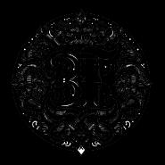
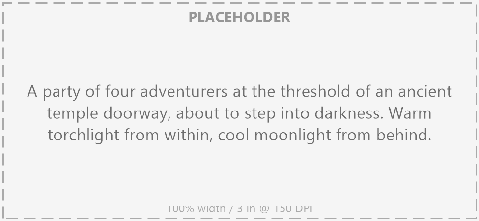
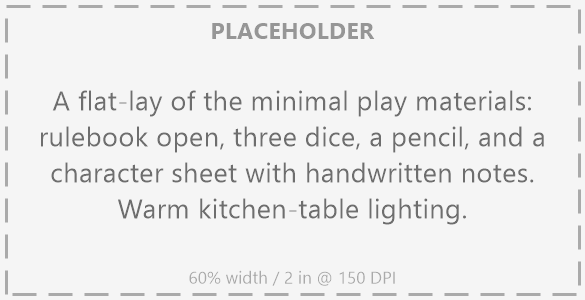
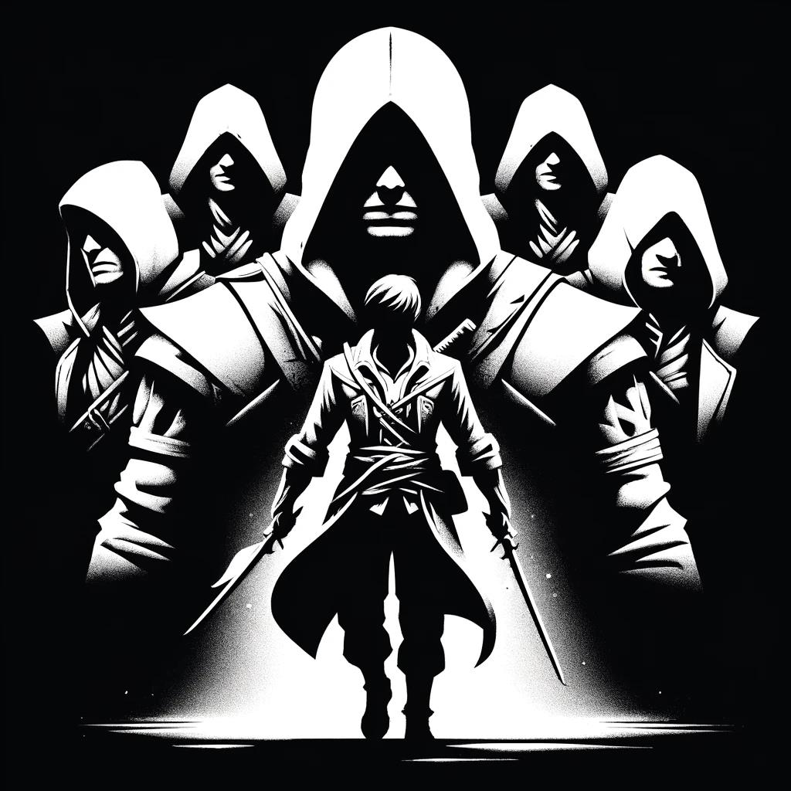
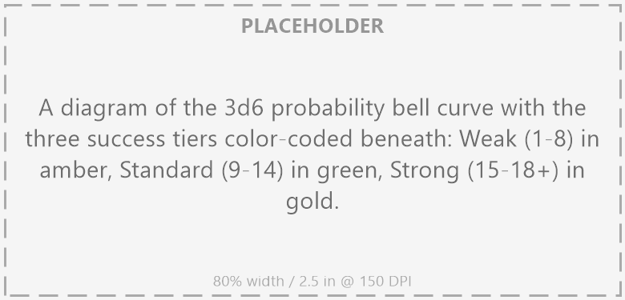
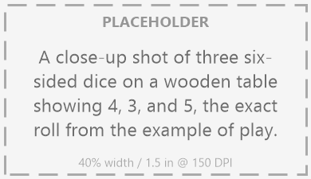
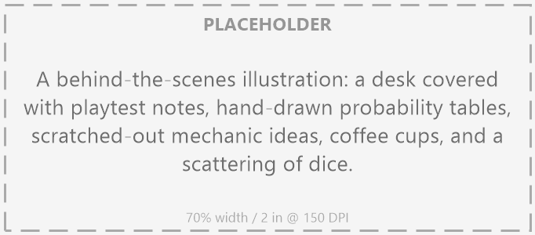
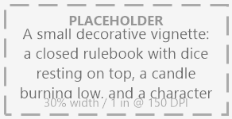

# Introduction {#sec-chapter-introduction}

{width="60%"}

*Illustration 2: Opening chapter decorative art. Placeholder; final art TBD. Dimensions: 185×185.*



Welcome to *Heroes of Legend*. If you're holding this book, you're about to do something remarkable: build a hero, step into their boots, and tell stories you'll remember for years. This is a game about rolling dice and making choices, but mostly it's about sitting around a table with your friends and saying, "Remember that time Kael charged the dragon?"

Here's how it works.

You create a hero: a **Protector**, a **Blade**, an **Arcanist**, or one of five other classes, each with their own way of approaching the world. One player takes on the role of the **Dungeon Architect** (**DA**). The DA describes the world. You decide what your hero does. The dice tell you how it goes.

That's it. That's the whole game. Everything else is details, and this book is full of them, because the details are where the magic lives.

So take a breath. You don't need to understand it all at once. This book is built to be read in pieces: crack it open at the table when you need a rule, flip through it on the couch when you're dreaming up your next character, or read it cover to cover if that's your style. However you approach it, you're in good company. Thousands of players have sat where you're sitting now, about to discover what happens when you roll three dice and everything changes.

<!-- Rationale: Emotional hook: a hero party shot that establishes the game's aspirational fantasy and group dynamic before the rules begin. -->

## What Is a Roleplaying Game?

Before we get to dice and character sheets, let's talk about what you're actually about to do.

A roleplaying game is collaborative storytelling with rules. You and your friends sit around a table, or a video call, or a blanket fort, I don't judge, and together you tell the story of a band of heroes. One of you is the **Dungeon Architect** (the DA). The DA describes the world: the crumbling tower on the horizon, the suspicious innkeeper who definitely knows more than she's saying, the dragon whose shadow just passed overhead. The DA plays everyone who isn't a hero: allies, villains, monsters, the mysterious stranger brooding in the corner of the tavern. Everyone else plays a **hero** they created, a character with their own skills, flaws, ambitions, and terrible ideas.

When your hero tries something risky, like swinging a sword at a goblin, talking your way past a guard, climbing a cliff in the rain, you roll dice to find out what happens. The dice tell you whether you pulled it off cleanly, barely scraped by, or failed in a way that makes the story more interesting. That's the key: there's no winning and no losing in this game. There's just the story you all built together, and whether it was a story worth telling. Some sessions end in triumph. Some end in tragedy. The best ones end with everyone at the table saying, "Remember when…?"

Everything else in this book, the rules, the spells, the weapons, the monsters, those are just tools. They're here to give structure to the story, to make sure the dice mean something, to help the DA keep the world feeling real. But the game isn't in the book. The game is at your table, when someone says "I have a terrible idea" and everyone else leans in.



## What You Actually Need

Think of me as your guide. I've been running tables for thirty years, and I'm going to walk you through everything you need to know.

Pull up a chair. Let me tell you what you *actually* need to play this game. I've seen players show up with custom dice towers, hand-painted miniatures, and leather-bound notebooks that cost more than my first sword. You know what the best sessions all had in common? None of that stuff.

You need this book. Everything you need to play is in these pages: the rules, the spells, the monsters, the advice. It's heavy enough to flatten a goblin if you throw it, but I'd recommend reading it instead.

You need dice. Three to six six-sided dice, the kind you'd find in any board game. Three for a standard roll. A couple more for when fortune smiles on you, or doesn't. You can spend forty dollars on hand-carved obsidian dice if you want. I've done it. They're gorgeous. They roll exactly the same as the ones that came with your copy of Monopoly. Don't let anyone tell you different.

You need something to write on and something to write with. A printed character sheet, a notebook, the back of a napkin: I've seen heroes born on all three. Your character sheet is where your hero lives when they're not in your head. Treat it with respect. Update your hit points. Track your gear. Future you will thank present you when the DA asks if anyone remembered to bring rope and you can point to your inventory and say, "Right here."

You need friends. Two to five is the sweet spot. One of you will be the DA: the architect of dungeons, the voice of villains, the arbiter of "can I try to jump that?" The rest are heroes, each with their own goals, fears, and terrible ideas that somehow work out. Rotate who DAs if you want; the game works either way. Some of the best campaigns I've run started because someone else needed a break and I said, "Hand me the screen."

That's the list. No miniatures required. No battle mat. No hundred-dollar sourcebooks. Just you, your friends, some dice, and your imagination. Everything else is optional. And the options are wonderful, don't get me wrong. I've got a closet full of miniatures I painted myself. But you don't *need* them. You never did.

<!-- Rationale: Entry-level reassurance: a flat-lay of minimal materials reinforces the low-barrier-to-entry message and makes new players feel welcome. -->

::: {.callout-important}
## Combat Is Tactical

One thing, though. I do recommend some graph paper or a gridded surface. Combat in *Heroes of Legend* is tactical: positioning matters, cover matters, who's standing next to whom matters. A quick sketch of the battlefield helps everyone see the fight. It's the difference between "I attack the goblin" and "I circle around the pillar, use it as cover, and strike from the goblin's blind spot." The rules work fine either way; theater of the mind is perfectly valid, but a rough map turns a brawl into a battle. And battles are more fun.
:::



## How to Read This Book

This isn't a manual. It's a companion. You don't read it once and put it on a shelf; you keep it at your elbow during sessions, dog-ear the pages you need most, and discover new things every time you crack it open. Here's how to start, depending on who you are and what you need right now.

::: {.callout-tip}
## Played Another RPG Before? Here's What's Different.
- **No d20.** We use 3d6. Your skills and attributes matter more than your luck.
- **Attacks always hit.** The roll determines damage, not whether you connect.
- **No spell slots. No mana.** Magic always fires. Your roll determines the outcome.
- **No class restrictions.** Anyone can learn anything: your class just makes some things cheaper.
- **Armor reduces damage**, it doesn't make you harder to hit.

The rest will feel familiar. Jump to @sec-chapter-character-creation to start building.
:::

**Never Done This Before? Start Here.** If you've never rolled a d20 in your life: start with @sec-chapter-character-creation. It walks you through building a character step by step, from "what do my stats mean?" to "can I buy a horse?" After that, read @sec-chapter-attributes through @sec-chapter-disciplines. You don't need to memorize anything. Just read them once so you know where to look when the DA says "make a Fortitude save" and you need to know what that means. The rules will stick through play, not through study. Your first session, you'll look things up constantly. That's normal. By your fifth session, you'll be explaining grappling to the new player at the table. That's normal too.

**If you're the Dungeon Architect**, the one who's going to run the game, you've got a slightly longer reading list. Start with @sec-chapter-attributes through @sec-chapter-disciplines to understand the mechanics. Then jump to @sec-chapter-gm-guidance. That chapter is written for you: it covers building adventures, running monsters, handing out rewards, and keeping the game moving when the party decides to ignore your carefully prepared dungeon and open a bakery instead. (It happens. It always happens. There's advice for that.) After that, skim the equipment and spell chapters so you know what your players can do. You don't need to memorize every spell. You just need to know that *someone* at the table can cast *Water Breathing*, so maybe don't hang your entire adventure on "they can't cross the lake."

**If you just want to see what this game is about**, if you're browsing, curious, trying to decide whether to bring this to your table, read this chapter. Then read the example of play below. If it makes you want to grab some dice, call your friends, and find out what happens when Kael kicks down the door, we've done our job. Welcome aboard.



{width="60%"}

*Illustration 3: Credits page art. Placeholder; final art TBD. Dimensions: 1024×1024.*



## The Core Mechanic

All right. Roll up your sleeves. This is the engine that drives everything.

In *Heroes of Legend*, whenever you attempt something with risk: swinging a sword, casting a spell, talking your way past a guard, climbing a crumbling wall while something with too many teeth chases you, you reach for three six-sided dice. You roll them. You add your hero's relevant **attribute** (see @sec-chapter-attributes). You add your **skill** bonus if you have one. The DA may add or subtract a modifier for difficulty. Then you look at the total. That number tells you what happens. That's it. That's the whole game, right there, in one sentence.

But numbers without context are just arithmetic. Here's what those totals *feel* like at the table:

**Weak (1–8):** You pull it off, but barely. The lock clicks open as the guard's footsteps round the corner. You scale the wall but your rope frays and you'll need a new one. Your blade finds the goblin but it's a glancing blow: he's bleeding, he's angry, he's still standing. Weak successes are the game's way of saying "yes, but." The story moves forward. You just might not like how.

**Standard (9–14):** Clean, professional work. The spell fires true. The lie lands. The ancient text yields its secrets. This is what trained competence looks like: the lock opens, the arrow flies straight, the negotiation goes your way. Standard results are the backbone of the game. They happen most often. They make you feel capable without making you feel invincible.

**Strong (15–18+):** You make it look easy. The crowd gasps. The enemy reels. The thing you were trying to do? You did it so well that something extra happens: bonus damage, bonus information, a moment of pure triumph that'll have the table on its feet. Strong results are rare enough to feel special and common enough to feel earned. This is why you trained. This is the moment you'll be talking about after the session.

Three natural 6s is a **Critical**: automatic Strong plus a bonus effect. The dice came up 6, 6, 6. The table erupts. Three natural 1s is a **Fumble**: automatic failure with a twist. Something has gone spectacularly, memorably wrong. Both happen about once every 200 rolls. When they do, they're not just numbers. They're stories.

That's the engine. Everything else in this book, skills, spells, equipment, monsters, hangs on that one roll. The **3d6**. The bell curve. The three tiers of success. Master this and you've mastered the game. Everything else is just knowing when to roll and what to add.

Now go grab three dice. Roll them. Look at the numbers. Imagine adding your best attribute, the thing your hero is *exceptional* at. That's a Strong. Now imagine adding nothing, just raw luck. That's probably a Standard. Now imagine rolling three ones. That's the universe laughing at you. It happens to everyone. Even heroes.

<!-- Rationale: Visual learning aid: a bell-curve diagram with color-coded success tiers gives players a memorable mental model of the core resolution system. -->

::: {.callout-important}
## The Only Rule You Need to Memorize
1. **Roll 3d6** whenever you attempt something risky.
2. **Add** your attribute modifier + skill bonus + any DA modifiers.
3. **Check the total:** 1–8 = Weak, 9–14 = Standard, 15–18+ = Strong.

That's the entire game engine. Come back to this box whenever you're unsure what to do.
:::



## A Note About Hitting Things

Let me tell you something that might surprise you.

In *Heroes of Legend*, attacks always hit. Always. Read that again. When you swing your sword at a goblin, you connect. When you hurl a firebolt at a troll, it lands. Every. Single. Time.

This is not how most games work. In most games, you roll to see *if* you hit. If you miss, your turn ends. Nothing happens. The table checks their phones. The dragon you're fighting stands there, entirely unharmed, while four heroes take turns swinging at the air around it. That's not drama. That's dead air.

In *Heroes of Legend*, the question isn't *whether* you hit. It's *how hard.* Your 3d6 roll determines the damage tier: Weak, Standard, or Strong. A Weak hit is a glancing blow that still draws blood. A Standard hit is a solid strike. A Strong hit is the kind of blow that makes the enemy reconsider every choice that led them to this moment. Something always happens. Every swing advances the fight. Every round, the board changes.

This keeps combat fast, cinematic, and dangerous. You can't stack armor so high that goblins can't touch you. Every attack lands. Armor reduces damage instead of preventing hits (see @sec-chapter-armor-shields). The knight in plate mail still gets knocked around, they just stay standing longer. Combat becomes about who's left standing, not about who finally rolled high enough to participate.

::: {.callout-important}
## Armor = Damage Reduction
In *Heroes of Legend*, armor doesn't make you harder to hit: every attack connects. Instead, armor subtracts from incoming damage. A goblin's club (Standard damage 3) bounces harmlessly off plate armor (Armor 3). But a dragon's claws (Strong damage 8) still gets 5 through.

Full armor rules: @sec-chapter-armor-shields.
:::

::: {.callout-tip}
## Why Always-Hit?

Think about your favorite fantasy fight scenes. The duel on the cliff. The desperate last stand in the throne room. The ambush in the forest. How often does the hero swing and completely miss? Almost never. They clash. They parry. They take glancing blows. Contact happens. The always-hit rule means the fiction at your table feels like the fiction in your head: every exchange matters, every blow counts, and nobody spends their turn accomplishing nothing.
:::



Enough theory. Let's see how this actually plays out at the table.

## Example of Play

Kael is a dwarf Blade: a shadow on the wall, the last face his enemies see. He strikes with precision, not fury, and his light blades find the gaps in any armor. Lyra is a halfling Odd, an unpredictable wildcard whose enemies never know what she'll do next, and neither do her friends, honestly. (You'll meet Kael and Lyra in the opening story.) Their DA, Morgan, has been running them through a goblin-infested ruin for the past hour. They've just kicked down the door to the chieftain's chamber.

**Morgan (DA):** "The goblin chieftain rises from his throne of salvaged shields. He's easily seven feet of scar tissue and bad decisions. He raises a rusted axe the size of your torso and bellows something in Goblin that probably isn't a compliment. What do you do?"

**Kael:** "I draw my longsword and step forward. 'You're in my spot.' I strike."

**Morgan:** "Roll 3d6."

*Kael grabs three dice. The table goes quiet. He shakes them in his hand, everyone has their ritual, and lets them fly.*

*Kael rolls:* "Four, three, five. That's twelve. My **Brawn** is +2, and I've got Blades Fighting at **Adept** (see @sec-chapter-skills), so that's another +2. Total is sixteen."

**Morgan:** "Sixteen is Strong. Your longsword's Strong damage is 5."

**Morgan:** "Crude leather armor. That's 5, reduced to 4."

**Morgan:** "Your blade finds its mark. The chieftain staggers backward, eyes wide. Nobody's made him bleed in years. The remaining goblins go quiet. Their champion just took a hit that would have killed any of them. For one breath, the whole room is still."

<!-- Rationale: Immersion anchor: a dice close-up showing the exact roll from the example grounds the abstract mechanic in a real, tactile player moment. -->

**Lyra:** "While he's distracted and everyone's staring at Kael, I want to slip behind the throne and check for anything valuable. Or explosive. Ideally both."

**Morgan:** "Give me a Stealth roll. The goblins are watching Kael, so I'll say Standard difficulty, no modifier."

*Lyra rolls. She doesn't shake the dice, she just drops them, casual, like she's not doing anything important.*

*Lyra rolls:* "Five, four, six. That's fifteen. **Agility** +2, Stealth Adept +2. Nineteen total."

**Morgan:** "Strong. You ghost past the goblin guards like you were never there. Behind the throne you find a locked chest. Also, what looks like a half-empty keg of something that smells powerfully flammable."

**Kael:** "I like where this is going."

**Morgan:** "I thought you might."

This is *Heroes of Legend.* Every roll drives the story forward. Every success tier changes the scene. And sometimes, just sometimes, you find an explosive keg behind the boss's chair. What you do with it, that's up to you.



<!-- Rationale: Tone transition: a behind-the-scenes desk shot signals the shift from in-world mentor voice to designer commentary. -->

## Design Justifications: Why We Built It This Way {#sec-design-justifications}

Before we move on, let me explain why the game works the way it does. These aren't just rules I made up — they're choices I made after watching thousands of sessions at hundreds of tables. Every mechanic in this book exists because I saw something not working at a real table, with real players, and thought: we can do better.

::: {.callout-note}

### Always-Hit: Something Always Happens

I've watched casters spend entire sessions saying "I miss." Not "I fail": "I *miss*." As in, nothing happened. The turn ended. Next player. That's not drama. That's dead air at the table while someone checks their phone.

So here's the rule: attacks always connect. Always. You swing, you cast, you fire: something happens. The roll doesn't ask *whether* you hit. It asks *how hard.* Weak damage is a glancing blow, a near-miss that still draws blood, a spell that clips the target instead of engulfing them. The fiction stays alive. Combat keeps moving. Nobody's turn is wasted.

This also means fights are inherently dangerous. You can't stack AC so high that goblins need a natural 20 to touch you. Every attack lands. Armor reduces damage instead of preventing hits, which means the knight in plate mail still gets knocked around, they just stay standing longer. The goblins are always a threat. The dragon is always terrifying. Combat doesn't become a solved equation; it stays a fight.

:::

::: {.callout-note}

### 3d6 Instead of d20: Your Training Matters More Than Your Luck

A twenty-sided die doesn't care about your backstory. Every number from 1 to 20 has exactly the same 5% chance: your legendary swordsman with +12 to hit has the same odds of rolling a natural 1 as the farmer who's never held a blade. That's not how competence works in stories, and it shouldn't be how it works in games.

Three six-sided dice create a bell curve. Most rolls land between 9 and 12. That means your attributes, your skills, your Disciplines (see @sec-chapter-disciplines), the things you *chose* for your character, matter more than the dice. A master thief almost always sneaks past the guards. A legendary blacksmith almost never ruins the sword. When the dice *do* produce triple 1s or triple 6s, it means something, because it only happens about once every 200 rolls.

Here's what thousands of rolls across hundreds of sessions have taught me: the 3d6 curve makes running the game easier. You can set difficulty modifiers knowing the dice will cluster around the middle, not swing wildly from "godlike" to "incompetent" on consecutive turns. Consistency is the friend of good storytelling. The dice support the fiction instead of fighting it.

:::

::: {.callout-note}

### No Spell Slots: Magic Always Fires

I've played a wizard in a system with spell slots. The party fought through six encounters. I was conservative with my spells, hoarding them for the final battle. We reached the boss. Everyone looked at me. I opened my mouth and said the least heroic words ever uttered at a gaming table: "I'm out of spell slots."

That's not a character moment. That's a scheduling error.

In *Heroes of Legend*, magic always fires. No mana. No slots. No "sorry, I used my good spell already." When you cast, the spell goes off. The roll determines whether it's a Weak sputter, a Standard blast, or a Strong inferno. You're never useless. You're never out of options. Your fire burns until *you* decide it stops.

Adept and Master spells have per-encounter and per-session limits (see @sec-chapter-magic-system), not because we want you counting gas, but because Master-tier effects reshape the battlefield. Those limits are about spotlight management, not resource attrition. When you unleash *Volcanic Eruption*, it should be a moment everyone remembers, not something you do three times before lunch.

:::

::: {.callout-note}

### Flat Damage & Disciplines: Speed and Freedom

Two more things worth understanding. **Flat damage** means one roll tells you everything: no separate damage dice, no arithmetic slowdown. The combat chapter (@sec-chapter-combat) covers this in full. **Disciplines** mean no class-locked skills: anyone can learn anything, it just costs more outside your wheelhouse. The disciplines chapter (@sec-chapter-disciplines) explains the full system.

:::

These are the big ideas. The rest of the book explains how they work in practice.

::: {.callout-tip}
## Ready to Begin?
- **New player?** Turn to @sec-chapter-character-creation and build your first hero.
- **New GM?** Skim @sec-chapter-attributes through @sec-chapter-disciplines, then dig into @sec-chapter-gm-guidance.
- **Just browsing?** Read the opening story in the next chapter to meet Kael and his companions in action.

However you proceed, welcome to the table. The dice are waiting.
:::

<!-- Rationale: Closing grace note: a small decorative vignette provides a visual exhale at chapter's end and signals a natural reading pause. -->

