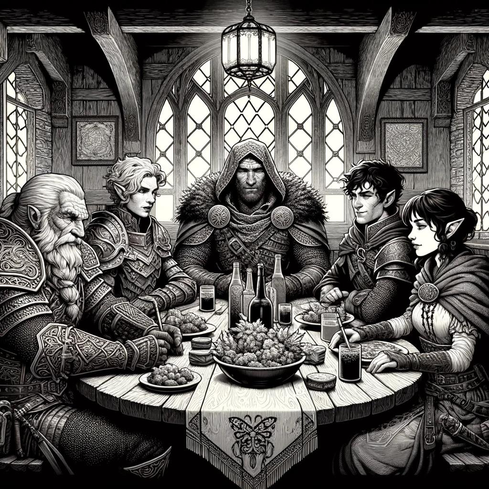

# The Last Ember {#sec-chapter-opening-fiction}

```{=typst}
#label("sec-chapter-opening-fiction")
```

{width="60%"}

*Illustration 4: Opening fiction header art (Player's Scene). Placeholder; final art TBD. Dimensions: 1024×1024.*



Kael pressed his back against the cold stone, breath misting in the darkness. Somewhere above, the temple groaned, ancient foundations shifting after centuries of silence. His sword hand trembled, but not from fear. The flame crawling up the blade's edge answered to him now, and it was *hungry*.

"Anything?" Lyra whispered beside him, her fingers tracing the runes carved into the archway. They glowed faintly blue, Knowledge, she'd said. Old Elvish. Warding glyphs.

"Just darkness," Kael said. "And something breathing."

Roric grunted, hefting his tower shield. The metal groaned, Armor Disciplines, three of them, forged into plate that had turned aside dragon fire. "Let it breathe. I'll give it something to choke on."

Zara said nothing. She rarely did. But Kael felt the air tighten, Energy gathering, the tang of ozone before lightning. She had three Wind Disciplines now. Whatever was in that darkness, it was about to meet a storm.

The glyphs flared. The warding shattered.

And the darkness *moved*.

Kael was first through the breach, fire blazing along his blade. *3d6: 5, 4, 6, 15 plus Brawn plus skill, Strong.* The flame struck true, illuminating something vast and many-legged. It shrieked.

Lyra was already moving, her voice cutting through the chaos. "The eyes! Strike the eyes!" Knowledge had its uses.

Roric's shield slammed down, Protection flaring, a wall of steel between the monster and his friends. Zara's winds howled.

They were four heroes against the dark.

They were enough.

```{=typst}
#horizontalrule
```

The thing had too many legs. That was Kael's first thought, followed immediately by the second, which was that it also had too many teeth, and the third, which was that it was moving toward Lyra.

Not on his watch.

He drove forward, flame licking from his longsword, every step a choice. The creature's attention flicked toward him, good. That was the point. The Blade draws the eye. The Blade makes the opening. The Blade trusts that someone else will finish what he starts.

Behind him, Zara's voice rose, not a shout, never a shout, but a single word in a language that predated human speech. The air around her cracked. Three Wind Disciplines didn't just summon a breeze. They summoned a hurricane in a bottle, compressed into a space the size of a fist, and then they *released* it.

The creature staggered. Half its legs lost purchase on the stone floor. It skidded sideways, shrieking, and slammed into the far wall with a sound like a tree splitting in a storm.

"Now!" Lyra shouted.

Roric was already there. He didn't run, Protectors don't run. They *arrive*. One moment he was beside Zara, shield raised. The next he was planted between the monster and his friends, tower shield braced, the metal humming with the impact of something that had tried to get past him and failed.

"Whatever you're going to do," Roric growled, "do it."

Lyra's hands were a blur. She wasn't casting, she was *building*. A pinch of sulfur from her belt pouch. A thread of silver wire. A drop of something viscous and black that smoked when it hit the air. The Odd didn't follow the rules of magic. The Odd *negotiated* with them.

"Kael!" she called. "Clear!"

He didn't ask questions. He dove sideways, rolled, came up with his blade still burning.

Lyra hurled the mixture.

It wasn't a fireball, fireballs were for Arcanists with their formulas and their precision. This was something older and meaner. It hit the creature's carapace and *stuck*, sizzling, eating through chitin and whatever passed for flesh beneath. The thing screamed, a sound that had no business coming from anything with a mouth.

"Zara, *now!*"

Zara's second word was different. Not a command. An invitation.

The wind that answered wasn't the controlled storm of before. It was raw and hungry and it *wanted* to burn. It found Lyra's concoction and the flame on Kael's blade and it fed on both, whipping them into a cyclone of fire that wrapped around the creature like a shroud.

The screaming stopped.

The fire died.

The thing, what was left of it, crumpled into a heap of smoking chitin and silence.

For a long moment, nobody spoke. The temple groaned again, settling. Dust sifted down from the ceiling. Somewhere far above, a bird called, a normal bird, a living bird, a bird that had no idea what had just happened sixty feet below it.

Roric lowered his shield. "Is it dead?"

"Very," Lyra said, trying to catch her breath. "Definitely. Probably. I'm not poking it to check."

Zara walked past them both, her robes still crackling with residual static. She knelt beside the creature's remains and studied them with the detached interest of someone examining a particularly interesting beetle. "It was a guardian," she said quietly. "Not the thing we came for. The real threat is deeper."

Kael sheathed his sword. The flame winked out, leaving the blade dark and ordinary. "Then we go deeper."

"Kael." Lyra's voice had changed, the manic energy of combat draining away, replaced by something Kael had learned to recognize. She was thinking. That was always dangerous. "The glyphs on the archway. They weren't just a ward. They were a *message*. Someone wanted this place sealed. Someone who knew what they were doing."

"The same someone who built the guardian?"

"No." She shook her head. "The guardian was added later. The glyphs are older. Much older. Whoever sealed this temple wasn't trying to keep us out." She looked at the darkness ahead, the passage that led deeper into the earth. "They were trying to keep something *in*."

Roric shifted his grip on his shield. "Anyone else thinking we should maybe not go deeper?"

"Anyone else thinking that's exactly why we have to?" Kael replied.

Zara stood. Her eyes were distant, the look she got when the winds were whispering things only she could hear. "There's magic ahead. Old magic. Sleeping magic." She paused. "It's starting to wake up."

Kael looked at his companions, his friends, his family, the only people in the world he trusted to have his back when the darkness moved. Lyra, with her pockets full of chaos and her grin full of trouble. Roric, with his shield and his stubbornness and his refusal to let anyone die on his watch. Zara, who spoke to storms and listened to the wind and never, ever flinched.

"All right," he said. "Here's the plan. Roric takes point. Zara stays behind him, I want you ready to hit whatever comes at us before it gets close. Lyra, you're with me. We find what's sleeping and we decide whether to wake it up or put it back to bed. Questions?"

"You're assuming I'll follow the plan," Lyra said.

"I'm assuming you'll do something more interesting than the plan, and that's why you're with me."

She grinned. "Fair."

They moved into the darkness, four heroes against whatever the ancient world had seen fit to bury. Behind them, the guardian's remains smoked and cooled. Ahead of them, something stirred, something old, something patient, something that had been waiting for a very long time.

The temple groaned once more.

And then it was silent.

The Last Ember was still burning.

```{=typst}
#horizontalrule
```

*To be continued in your game.*
