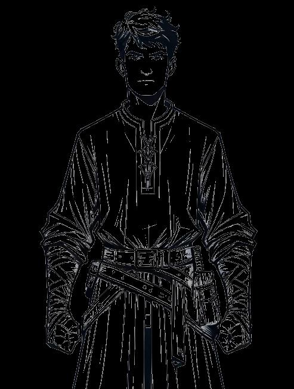

# Attributes {#sec-chapter-attributes}

{width="60%"}

*Illustration 7 — Attributes chapter art. Placeholder; final art TBD. Dimensions: 493×651.*



Your hero is defined by six numbers. Don't let that fool you, those six numbers will determine whether you bend iron bars, talk your way past the guards, or accidentally set the tavern on fire. They're simple. They're powerful. They're where your hero begins.

Here's what each attribute does, in plain language:

| Attribute | Abbr | What It Governs |
|-----------|------|-----------------|
| **Brawn** | BR | Hitting harder, lifting heavy things, looking imposing |
| **Fortitude** | FO | Staying alive, resisting poison, marching through blizzards |
| **Agility** | AG | Moving fast, dodging, picking locks, shooting straight |
| **Guile** | GU | Lying convincingly, charming nobles, picking pockets |
| **Knowledge** | KN | Remembering lore, identifying monsters, speaking ancient languages |
| **Reason** | RE | Solving puzzles, casting spells, crafting potions |



## Your Attribute Scores

Attributes range from -2 to +2. Most ordinary people sit at +0. Heroes are different, you have strengths, and you have weaknesses. That's what makes you interesting.

| Score | Modifier | What It Means |
|-------|----------|---------------|
| -2 | -2 | A genuine liability. The barbarian who can't read. The wizard who gets winded climbing stairs. |
| -1 | -1 | Below average. Not your thing. You manage, barely. |
| +0 | +0 | Competent. Normal. You can handle yourself. |
| +1 | +1 | Talented. This is a strength. People notice. |
| +2 | +2 | Exceptional. Olympic-level. The thing you're known for. |

::: {.callout-note}
## The Bell Curve: Why -2 to +2 Is the Sweet Spot

With 3d6, most rolls land between 9 and 12. That's the bell curve at work, the dice cluster around the middle. A +1 bonus shifts the entire curve. A +2 bonus is enormous.

Compare this to a d20 system, where a +1 is just 5%. On 3d6, a +1 bonus is worth about 12.5% at the center of the curve, more than double the impact. This means every attribute point matters. Every skill rank matters. You feel the difference between Brawn +1 and Brawn +2 every single session.

The -2 to +2 range keeps the math tight. A hero with Brawn +2 and a hero with Brawn -1 are only 3 points apart on the same roll, but those 3 points on a bell curve are the difference between "I contribute regularly" and "I'm a liability in a fight." The range is narrow, but the impact is wide. That's intentional.
:::



## Creating Your Hero

Your six attribute scores must total *exactly +3*. Every attribute starts at +0. Raising one to +1 costs one point from your pool. Raising it to +2 costs two points total. If you need more points, you can drop an attribute into the negatives, each -1 gives you an extra point. But the final sum across all six must be +3. No attribute may go below -2 or above +2.

A quick way to check: add up all six modifiers. They should equal 3. If they don't, adjust until they do.

**Example:** Makeva wants a charming rogue. She puts +1 in Agility (nimble fingers), +1 in Guile (silver tongue), and +1 in Brawn (can handle herself in a scrap). Her final spread: Brawn +1, Fortitude +0, Agility +1, Guile +1, Knowledge +0, Reason +0. Sum: +1+0+1+1+0+0 = +3. She's quick, persuasive, and can throw a punch, but she's no scholar and no tank. That's a choice. Choices make characters.

At levels 4, 8, 12, 16, and 20, you may increase one attribute by +1 (up to the +2 maximum). Your hero grows as they adventure.



## What Your Attributes Give You

**Health Points at Level 1:** 10 + Brawn. This is your staying power, how many hits you can take before you go down. A dwarf with Brawn +2 starts with 12 HP. A slight fae-touched wanderer with Brawn -1 starts with 9 HP. Brawn is muscle, bone, and sheer physical resilience. After Level 1, you gain your Brawn modifier in HP each level (minimum 1).

**Initiative:** Your Agility modifier. Quick people go first. That's not a rule of the game, that's a rule of the universe.

**Movement:** 30 feet per round for most heroes. Heavy armor and some conditions will slow you down.

**Carrying Capacity:** 10 + (Brawn x 5) inventory slots. Stronger heroes carry more. The party's tank is also the party's pack mule.



## The Six Attributes, in Detail

**Brawn (BR):** This is the "lift the portcullis, bend the bars, arm-wrestle the ogre" attribute. When you swing a weapon, Brawn pushes your 3d6 roll toward the Strong tier, better Brawn means more damage, not because it adds to the damage number, but because it helps you land the telling blow. Brawn also determines how much you can carry and how far you can throw things. Like goblins. Or allies.

**Fortitude (FO):** Your body's refusal to quit. Fortitude sets your Health Points, helps you shake off poison, and keeps you upright when the blizzard hits. It's the attribute you don't think about until you need it, and then it's the only one that matters. A hero with Fortitude +2 can drink the dwarven ale that puts everyone else under the table.

**Agility (AG):** Speed, grace, precision. Agility gets you up the wall, through the window, and out the other side before the guards finish their card game. It governs ranged combat, stealth, lockpicking, and acrobatics. It also determines who acts first when swords come out. High Agility heroes dance through fights; low Agility heroes wade through them.

**Guile (GU):** The art of winning without fighting. Guile covers deception, persuasion, intimidation, and every variety of social maneuvering. It's the difference between "Let me in" and "I'm the health inspector, you really want to open this door." A hero with Guile +2 doesn't need to draw their weapon because they already convinced you to put yours down.

**Knowledge (KN):** What you know. Ancient history, arcane theory, monster weaknesses, noble lineages, the price of saffron in three different ports. Knowledge is the scholar's attribute, it governs lore, investigation, and identifying creatures. It also helps determine your starting Health Points and your early-life Development Points. Smart heroes live longer.

**Reason (RE):** What you *do* with what you know. Reason is the engine behind spellcasting, alchemy, crafting, and puzzle-solving. Knowledge tells you that trolls fear fire; Reason tells you how to make some. A wizard with Reason +2 doesn't just know spells, they understand *why* spells work, which makes them devastatingly effective.

::: {.callout-note}
## Attributes Are Your Story

Your attribute spread isn't just numbers, it's the first sentence of your hero's biography. Brawn +2, Knowledge -1? You grew up working, not reading. Guile +2, Fortitude -1? You survived on wit, not toughness. Every combination suggests a different life. Lean into it. The mechanics will follow.
:::



## Worked Examples: Each Attribute in Play

Knowing what an attribute *governs* is one thing. Seeing it at the table is another. Here's each attribute doing its job.

### Brawn in Play

The party is trapped in a collapsing tomb. The stone door is grinding shut, they have one round to get out. Roric, the dwarf Protector with Brawn +2, braces himself against the door.

**The roll:** 3d6 + Brawn (+2) + Athletics Novice (+1). Roric rolls 4, 5, 3 = 12 + 3 = 15. **Strong.**

The door shudders. Roric's muscles cord, his boots skid on the stone, and the door *stops.* He's holding it open through sheer strength. "Go!" The party scrambles through. Roric releases the door and dives after them as it slams shut. Everyone is alive because the dwarf was strong enough to say "not today."

**If he'd rolled Weak (6 or less):** The door closes halfway. Roric is stuck on the wrong side. The party has a new problem, and a new rescue mission.

### Fortitude in Play

Lyra, the halfling Odd, has been bitten by a venomous spider. The venom is working through her system, the DA calls for a Fortitude save.

**The roll:** 3d6 + Fortitude (+0). Lyra rolls 5, 2, 3 = 10. **Standard.**

She feels the venom burn in her veins, but her body fights it off. She's woozy. She's sweating. She's going to have a spectacular bruise. But she's not poisoned, and she's still standing. Her Fortitude isn't exceptional, but it's enough. Sometimes enough is all you need.

**If she'd rolled Strong (13+):** She shrugs it off completely. The spider's venom sack was nearly empty. She doesn't even feel it. The DA describes her as "annoyingly fine."

**If she'd rolled Weak (1-6):** The Poisoned condition kicks in, disadvantage on all attacks. She's in trouble. The party needs to end this fight fast or get her an antidote.

### Agility in Play

Kael needs to cross a crumbling bridge over a chasm. The stone is cracked, the drop is fatal, and there's no time to find another way.

**The roll:** 3d6 + Agility (+2) + Acrobatics (+0, he doesn't have the skill). Kael rolls 3, 6, 4 = 13 + 2 = 15. **Strong.**

He moves like a cat. Foot to stone, weight shifting, never stopping. He's across in seconds. He doesn't even look back, because he knows he made it look easy, and that's the point.

**If he'd rolled Weak (1-6):** A stone crumbles under his foot. He catches himself on the edge, his fingers are the only thing between him and the abyss. The DA gives the party one round to save him before he falls. The scene just escalated.

### Guile in Play

Ser Aldric, the party's Leader, needs to talk his way past a checkpoint manned by the city watch. The party is carrying weapons banned within the city walls, and they don't have permits.

**The roll:** 3d6 + Guile (+1) + Persuasion Adept (+2). Aldric rolls 5, 4, 3 = 12 + 3 = 15. **Strong.**

"Captain." Aldric clasps the guard's hand like an old friend. "We're on Crown business. Monster hunt. You know how it is, weapons check at the gate, paperwork, delays. The beast we're tracking doesn't wait for permits. I'd consider it a personal favor if you'd wave us through. Your name goes in my report. I'll make sure the captain of the watch hears about your... flexibility."

The guard hesitates. Then nods. "Crown business. Right. Move along." He waves them through. Aldric's Guile just saved the party an hour of bureaucracy and a night in a holding cell.

**If he'd rolled Weak (1-6):** The guard's eyes narrow. "Crown business, you say? Let's see your writ." The party doesn't have one. The situation is now worse than if Aldric had said nothing. A bad lie is worse than no lie at all.

### Knowledge in Play

The party discovers an ancient mural in a sunken temple. It depicts a battle between winged figures and something vast and tentacled. Understanding this mural could reveal the temple's purpose, and its dangers.

**The roll:** 3d6 + Knowledge (+2) + History Novice (+1). The Intellect rolls 2, 6, 4 = 12 + 3 = 15. **Strong.**

"The Celestial War," she breathes. "Third Era. The winged figures are Solari, servants of the sun god. The tentacled thing is a Void Spawn. This temple wasn't built to worship anything. It was built to *contain* something." She traces the mural to a sealed door. "And that door should stay closed until we know what's behind it."

The party now has critical information, and a terrifying choice. All because the Intellect knew her history.

**If she'd rolled Weak (1-6):** "It's a battle scene. Very old. Could be religious, could be historical, I'd need more time to be sure." The party proceeds without the warning. The sealed door gets opened. The Void Spawn gets released. The Knowledge check that failed just became the party's next three sessions.

### Reason in Play

Zara, the party's Arcanist, is trying to disable an ancient magical ward blocking the temple's inner sanctum. The ward is complex, layers of protective energy woven together over centuries.

**The roll:** 3d6 + Reason (+2) + Arcana Adept (+2). Zara rolls 1, 6, 5 = 12 + 4 = 16. **Strong.**

She doesn't just disable the ward, she *understands* it. "The outer layer is a deterrent, flash and noise. The inner layer is the real threat. Dispel the inner layer first, and the outer layer collapses on its own." She traces the correct sigils in the air. The ward flickers, hums, and fades. The door opens. Clean. Professional. Reason at work.

**If she'd rolled Weak (1-6):** The ward triggers. A blast of force throws Zara across the room. She takes 2 damage and the ward is still active, now glowing brighter, pulsing with renewed energy. The party knows the ward is dangerous. They don't know how to disarm it. Reason failed, and now they need a new plan.
