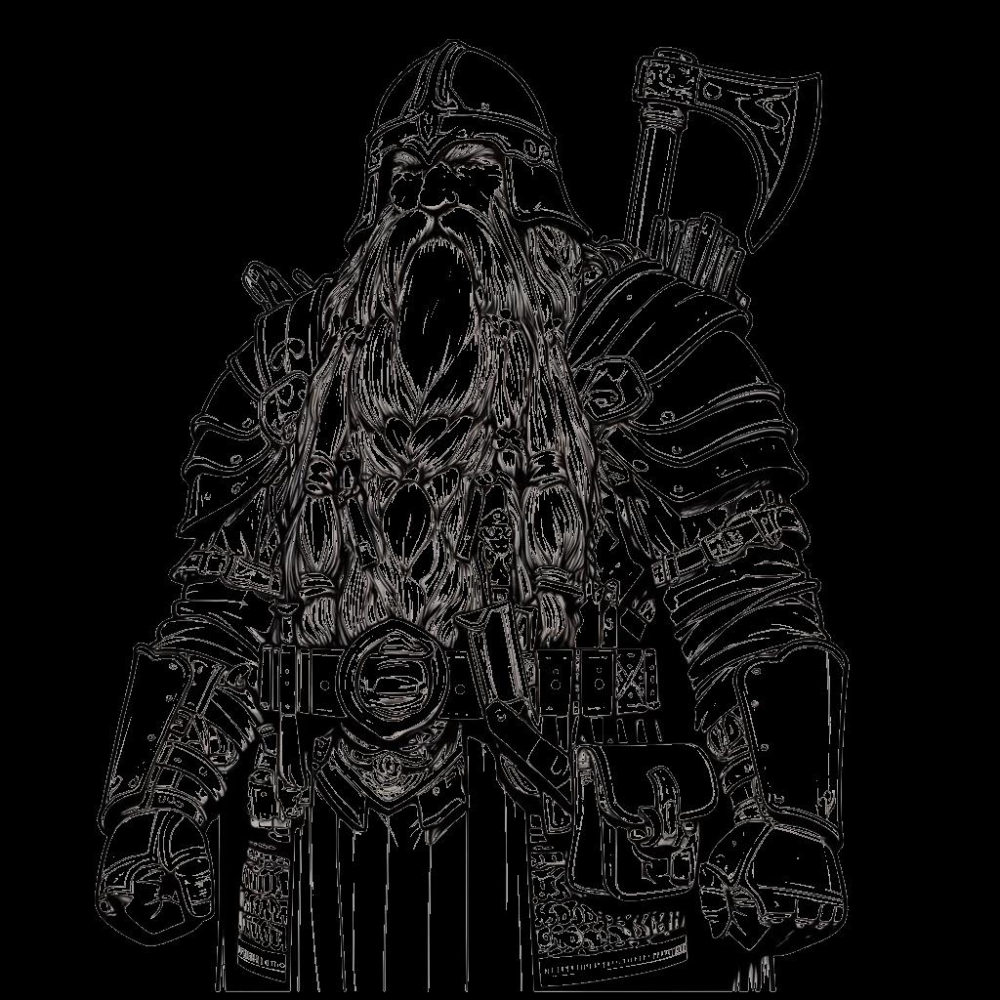
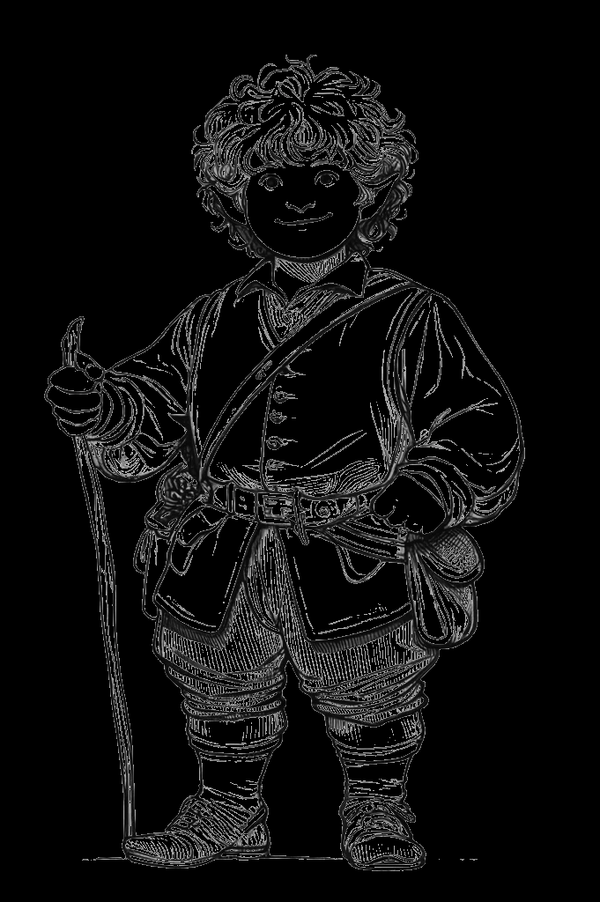

# Ancestries & Cultures {#sec-chapter-ancestries}

```{=typst}
#label("sec-chapter-ancestries")
```

{width="60%"}

*Illustration 8 — Ancestries & cultures chapter art. Placeholder; final art TBD. Dimensions: 1024×1024.*



Your hero comes from somewhere. They have a people, a homeland, a way of life that shaped them before they ever picked up a sword. Ancestry is who you're born as. Culture is how you were raised. Together, they're the first chapter of your hero's story.

::: {.callout-note}
## Ancestry Is Flavor, Not Fate

A dwarf raised by elves is different from a dwarf raised in the mountain holds. Your ancestry gives you a Discipline and a trait, your biology, essentially. Your culture gives you skills and perspective, your upbringing. You can mix any ancestry with any culture. The gruff mountain dwarf raised by halfling riverfolk is not only allowed, it's *interesting*.
:::

::: {.callout-note}
## Mixing Ancestry and Culture: The Combinator's Guide

The system is built for unusual combinations. Here's what different mixes look like at the table:

**Dwarf + Coastal Culture:** You grew up on the surface, working the docks. You're stronger than the human sailors and twice as stubborn. Your Axes Discipline came from splitting hull planks, not mining ore. The sea's salt is in your beard, and you don't trust anything that doesn't have a keel.

**Elf + Nomadic Culture:** Your people left the ancient forests generations ago. You ride with the herds under open sky, your bow always strung. The other elves call you "the lost ones." You call yourselves "the free ones." Archery and Polearms, you hunt from horseback and fight from the saddle.

**Halfling + Mountain Culture:** You were raised in dwarven halls, the only halfling in a clan of stoneworkers. You're short even for your kind, but your arms are corded from the forge. You wield a smith's hammer like other halflings wield a butter knife. The dwarves call you "Little Anvil." It's not an insult.

**Human + Twilight Elf Culture:** You were adopted by twilight elves, raised in the half-light, trained in shadow and blade. You don't have elven grace or elven lifespan, but you have their training. Water Discipline flows through you. The darkness is your ally, not your enemy.

The rules support any combination. The stories are yours to tell. Pick what excites you. The DA will help you make it work in the world.
:::



## The Four Ancestries

| Ancestry | Discipline | Trait | You're Probably... |
|----------|-----------|-------|-------------------|
| **Human** | Any one | **Versatile:** +1 DP at Level 0 | Ambitious, adaptable, everywhere |
| **Elf** | Archery or Blades | **Elven Grace:** once per session, reroll one die of your 3d6 roll | Ancient, graceful, a little haunted |
| **Dwarf** | Axes or Armor | **Sturdy:** +2 maximum HP | Resilient, tradition-bound, impossible to move |
| **Halfling** | Blades or Archery | **Lucky:** add one boon to any roll, once per session | Quick, cheerful, underestimated |

### Human

*"We're not the strongest or the fastest. But we're still here, aren't we?"*

Humans are the most numerous and most varied of the ancestries. They build empires and burn them down. They forget history and rediscover it. What they lack in specialization they make up for in sheer adaptability, a human can be anything, and usually is.

I've fought beside humans for thirty years. I've seen a human farm girl pick up her father's sword and hold a bridge against six goblins. I've seen a human scholar talk a dragon into sparing a village, not with magic, just with words and sheer nerve. Humans don't live long enough to master any one thing, so they learn a little of everything. When the moment calls for something they don't know, they figure it out. That's the human gift. Not power. Adaptability.

Humans receive one Discipline of any type and one extra Development Point at Level 0. They're the only ancestry with no fixed Discipline, that flexibility is the human superpower.

*Common human names:* Aldric, Brenna, Corwin, Della, Egon, Marta, Oswin, Petra, Rolf, Sigrid.

### Elf

*"The trees remember your great-grandfather. So do we."*

Elves live long enough to see mountains erode. They carry the weight of ancient pacts, forgotten wars, and songs written before human beings discovered fire. This makes them patient, precise, and occasionally insufferable at dinner parties.

An elf who's walked the world for three centuries has seen every trick, every betrayal, every miracle twice. They don't rush. They don't panic. When the party is scrambling and the torches are guttering and everyone's yelling at once, the elf is the one leaning against the wall, waiting for the right moment. That moment always comes. Elves have the patience to wait for it.

Elves receive one Archery Discipline (bow, precision, ranged mastery) or Blades Discipline (sword, finesse, dueling). Their **Elven Grace** lets them reroll one die of their 3d6 roll, once per session, centuries of practice distill into a single perfect moment.

*Common elf names:* Aelindra, Caerwyn, Elowen, Faelan, Illyria, Lirael, Orin, Sylvara, Theron, Vaelith.

### Dwarf

*"Measure twice. Strike once. Bury deep."*

Dwarves are built like the mountains they call home, solid, enduring, and extremely difficult to move once they've made up their minds. They invented metallurgy, perfected stonework, and hold grudges longer than most civilizations last.

Here's what you need to know about fighting alongside a dwarf: they will not retreat. They will not break. You can drop a ceiling on them and they'll crawl out of the rubble, dust off their beard, and ask if that's the best you've got. That +2 HP from Sturdy isn't just a number, it's a statement. Dwarves are harder to kill because they refuse to die.

Dwarves receive one Axes Discipline (brutal chopping, cleaving power) or Armor Discipline (heavy armor, damage soaking). Their **Sturdy** constitution grants +2 maximum HP, that's two more hits they can shrug off with a grunt.

*Common dwarf names:* Baldrek, Darin, Gorma, Haldra, Kazrik, Morin, Naldra, Rurik, Thaldrin, Ulfgar.

### Halfling

*"Big things come in small packages. Also: breakfast, second breakfast, and elevenses."*

Halflings are small, quick, and possessed of an almost supernatural luck that makes other ancestries quietly furious. They don't build empires. They build communities, feast halls, and improbably comfortable burrows. They're underestimated constantly, which suits them perfectly.

I've watched a halfling pick a lock with a hairpin while a guard stood three feet away. I've seen a halfling talk a crime lord into retirement over a shared pipe and a bottle of something questionable. Halflings survive because the universe looks at them and thinks "what harm could they possibly do?", and by the time the universe realizes its mistake, the halfling is already three miles away with your wallet.

Halflings receive one Blades Discipline (daggers, short swords, quick strikes) or Archery Discipline (slings, thrown weapons, ranged precision). Their **Lucky** trait lets them add one boon (an extra d6) to any 3d6 roll, once per session. When the moment is desperate and the odds are against you, the universe cuts you a break. That's not luck. That's being a halfling.

*Common halfling names:* Bramble, Cora, Dabney, Eglantine, Finn, Lottie, Makeva, Nettle, Pip, Rufus, Tansy.



{width="60%"}

*Illustration 9 — Ancestries & cultures second art. Placeholder; final art TBD. Dimensions: 681×1024.*



## Cultures

Your culture is how you were raised. It's not just flavor, it's the skills and Disciplines that shaped your hero before they ever held a sword. Each culture grants a *+1 skill bonus* and either *two specific Disciplines* that define its traditions, or *one free Discipline* for cultures built on adaptability. Pick the one that fits your story.

### Human Cultures

| Culture | Skill Bonus | Disciplines | You Grew Up... |
|---------|------------|-------------|----------------|
| **Imperial** | Persuasion or History | Any one (free choice) | In the heart of an empire. Politics, protocol, and the art of getting what you want with a smile. Imperial education is broad, you found your own path. |
| **Nomadic** | Survival or Animal Handling | Archery + Polearms | Following the herds, reading the stars. You can start a fire in a monsoon and never get lost. Bow for the hunt, lance for the fight. |
| **Coastal** | Athletics or Navigation | Polearms + Protection | Salt in your hair, sand between your toes. You swim before you walk. Harpoon in hand, shield on arm, the sea provides, but it also threatens. |

### Elf Cultures

| Culture | Skill Bonus | Disciplines | You Grew Up... |
|---------|------------|-------------|----------------|
| **High Elf** | Arcana or History | Energy + Blades | Among spires of crystal and libraries of starlight. Raw magic flows through your education, and the blade dances in your hand. |
| **Wood Elf** | Stealth or Nature | Animal + Archery | In forests so ancient the trees have opinions. You run with beasts, and your arrows find their mark before your prey knows you're there. |
| **Twilight Elf** | Deception or Insight | Water + Blades | In the places between light and shadow. Your people walked away from the sun long ago, mastering the blade in darkness as cold and fluid as deep water. |

### Dwarf Cultures

| Culture | Skill Bonus | Disciplines | You Grew Up... |
|---------|------------|-------------|----------------|
| **Mountain** | Craft or Athletics | Armor + Axes | In the high peaks, where the air is thin and the stone is stubborn. You forge steel and wear it like a second skin. Your axe is an heirloom; your armor, a resume. |
| **Deep** | Resilience or Lore | Axes + Protection | In halls carved miles beneath the surface. Darkness is comforting. You fight in tight tunnels where there's no room for fancy footwork, just your axe, your shield-arm, and the stone at your back. |
| **Hill** | History or Persuasion | Any one (free choice) | In the foothills, trading with surface folk. You're the dwarf who explains dwarves to everyone else, you've picked up a little of everything. |

### Halfling Cultures

| Culture | Skill Bonus | Disciplines | You Grew Up... |
|---------|------------|-------------|----------------|
| **Riverfolk** | Acrobatics or Sleight of Hand | Blades + Archery | On boats and barges, navigating rivers and trade routes. You can walk a gunwale in a storm. Dagger close, sling far, you're ready for whatever comes down the river. |
| **Burrower** | Stealth or Survival | Protection + Blades | In cozy tunnels beneath the hills, hidden from big folk and their big problems. You know every root, every mushroom, every hidden exit. When trouble comes knocking, your blade is ready and your home is your fortress. |
| **Wanderer** | Streetwise or Performance | Any one (free choice) | On the road, in the caravans, telling stories for supper. Home is wherever you hang your hat. You've learned a little of everything. |
