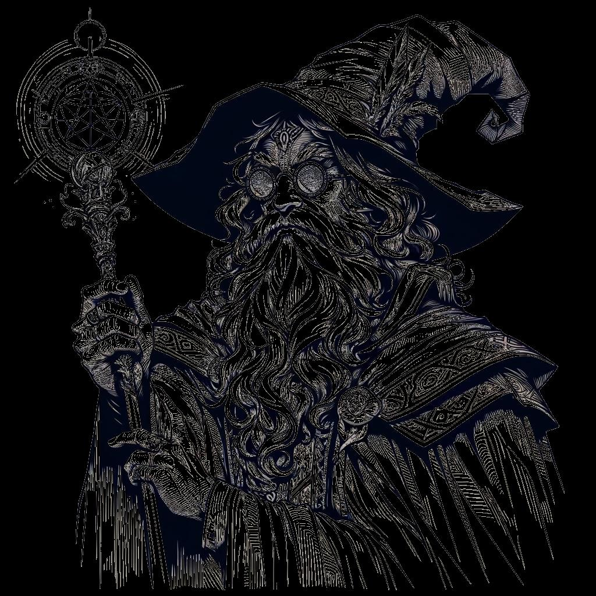

# Skills {#sec-chapter-skills}

{width="60%"}

*Illustration 14 — Skills chapter art (Arcanist class). Placeholder; final art TBD. Dimensions: 1024×1024.*



Skills represent what your hero has learned to do. When the dice hit the table, your skill bonus is what separates "I tried" from "I succeeded." Every hero picks up skills in their background and class training. The ones you invest in define how you solve problems, with a blade, with a spell, with a silver tongue, or with your fists.

Here's the core loop: the DA calls for a roll. You grab 3d6. You add the attribute that matches what you're attempting. Then you add your skill bonus, +1 for Novice, +2 for Adept, +3 for Master. The DA adds or subtracts for difficulty. Compare the total to the success tiers. Something happens. Always.



## Skill Tiers {#sec-skill-tiers}

Skills come in three tiers. Higher tiers mean bigger bonuses and unlock maneuvers, special combat or exploration techniques you can use by spending your Maneuver for the turn.

| Tier | Bonus | DP Cost (X1) | DP Cost (X2) | DP Cost (X3) |
|------|-------|-------------|-------------|-------------|
| **Novice** | +1 | 1 DP | 2 DP | 3 DP |
| **Adept** | +2 | 2 DP | 4 DP | 6 DP |
| **Master** | +3 | 3 DP | 6 DP | 9 DP |

Your class determines your cost multiplier for each skill. A Protector pays X1 for Axe Fighting and X3 for Arcana. Check each skill's card below, the X1/X2/X3 columns tell you which classes get which rates. Abilities always cost 1/2/4 DP regardless of class; their real gate is Discipline prerequisites.



## How Skills Work in Play

When you attempt something with a meaningful chance of failure and consequence, the DA sets a difficulty and you roll. The total, 3d6 + attribute + skill + difficulty modifier, determines your success tier.

| Success Tier | Total | What It Means |
|-------------|-------|---------------|
| **Weak** | 1-8 | You succeed, but there's a cost, complication, or reduced effect. |
| **Standard** | 9-14 | Clean success. You do the thing you set out to do. |
| **Strong** | 15-18+ | Exceptional success. Extra effect, bonus information, or added style. |
| **Critical** | 3-6 | Automatic Strong plus a special outcome. The table erupts. |
| **Fumble** | 3-1 | Automatic failure with a serious complication. |

### Difficulty Modifiers

The DA sets difficulty based on how hard the task is in the fiction. These numbers are subtracted from (or added to) your roll.

| Difficulty | Modifier | Example Task |
|-----------|----------|-------------|
| **Trivial** | +4 | Climbing a knotted rope. Remembering the king's name. |
| **Easy** | +2 | Picking a simple lock. Tracking a creature through mud. |
| **Standard** | +0 | Most tasks. The default difficulty. |
| **Hard** | -2 | Picking a complex lock in the dark. Lying to a suspicious guard. |
| **Very Hard** | -4 | Swimming in armor during a storm. Recalling a thousand-year-old spell. |
| **Nearly Impossible** | -6 | Climbing a sheer ice wall with no tools. Convincing the king you're his long-lost heir. |

::: {.callout-note}
## When NOT to Roll

If there's no consequence for failure and no pressure, don't roll dice. Just tell the story.

The barbarian with Brawn +2 wants to kick down a normal wooden door? It breaks. No roll. The ranger with Survival Adept wants to find edible berries in a temperate forest? They find them. No roll. Rolling dice when there's nothing at stake drains tension from the moments that *do* matter.

Roll when failure is interesting. Roll when the outcome is uncertain. Roll when the table is leaning forward, waiting to see what happens. Never roll just because the rules say there's a skill for it. The rules serve the story, not the other way around.
:::

### Worked Example: Skill in Action, Different Tiers, Different Outcomes

Makeva Quickfoot, a halfling Odd, is trying to pick the lock on a merchant's strongbox while the merchant is distracted at the front of the shop.

**The setup:** Makeva has Agility +1 and Sleight of Hand at Adept (+2). The DA rules this is Hard difficulty (-2), the lock is quality dwarven work, and she's working fast. Total modifiers: +1 (Agility) +2 (skill) -2 (difficulty) = +1.

She rolls 3d6. Let's look at three possible outcomes:

**Result A, She rolls 2, 1, 3 (total 6 + 1 = 7, Standard):** The lock clicks open with a soft *snick.* She slips the strongbox open, pockets the ledger inside, and closes it again. The merchant hasn't noticed a thing. Clean. Professional.

**Result B, She rolls 5, 6, 4 (total 15 + 1 = 16, Strong):** The lock practically opens itself. Not only does she get the ledger, but she spots a false bottom in the strongbox, a pouch of uncut gems the merchant wasn't declaring to the tax collector. Bonus loot, and bonus leverage if she ever needs it.

**Result C, She rolls 1, 2, 2 (total 5 + 1 = 6, Weak):** The lockpick snaps. The strongbox is still locked, and now there's a piece of metal visibly wedged in the mechanism. She got the ledger, barely, but the merchant is going to know someone tampered with his box the moment he checks it. The DA makes a note: *the town guard will be asking questions tomorrow.*

Same skill. Same modifiers. Three different stories, all driven by the dice.

### Worked Example: Using a Skill Maneuver in Combat

Kael, a dwarf Blade, has Blades Fighting at Adept. His Adept maneuver is **Riposte**, when an enemy misses him in melee, he can spend his reaction to counterattack.

**The fight:** Kael is squared off against a bandit captain. The captain swings, the DA rolls for the bandit's attack. Weak result: 2 damage. Kael's leather armor (DR 2) absorbs it completely. The blade scrapes off his pauldron.

**Kael:** "He missed. Riposte."

Kael spends his reaction. He makes an immediate melee attack against the captain, 3d6 + Brawn (+1) + Blades Fighting (+2). He rolls 4, 5, 4 = 13 + 3 = 16. Strong. His longsword deals 5 Strong damage. The captain's armor (DR 1) reduces it to 4.

**The fiction:** The captain overcommitted. His blade glanced off Kael's shoulder, and before he could recover his guard, Kael's sword was already sliding between his ribs. That's Riposte, you miss, you bleed.



## Skill List

| Skill | Attr | Discipline | Description |
|-------|------|-----------|-------------|
| **Athletics** | BR |, | Climbing, swimming, jumping, feats of strength |
| **Intimidation** | BR |, | Frightening foes, coercion through force |
| **Blades Fighting** | BR | Blades | Fighting with swords, daggers, and light blades |
| **Axe Fighting** | BR | Axes | Fighting with axes, hatchets, and cleaving weapons |
| **Polearms Fighting** | BR | Polearms | Fighting with spears, halberds, and reach weapons |
| **Heavy Weapon Fighting** | BR | Heavy Weapon | Fighting with greatswords, mauls, and massive weapons |
| **Unarmed Fighting** | BR | Unarmed | Fists, grappling, and improvised brawling |
| **Endurance** | FO |, | Resisting fatigue, holding breath, forced marches |
| **Survival** | FO | Animal | Tracking, foraging, navigating wilderness |
| **Resilience** | FO |, | Resisting poison, disease, extreme temperatures |
| **Acrobatics** | AG |, | Balancing, tumbling, escaping restraints |
| **Stealth** | AG |, | Sneaking, hiding, moving silently |
| **Bow Fighting** | AG | Archery | Fighting with longbows and shortbows |
| **Thrown Weapon** | AG |, | Fighting with throwing knives, axes, and javelins |
| **Crossbow Fighting** | AG |, | Fighting with crossbows |
| **Sleight of Hand** | AG |, | Pickpocketing, lockpicking, legerdemain |
| **Deception** | GU |, | Lying, bluffing, disguising intent |
| **Persuasion** | GU |, | Diplomacy, negotiation, charm |
| **Streetwise** | GU |, | Gathering information, underworld contacts |
| **Arcana** | KN | Energy | Magical knowledge, spell identification |
| **History** | KN |, | Lore, legends, past events |
| **Investigation** | KN |, | Searching, deducing, finding clues |
| **Nature** | KN | Animal | Plants, animals, natural phenomena |
| **Religion** | KN |, | Gods, rituals, divine lore |
| **Alchemy** | RE |, | Brewing potions, identifying substances |
| **Crafting** | RE |, | Smithing, woodworking, creating items |
| **Medicine** | RE | Animal | Healing, diagnosis, first aid |
| **Insight** | RE |, | Reading people, detecting lies, intuition |



{width="60%"}

*Illustration 33 — Skills chapter midpoint. Placeholder for final art. Use placeholder-section.svg dimensions: 400×300.*



## Skill Cards

Each skill card shows your *X1/X2/X3* class cost tier, then the *Novice*, *Adept*, and *Master* tiers. Adept and Master each unlock a maneuver, powered by your Maneuver for the turn, with a Discipline requirement.

DP costs per tier are shown in @sec-skill-tiers at the top of this chapter. X1 classes pay the lowest cost; X3 pay the highest.

### Blades Fighting {#sec-skill-blades-fighting}

*Brawn - Blades*

| Tier | Bonus | X1 | X2 | X3 | Maneuver |
|------|-------|----|----|----|----------|
| **Novice** | +1 | Protector, Blade, Leader | Intellect, Shepherd, Odd | Arcanist, Unbalanced |, |
| **Adept** | +2 |, |, |, | **Riposte**, Counterattack when missed in melee. Disc: Blades (2). |
| **Master** | +3 |, |, |, | **Flurry**, Second melee attack at -2. Disc: Blades (3). |

### Axe Fighting {#sec-skill-axe-fighting}

*Brawn - Axes*

| Tier | Bonus | X1 | X2 | X3 | Maneuver |
|------|-------|----|----|----|----------|
| **Novice** | +1 | Protector | Leader, Odd | Blade, Arcanist, Shepherd, Intellect, Unbalanced |, |
| **Adept** | +2 |, |, |, | **Cleave**, Drop a foe to 0 HP, carry remaining damage to adjacent enemy. Disc: Axes (2). |
| **Master** | +3 |, |, |, | **Sunder**, Next axe attack ignores 2 DR. Disc: Axes (3). |

### Polearms Fighting
*Brawn - Polearms*

| Tier | Bonus | X1 | X2 | X3 | Maneuver |
|------|-------|----|----|----|----------|
| **Novice** | +1 | Protector, Leader | Blade, Intellect, Odd | Arcanist, Shepherd, Unbalanced |, |
| **Adept** | +2 |, |, |, | **Brace**, Set vs charge. If charged before next turn, attack auto-deals Strong damage. Disc: Polearms (2). |
| **Master** | +3 |, |, |, | **Sweep**, Attack all adjacent foes with one roll. Disc: Polearms (3). |

### Heavy Weapon Fighting
*Brawn - Heavy Weapon*

| Tier | Bonus | X1 | X2 | X3 | Maneuver |
|------|-------|----|----|----|----------|
| **Novice** | +1 | Protector | Leader, Odd | Blade, Arcanist, Shepherd, Intellect, Unbalanced |, |
| **Adept** | +2 |, |, |, | **Crushing Blow**, On Standard+ hit, knock target prone. Disc: Heavy Weapon (2). |
| **Master** | +3 |, |, |, | **Grand Slam**, Attack all creatures in 10-ft cone with one roll. Disc: Heavy Weapon (3). |

### Unarmed Fighting
*Brawn - Unarmed*

| Tier | Bonus | X1 | X2 | X3 | Maneuver |
|------|-------|----|----|----|----------|
| **Novice** | +1 | Protector, Blade, Unbalanced | Shepherd, Odd, Leader | Arcanist, Intellect |, |
| **Adept** | +2 |, |, |, | **Throw**, While grappling, hurl target 10 ft. Lands prone, takes Weak unarmed damage. Disc: Unarmed (2). |
| **Master** | +3 |, |, |, | **Stunning Strike**, On Strong unarmed hit, target Stunned until end of its next turn. Disc: Unarmed (3). |

### Bow Fighting
*Agility - Archery*

| Tier | Bonus | X1 | X2 | X3 | Maneuver |
|------|-------|----|----|----|----------|
| **Novice** | +1 | Blade | Protector, Intellect, Odd, Leader, Unbalanced | Arcanist, Shepherd |, |
| **Adept** | +2 |, |, |, | **Pin Down**, Target hit with bow has disadvantage on attacks until it moves 5 ft. Disc: Archery (2). |
| **Master** | +3 |, |, |, | **Twin Shot**, Fire second arrow at same target at -2. Disc: Archery (3). |

### Thrown Weapon
*Agility - Blades or Archery*

| Tier | Bonus | X1 | X2 | X3 | Maneuver |
|------|-------|----|----|----|----------|
| **Novice** | +1 | Blade | Protector, Shepherd, Intellect, Odd, Leader, Unbalanced | Arcanist |, |
| **Adept** | +2 |, |, |, | **Ricochet**, Bounces to second target within 10 ft for half damage. Disc: Blades (1) or Archery (1). |
| **Master** | +3 |, |, |, | **Crippling Throw**, On Standard+ hit, target's movement halved until end of its next turn. Disc: Blades (2) or Archery (2). |

### Crossbow Fighting
*Agility - Archery*

| Tier | Bonus | X1 | X2 | X3 | Maneuver |
|------|-------|----|----|----|----------|
| **Novice** | +1 |, | Protector, Blade, Shepherd, Intellect, Odd, Leader, Unbalanced | Arcanist |, |
| **Adept** | +2 |, |, |, | **Steady Aim**, Next crossbow shot ignores cover penalties. Disc: Archery (1). |
| **Master** | +3 |, |, |, | **Penetrating Bolt**, Bolt pierces target; creature behind takes half damage. Disc: Archery (2). |

### Athletics
*Brawn - , *

| Tier | Bonus | X1 | X2 | X3 | Maneuver |
|------|-------|----|----|----|----------|
| **Novice** | +1 | Protector | Blade, Shepherd, Intellect, Odd, Leader, Unbalanced | Arcanist |, |
| **Adept** | +2 |, |, |, | **Powerful Leap**, Double jump distance this turn. |
| **Master** | +3 |, |, |, | **Unstoppable**, Ignore difficult terrain and cannot be slowed this turn. |

### Endurance
*Fortitude - , *

| Tier | Bonus | X1 | X2 | X3 | Maneuver |
|------|-------|----|----|----|----------|
| **Novice** | +1 | Protector | Blade, Arcanist, Shepherd, Intellect, Odd, Leader, Unbalanced |, |, |
| **Adept** | +2 |, |, |, | **Shake It Off**, Automatically succeed on a save vs poison or disease. |
| **Master** | +3 |, |, |, | **Second Wind**, Regain HP equal to Fortitude + level. Once per combat. |

### Survival
*Fortitude - Animal*

| Tier | Bonus | X1 | X2 | X3 | Maneuver |
|------|-------|----|----|----|----------|
| **Novice** | +1 | Shepherd | Protector, Blade, Arcanist, Intellect, Odd, Leader, Unbalanced |, |, |
| **Adept** | +2 |, |, |, | **Tracker's Eye**, Learn direction and distance of a creature that passed within the last hour. Disc: Animal (1). |
| **Master** | +3 |, |, |, | **Ambush**, Become hidden. Remain hidden until you attack, cast, or move. Disc: Animal (2). |

### Resilience
*Fortitude - , *

| Tier | Bonus | X1 | X2 | X3 | Maneuver |
|------|-------|----|----|----|----------|
| **Novice** | +1 | Protector, Leader | Blade, Arcanist, Shepherd, Intellect, Odd, Unbalanced |, |, |
| **Adept** | +2 |, |, |, | **Iron Will**, Reroll a failed save vs fear or charm. |
| **Master** | +3 |, |, |, | **Unbroken**, Ignore one condition (Frightened, Poisoned, or Stunned) for 1 round. |

### Acrobatics
*Agility - , *

| Tier | Bonus | X1 | X2 | X3 | Maneuver |
|------|-------|----|----|----|----------|
| **Novice** | +1 | Blade, Odd | Protector, Arcanist, Shepherd, Intellect, Leader, Unbalanced |, |, |
| **Adept** | +2 |, |, |, | **Tumble**, Move through an enemy's space without provoking. |
| **Master** | +3 |, |, |, | **Evasion**, On successful save vs area effect, take no damage instead of half. |

### Stealth
*Agility - , *

| Tier | Bonus | X1 | X2 | X3 | Maneuver |
|------|-------|----|----|----|----------|
| **Novice** | +1 | Blade, Odd | Protector, Shepherd, Intellect, Leader, Unbalanced | Arcanist |, |
| **Adept** | +2 |, |, |, | **Vanish**, Attempt Stealth check to hide even while observed. |
| **Master** | +3 |, |, |, | **Shadow Step**, Move 20 ft to any shadow or concealed position. No opportunity attacks. |

### Sleight of Hand
*Agility - , *

| Tier | Bonus | X1 | X2 | X3 | Maneuver |
|------|-------|----|----|----|----------|
| **Novice** | +1 | Blade, Odd | Protector, Arcanist, Shepherd, Intellect, Leader, Unbalanced |, |, |
| **Adept** | +2 |, |, |, | **Quick Draw**, Draw and use an item as part of the same maneuver. |
| **Master** | +3 |, |, |, | **Disarm**, Opposed check to knock held item from target's grasp. |

### Deception
*Guile - , *

| Tier | Bonus | X1 | X2 | X3 | Maneuver |
|------|-------|----|----|----|----------|
| **Novice** | +1 | Blade, Odd, Unbalanced | Protector, Arcanist, Shepherd, Intellect, Leader |, |, |
| **Adept** | +2 |, |, |, | **Feint**, Next attack against you before your next turn is at disadvantage. |
| **Master** | +3 |, |, |, | **Double Bluff**, On Standard+ Deception check, target believes lie for 1 minute, no further checks. |

### Persuasion
*Guile - , *

| Tier | Bonus | X1 | X2 | X3 | Maneuver |
|------|-------|----|----|----|----------|
| **Novice** | +1 | Leader | Protector, Blade, Arcanist, Shepherd, Intellect, Odd, Unbalanced |, |, |
| **Adept** | +2 |, |, |, | **Rally**, One ally within 30 ft loses Frightened. |
| **Master** | +3 |, |, |, | **Command**, One ally within 30 ft takes an immediate move action. |

### Streetwise
*Guile - , *

| Tier | Bonus | X1 | X2 | X3 | Maneuver |
|------|-------|----|----|----|----------|
| **Novice** | +1 | Odd | Protector, Blade, Arcanist, Shepherd, Intellect, Leader, Unbalanced |, |, |
| **Adept** | +2 |, |, |, | **Contacts**, Once per session, "know a person" for info, shelter, or a small favor. |
| **Master** | +3 |, |, |, | **Read the Room**, Instantly assess social power dynamics: authority, lies, exits. |

### Arcana
*Knowledge - Energy*

| Tier | Bonus | X1 | X2 | X3 | Maneuver |
|------|-------|----|----|----|----------|
| **Novice** | +1 | Arcanist, Intellect, Unbalanced | Shepherd, Odd, Leader | Protector, Blade |, |
| **Adept** | +2 |, |, |, | **Identify Spell**, Learn spell being cast within 60 ft: name, tier, school. Disc: Energy (1). |
| **Master** | +3 |, |, |, | **Counterspell**, Reaction + maneuver. Arcana check vs 7 + spell tier to disrupt casting. Disc: Energy (2). |

### History
*Knowledge - , *

| Tier | Bonus | X1 | X2 | X3 | Maneuver |
|------|-------|----|----|----|----------|
| **Novice** | +1 | Arcanist, Intellect | Protector, Blade, Shepherd, Odd, Leader, Unbalanced |, |, |
| **Adept** | +2 |, |, |, | **Lore Recall**, Recall a relevant historical fact, legend, or piece of ancient knowledge. |
| **Master** | +3 |, |, |, | **Known Weakness**, DA reveals one vulnerability, resistance, or special ability of a creature known to legend. |

### Investigation
*Knowledge - , *

| Tier | Bonus | X1 | X2 | X3 | Maneuver |
|------|-------|----|----|----|----------|
| **Novice** | +1 | Arcanist, Intellect | Protector, Blade, Shepherd, Odd, Leader, Unbalanced |, |, |
| **Adept** | +2 |, |, |, | **Eye for Detail**, Automatically spot one hidden clue, secret door, or concealed creature. |
| **Master** | +3 |, |, |, | **Deduction**, DA provides one coherent insight connecting gathered evidence. |

### Nature
*Knowledge - Animal*

| Tier | Bonus | X1 | X2 | X3 | Maneuver |
|------|-------|----|----|----|----------|
| **Novice** | +1 | Shepherd | Arcanist, Intellect, Odd, Unbalanced | Protector, Blade, Leader |, |
| **Adept** | +2 |, |, |, | **Beast Lore**, Identify creature's type, abilities, and vulnerabilities. Disc: Animal (1). |
| **Master** | +3 |, |, |, | **Commune**, Speak with a natural beast for 1 minute. Disc: Animal (2). |

### Religion
*Knowledge - Religion*

| Tier | Bonus | X1 | X2 | X3 | Maneuver |
|------|-------|----|----|----|----------|
| **Novice** | +1 | Shepherd | Intellect, Odd, Leader, Unbalanced | Protector, Blade, Arcanist |, |
| **Adept** | +2 |, |, |, | **Blessing**, One ally within 30 ft gains +1 on all rolls until start of your next turn. |
| **Master** | +3 |, |, |, | **Smite**, Next attack deals bonus radiant damage equal to your Knowledge. |

### Alchemy
*Reason - , *

| Tier | Bonus | X1 | X2 | X3 | Maneuver |
|------|-------|----|----|----|----------|
| **Novice** | +1 | Arcanist | Shepherd, Intellect, Odd, Unbalanced | Protector, Blade, Leader |, |
| **Adept** | +2 |, |, |, | **Quick Mix**, Identify a potion, poison, or substance by taste/smell. Quickly mix a simple remedy. |
| **Master** | +3 |, |, |, | **Alchemical Bomb**, Hurl explosive up to 30 ft. 2d6 elemental (fire/acid/frost) in 10-ft radius. |

### Crafting
*Reason - , *

| Tier | Bonus | X1 | X2 | X3 | Maneuver |
|------|-------|----|----|----|----------|
| **Novice** | +1 |, | Protector, Blade, Arcanist, Shepherd, Intellect, Odd, Leader, Unbalanced |, |, |
| **Adept** | +2 |, |, |, | **Field Repair**, Temporarily restore a broken weapon, armor, or tool for the encounter. |
| **Master** | +3 |, |, |, | **Jury-Rig**, Improvise a simple trap, barricade, or device. Lasts until end of scene. |

### Medicine
*Reason - Animal*

| Tier | Bonus | X1 | X2 | X3 | Maneuver |
|------|-------|----|----|----|----------|
| **Novice** | +1 | Shepherd, Intellect | Protector, Blade, Arcanist, Odd, Leader, Unbalanced |, |, |
| **Adept** | +2 |, |, |, | **Field Dressing**, Adjacent ally stabilizes (if dying) or regains 1d6 HP. Disc: Animal (1). |
| **Master** | +3 |, |, |, | **Battlefield Surgery**, Remove one condition from adjacent ally, or heal 3d6 HP. Disc: Animal (2). |

### Insight
*Reason - , *

| Tier | Bonus | X1 | X2 | X3 | Maneuver |
|------|-------|----|----|----|----------|
| **Novice** | +1 | Unbalanced | Protector, Blade, Arcanist, Shepherd, Intellect, Odd, Leader |, |, |
| **Adept** | +2 |, |, |, | **Read Intent**, Learn target's next intended action (attack, flee, cast, negotiate). |
| **Master** | +3 |, |, |, | **Perfect Counter**, Choose a creature. Its next attack against you is at disadvantage. |

### Intimidation
*Brawn - , *

| Tier | Bonus | X1 | X2 | X3 | Maneuver |
|------|-------|----|----|----|----------|
| **Novice** | +1 | Protector, Unbalanced | Blade, Shepherd, Intellect, Odd, Leader | Arcanist |, |
| **Adept** | +2 |, |, |, | **Menacing Glare**, One foe within 30 ft must make an immediate Morale Check. |
| **Master** | +3 |, |, |, | **Terrifying Presence**, All foes within 30 ft make a Morale Check at disadvantage. |
