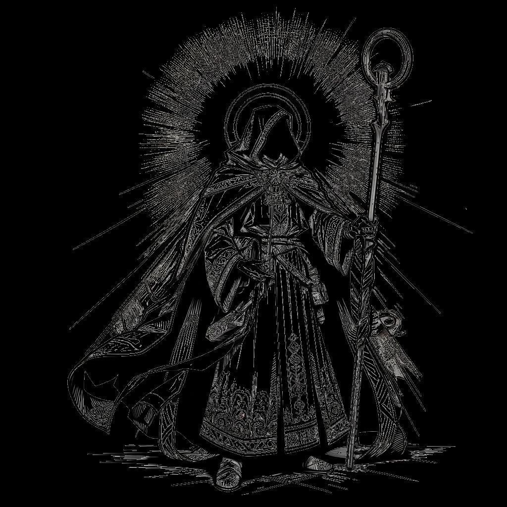

# Disciplines {#sec-chapter-disciplines}

{width="60%"}

*Illustration 15 — Disciplines chapter art (Shepherd class). Placeholder; final art TBD. Dimensions: 1024×1024.*



Disciplines are the signature mechanic of *Heroes of Legend.* They're how the game knows what your hero has mastered. Not just skills, *domains of power.* Fire. Blades. Protection. The forces and forms your character has attuned to through training, study, or sheer stubborn repetition.

Here's the important part: **Disciplines are prerequisites, not rolls.** You don't roll your Fire Discipline. You don't add your Blades Discipline to an attack. Disciplines are the gate, you need them to *unlock* skills, abilities, and talents. Once you've got them, they represent permanent mastery. No expiration. No forgetting.



## What Are Disciplines?

A Discipline represents a domain of expertise or power your hero has internalized. It's the difference between "I picked up a sword once" and "I've trained with blades for ten years." Between "I read a book about fire" and "Fire answers when I call."

**Example:** A warrior with 3 Blade Disciplines has spent years mastering swords, every angle, every grip, every weakness in every guard. A mage with 3 Fire Disciplines doesn't just cast flames, they *understand* flame, the way a shipwright understands wood. A ranger with 2 Animal Disciplines has bonded with the wild in ways city-folk will never comprehend.

You don't roll Disciplines. You *collect* them. They're permanent markers on your character sheet that say: "I've earned this."



## The Discipline Taxonomy

| Category | Discipline | Represents |
|----------|-----------|------------|
| **Elemental** | **Fire** | Flame, heat, passion, destruction |
| | **Earth** | Stone, stability, endurance, crafting |
| | **Wind** | Air, speed, storms, precision |
| | **Water** | Ice, flow, healing, adaptation |
| **Weapon** | **Blades** | Swords, daggers, finesse and precision |
| | **Axes** | Axes, cleavers, brutal chopping power |
| | **Polearms** | Spears, halberds, reach and control |
| | **Archery** | Bows, crossbows, ranged precision |
| | **Heavy Weapon** | Greatswords, greataxes, mauls, two-handed power |
| | **Unarmed** | Fists, gauntlets, grappling, close-quarters combat |
| **Defense** | **Protection** | Shields, warding, guarding allies |
| | **Armor** | Heavy armor proficiency, damage soaking |
| **Primal** | **Animal** | Beasts, nature, shapeshifting, instinct |
| **Arcane** | **Energy** | Raw magical force, metamagic, spellcraft |

Fourteen Disciplines. Five categories. Your hero's path through them defines everything they can do.



## Acquiring Disciplines

### Starting Disciplines

Every character begins with **3 General Disciplines.** These are flexible, they can substitute for any specific Discipline at the Novice tier. Need 1 Fire for a Firebolt? A General Discipline covers it. Need 2 Fire for a Fireball? That's Adept, you need the real thing. General Disciplines get you started, but they won't carry you to mastery.

### Class Disciplines

Your class hands you specific Disciplines at creation. These are your foundation, what your training, tradition, or sheer talent has already taught you:

| Class | Starting Disciplines |
|-------|---------------------|
| Protector | 2 Armor, 2 Protection |
| Blade | 3 Blades |
| Arcanist | 2 Fire, 1 Energy, 1 Wind (or any 4 elemental) |
| Shepherd | 2 Protection, 2 Animal |
| Intellect | 3 of any type (flexible) |
| Odd | 3 of any type, must be from different categories |
| Leader | 2 Protection, 1 Energy, 1 any |
| Unbalanced | 2 of one type, 2 of its opposite (Fire/Water or Earth/Wind) |

### Progression

At levels 3, 6, 9, 12, 15, and 18, you gain one additional Discipline of your choice. Class-favored Disciplines, the ones your class gave you at creation, are always available. Cross-class Disciplines may require narrative justification or story events. Want your Blade to pick up Fire? Make it a story. Find a mentor. Touch a primordial flame. Earn it.

### Magic Items

Rare magic items may grant temporary or permanent Disciplines while attuned or wielded. A *Sword of the Phoenix* might grant +1 Fire Discipline in your hands. Set it down, lose the power. These items are treasures, and the DA should make you work for them.



## Disciplines as Prerequisites

Skills, abilities, and talents require specific Disciplines before you can learn them. No Disciplines, no purchase. It's that simple.

| Skill/Ability | Disciplines Required | Tier |
|--------------|---------------------|------|
| Longsword | 2 Blades | Adept |
| Dagger | 1 Blade | Novice |
| Greataxe | 2 Axes | Adept |
| Fireball | 2 Fire + 1 Energy | Adept |
| Volcanic Eruption | 3 Fire + 1 Earth | Master |
| Chain Mail | 2 Armor | Novice |
| Shield Block | 1 Protection | Novice |
| Animal Companion | 2 Animal | Adept |
| Magic Missile | 1 Energy | Novice |
| Counterspell | 2 Energy + 1 Reason | Adept |

### General Disciplines Substitution

General Disciplines substitute for specific Disciplines at Novice tier (1:1). At Master tier, two General Disciplines may substitute for one specific Discipline (2:1). General Disciplines cannot substitute at the Adept tier.

Need 1 Fire for Firebolt? A General covers it. Need 2 Fire for Fireball at Adept? You need the real thing, no substitutions. Need 3 Fire and 1 Earth for Volcanic Eruption but you only have 3 Fire? Two Generals stand in for that Earth, and the volcano answers. General gets you in the door. Adept demands commitment. Master rewards cleverness, but charges double for shortcuts.



## Worked Example: Building a Fire Mage

Kael wants to burn the world. He's an Arcanist, his class gives him 2 Fire and 1 Energy at creation, plus 3 General Disciplines.

**Novice (Firebolt):** Requires 1 Fire. Kael has 2 Fire. He qualifies without even touching his Generals. Firebolt is his immediately.

**Adept (Fireball):** Requires 2 Fire + 1 Energy. Kael has exactly that, 2 Fire, 1 Energy. He qualifies at creation. Most casters need levels to reach Adept. Arcanists start closer to the flame.

**Master (Volcanic Eruption):** Requires 3 Fire + 1 Earth. Kael's got 2 Fire and 1 Energy, he needs 1 more Fire and 1 Earth. Under the old system, this took twelve levels. Now? Two paths open to him.

*Path of the Patient:* At level 3, Kael takes Fire, now 3 Fire, 1 Energy. At level 6, he takes Earth, now 3 Fire, 1 Earth, 1 Energy. He qualifies for Volcanic Eruption at level 6, with all three General Disciplines still in his pocket for other pursuits. He could branch into Protection for defense, Animal for a familiar, or bank them for cross-class talents. Six levels to master volcanic fury, and he's still got room to grow.

*Path of the Specialist:* At level 3, Kael takes Fire, now 3 Fire, 1 Energy. He needs 1 Earth. At the Master tier, two General Disciplines substitute for one specific Discipline. Kael spends 2 of his 3 Generals to cover the Earth requirement. He qualifies for Volcanic Eruption at level 3, but he's burned most of his flexibility getting there fast.

Two paths. Same destination. One leaves you options. The other gets you there first. Both are valid. Both are *earned.*

That's the Discipline system working as intended. Master spells should be achievable before your campaign's final act, but they should still mean something when you cast them. A level 6 Volcanic Eruption says "I committed to this." A level 3 Volcanic Eruption says "I committed to this *and nothing else.*" Either way, when Kael calls down the mountain's fury, everyone at the table knows he paid for it.
