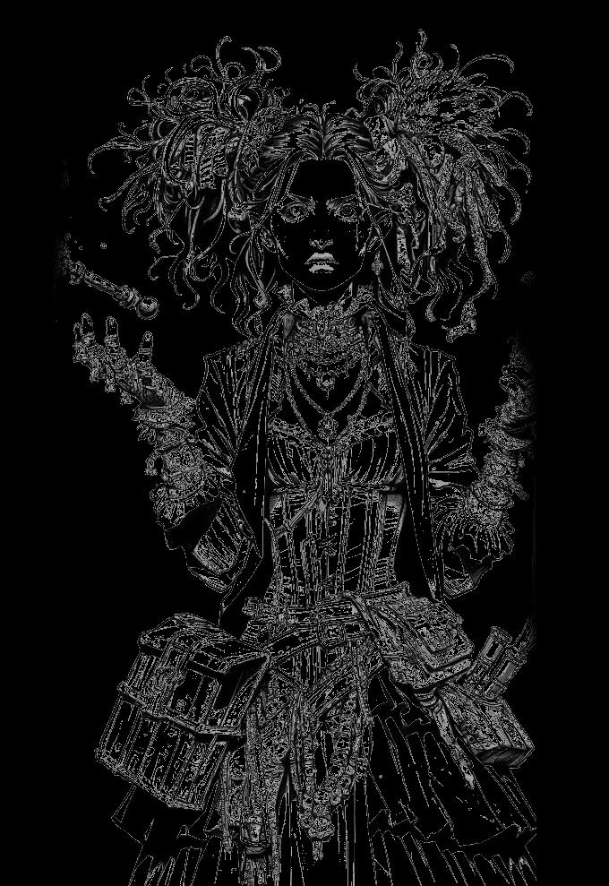

# Magic System {#sec-chapter-magic-system}

{width="60%"}

*Illustration 17 — Magic system chapter art (Odd class). Placeholder; final art TBD. Dimensions: 680×989.*



Let's get one thing straight before we start: in *Heroes of Legend*, magic always fires. Always. No spell slots. No mana pool. No "sorry, I used my good spell already." When you cast, the magic happens. Your fire burns until *you* decide it stops. The only question is how hard.

This changes everything about playing a caster. You're never useless. You're never out of options. Every round, you have something to do, and that something will have an effect.



## Always Fires: The Core Rule

You don't roll to cast. You roll to determine *effect strength.* The spell goes off. The magic flows. Your 3d6 roll tells you whether the result is a sputter, a blast, or an inferno.

Every spell in this game has three outcomes built right into its stat block:

- **Weak:** The spell fires but underperforms. The firebolt singes instead of ignites. The heal knits flesh but leaves a scar. You got the job done, barely.
- **Standard:** Clean, expected result. Professional spellwork. This is what the spell was designed to do, and you did it.
- **Strong:** The magic surges. Extra damage, bonus effects, wider areas. The spell doesn't just work, it *dominates.* This is why you became a caster.

That's it. One roll. Three outcomes. No separate casting check, no concentration roll, no spell failure percentage. Roll 3d6 + Knowledge + relevant skill. Read the result. Magic happens.



## Spell Chains: Novice ? Adept ? Master

Spells don't exist in isolation. They're organized into **chains**, three-tier progressions where each spell builds on the one before it. You start with the Novice version. You earn the Adept. You aspire to the Master.

| Chain | Novice | Adept | Master |
|-------|--------|-------|--------|
| Fire Magic | Firebolt | Fireball | Volcanic Eruption |
| Ice Magic | Ray of Frost | Ice Storm | Cone of Cold |
| Lightning | Shocking Grasp | Lightning Bolt | Chain Lightning |
| Healing | Cure Wounds | Prayer of Healing | Mass Heal |
| Protection | Shield | Magic Circle | Globe of Invulnerability |
| Charm | Charm Person | Suggestion | Dominate Person |
| Illusion | Minor Illusion | Mirror Image | Greater Invisibility |
| Necromancy | Chill Touch | Animate Dead | Finger of Death |
| Divination | Detect Magic | Clairvoyance | True Seeing |
| Transmutation | Enlarge/Reduce | Polymorph | Time Stop |

Every chain follows the same logic: Novice is your workhorse, Adept is your heavy hitter, Master is your "everyone remember where we parked the horses" moment.



## Discipline Prerequisites

Spells don't care about your level. They care about your **Disciplines.** Want to throw a Fireball? You need 2 Fire and 1 Energy, not "level 5 wizard." The Discipline system follows a clean doubling progression: **Novice spells require 1 Discipline, Adept require 2, Master require 4.** A dedicated caster can reach Adept spells at creation and Master spells by level 6, or even level 3, if they're willing to pay the General premium.

At the Master tier, one additional rule applies: **no single Discipline type may exceed 3.** Every Master spell blends at least two types. Volcanic Eruption isn't just "more fire", it's fire and earth working together. This ensures Master spells represent broad magical mastery, not narrow specialization.

General Disciplines follow a tiered substitution rule: at Novice, one General substitutes for one specific Discipline (1:1). At Master, two General Disciplines substitute for one specific Discipline (2:1). General Disciplines cannot substitute at the Adept tier. This means a clever caster can reach Master spells early by burning General Disciplines, but it's expensive, and those Generals won't be available for other pursuits.

| Spell | Tier | Discipline Req | Effect Range (W / S / St) |
|-------|------|---------------|--------------------------|
| Firebolt | Novice | 1 Fire | W: 2 / S: 3 / St: 5 + ignite |
| Fireball | Adept | 2 Fire + 1 Energy | W: 6 (5ft) / S: 9 (15ft) / St: 12 (20ft) |
| Volcanic Eruption | Master | 3 Fire + 1 Earth | W: 9 (20ft) / S: 15 (30ft) / St: 21 (40ft) + terrain hazard |

Look at that jump from Firebolt to Volcanic Eruption. One Discipline. Two Disciplines. Four Disciplines. Novice spells are tools. Adept spells are weapons. Master spells are *events.* The Discipline requirements make sure you earn the difference, but they don't make you wait half a campaign to do it.



## Cantrips

Cantrips are the spells you learn before you learn "real" spells. Minor magic. Parlor tricks that grew teeth.

Cantrips require **no Discipline prerequisites.** Every caster knows all cantrips in their tradition, arcane or divine. These are your at-will abilities: *Prestidigitation, Light, Mage Hand, Thaumaturgy, Guidance.* Small effects. Infinite uses. No roll required unless the cantrip says otherwise.

They won't win a fight. They'll start one, or end one creatively. Never underestimate a caster who knows exactly what their cantrips can do.



## Arcane vs. Divine Magic

Two traditions. Two philosophies. Same engine underneath.

**Arcane** (Arcanist, Odd, Unbalanced): Fire, Wind, Water, Earth, and Energy spells. Arcane casters manipulate natural forces through study, talent, or sheer force of will. They're scientists of the impossible, or artists of the unstable. Damage is their language. Destruction is their punctuation.

**Divine** (Shepherd, some Leaders): Protection, Animal, Life, and Religion spells. Divine casters channel power from a higher source, gods, nature, ancestors, the light between stars. They heal. They ward. They burn what shouldn't exist, like undead and demons. Their magic is a relationship, not a formula.

Some classes blur the line. The Odd steals from both traditions. The Unbalanced channels opposing elements through their own body. The game doesn't build walls between arcane and divine, it just asks what you're willing to pay.



## Limitations

Magic is powerful. That's the point. But there are brakes. Not to frustrate you, to make your biggest spells feel like *moments.*

**Per-Encounter:** Adept and Master spells can only be used once per combat. You can't chain-cast Fireball every round. Choose your moment. Make it count.

**Per-Session:** Master-tier spells are once per session. When you unleash Volcanic Eruption or Time Stop, the table should go quiet. These spells reshape encounters. They're not your default attack, they're your signature. Use them when it matters most.

**Concentration:** Some ongoing spells, illusions, wards, enchantments, require concentration. You can only maintain one concentration spell at a time. If you take damage while concentrating, make a Fortitude save to hold the spell together. Concentration is about focus. Lose focus, lose the spell.

::: {.callout-note}
## Why Limits on Master Spells?

I've seen what happens when a caster can drop their biggest spell every round. Combat becomes a fireworks display with no tension. The Blades and Protectors might as well put their dice away.

The per-session limit on Master spells isn't about resource management, it's about spotlight management. When you cast Volcanic Eruption, *everyone* should remember it. That means you can't do it three times before lunch.

The Veteran Adventurer
:::



## Worked Example: Casting a Fireball

Lyra is an Odd with 2 Fire and 1 Energy. She's facing a cluster of goblins huddled behind a barricade. Time for a Fireball.

**The roll:** Lyra's Knowledge is +1, and she has Arcana at Adept (+2). The goblins are packed tight, Standard difficulty, no modifier. She rolls 3d6: 5, 3, 4 = 12. Plus 1 (Knowledge), plus 2 (Arcana) = 15. *Strong.*

**The effect:** Fireball's Strong damage is 12 in a 20-foot radius. Everything in that circle takes 12 fire damage unless it has resistance. The goblins have no armor and no resistance. Four goblins, twelve damage each. The barricade, wooden, dry, catches fire. The goblins' formation collapses into screaming chaos.

**The aftermath:** The Fireball is per-encounter. Lyra won't cast it again this fight. But she doesn't need to. She just cleared the room. Now she draws her dagger and lets the Protector handle cleanup while she looks for her next opening.

That's how magic works in *Heroes of Legend.* No "sorry, I missed." No "I'm out of mana." Just one roll, one result, and a room full of consequences.
