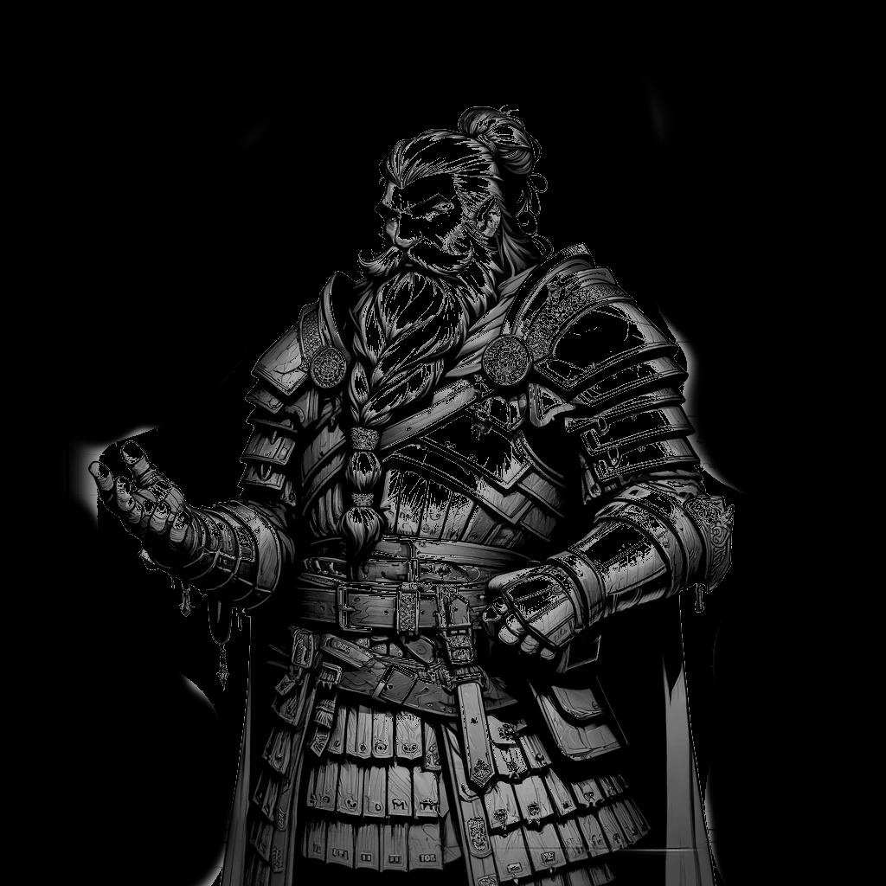

# Arcane Spells {#sec-chapter-arcane-spells}

{width="60%"}

*Illustration 18 — Arcane spells chapter art (Leader class). Placeholder; final art TBD. Dimensions: 1024×1024.*



Fire is the first magic. It's the magic of anger, of hunger, of the campfire that keeps the dark at bay. Every mage starts with fire, and most never stop.

But fire's just the beginning. Ice that freezes blood in the veins. Lightning that jumps from foe to foe like it's choosing favorites. Acid that doesn't just burn, it *unmakes.* Force magic that hits like a battering ram made of pure will. Illusions that make trained soldiers stab at shadows. The cold arithmetic of necromancy. The whisper that becomes a command. The body reshaped into something faster, harder, deadlier.

Arcane magic is the art of telling the universe to sit down and shut up, and making it listen. You don't ask. You don't pray. You *impose.*

This chapter contains every arcane spell in the game. They're organized by element, then by chain. Each chain is a path: Novice to Adept to Master. Walk it. Earn it. Then set the world on fire.

*See @sec-chapter-magic-system for how spellcasting works.*



## Arcane Cantrips

Cantrips are minor spells. The magic you learn before you learn *real* magic. They don't require Disciplines, they don't cost anything to learn, and you can cast them as often as you like, at-will, every round, all day. Every arcane caster knows all of these.

They won't win a fight by themselves. But they'll start one, end one, or change the terms of one. Never underestimate a caster who knows exactly what their cantrips can do.

### Arcane Mark (Cantrip)
**Disciplines:** None
**Casting Time:** 1 action
**Range:** Touch
**Duration:** Permanent until dispelled
**Target:** One surface or object

**Description:** You inscribe your personal sigil, invisible to normal sight, onto any surface. The mark is unique to you. It can be made visible with a word, and it glows under magical detection.

| Outcome | Effect |
|---------|--------|
| Weak (1-8) | The mark is faint. Detection spells reveal it, but the image is blurry. |
| Standard (9-14) | Clean, permanent mark. Visible on command, unmistakably yours. |
| Strong (15-18+) | The mark is flawless. You may also sense when any creature touches it within 100 feet for the next 24 hours. |

*Your signature on the world. Some mages use it to claim territory. Some to leave messages. Some to remind an enemy who burned their house down.*

### Dancing Lights (Cantrip)
**Disciplines:** None
**Casting Time:** 1 action
**Range:** 60 feet
**Duration:** Concentration, up to 1 minute
**Target:** Up to 4 points in range

**Description:** You create up to four torch-bright orbs of light that hover and move at your command. Each sheds light in a 10-foot radius. You can combine them into a single glowing humanoid shape.

| Outcome | Effect |
|---------|--------|
| Weak (1-8) | Two dim orbs. Light radius halved. They flicker. |
| Standard (9-14) | Four bright orbs or one glowing shape. Full control of movement. |
| Strong (15-18+) | The lights are dazzling. One creature of your choice within the light radius has disadvantage on its next attack. |

*Better than a torch. Worse than a fireball. But they don't go out in the rain, and they'll follow you down any hole you're stupid enough to climb into.*

### Frost Touch (Cantrip)
**Disciplines:** None
**Casting Time:** 1 action
**Range:** Touch
**Duration:** Instantaneous
**Target:** One creature or object

**Description:** Your hand erupts in freezing cold. A creature you touch takes 1d6 ice damage. A liquid you touch freezes solid in a 1-foot cube for 1 minute. A small object becomes brittle.

| Outcome | Effect |
|---------|--------|
| Weak (1-8) | 1d4 ice damage. Liquid chills but doesn't freeze. |
| Standard (9-14) | 1d6 ice damage. Liquid freezes solid. |
| Strong (15-18+) | 1d6+2 ice damage. Target's next physical action has disadvantage as cold numbs their limbs. |

*The first spell every ice mage learns. Touch a lock. Touch a rope. Touch a throat. Cold solves problems heat can't.*

### Ghost Sound (Cantrip)
**Disciplines:** None
**Casting Time:** 1 action
**Range:** 30 feet
**Duration:** Concentration, up to 1 minute
**Target:** One point in range

**Description:** You create a sound that originates from a point you choose, footsteps, a whispered voice, a door slamming, a growl. The sound can be as quiet as a breath or as loud as a scream.

| Outcome | Effect |
|---------|--------|
| Weak (1-8) | One brief, obvious sound. Anyone listening gets a Reason check to recognize it as magical. |
| Standard (9-14) | Sustained or repeating sounds. Believable enough to distract or mislead. |
| Strong (15-18+) | Complex audio, a full sentence in a recognizable voice, or a soundscape (approaching guards, a wolf pack circling). |

*The oldest trick in the book. Still works. Guards have been chasing phantom footsteps since the first wizard figured out this spell, and guards will be chasing them long after you're dust.*

### Mage Hand (Cantrip)
**Disciplines:** None
**Casting Time:** 1 action
**Range:** 30 feet
**Duration:** Concentration, up to 1 minute
**Target:** One unattended object up to 10 pounds

**Description:** A spectral, floating hand appears at a point you choose. It can manipulate objects, open doors, pull levers, or deliver items. The hand can't attack or activate magic items.

| Outcome | Effect |
|---------|--------|
| Weak (1-8) | The hand is clumsy. Fine manipulation fails. Objects may be dropped. |
| Standard (9-14) | Precise control. The hand can turn keys, pour liquids, or lift up to 10 pounds. |
| Strong (15-18+) | The hand is preternaturally deft. It can pick pockets, disarm simple traps, or deliver a potion to an ally's lips mid-combat. |

*You will use this spell more than any other. You will open things you shouldn't open. You will touch things you shouldn't touch. You will learn. Or you won't.*

### Prestidigitation (Cantrip)
**Disciplines:** None
**Casting Time:** 1 action
**Range:** 10 feet
**Duration:** Up to 1 hour
**Target:** See below

**Description:** The workhorse of minor magic. You may produce one of the following effects at a time: light or snuff a candle, clean or soil an object, chill or warm a drink, create a harmless sensory effect (a shower of sparks, a faint breeze, a whisper of perfume), or color a small object for 1 hour. You can have up to three non-instantaneous effects active at once.

| Outcome | Effect |
|---------|--------|
| Weak (1-8) | One effect. It's crude, the sparks are dull, the cleaning is smeary. |
| Standard (9-14) | Up to three simultaneous effects. Each works exactly as intended. |
| Strong (15-18+) | Your effects are especially vivid or lasting. The perfume lingers for hours. The sparks are bright enough to briefly distract. The cleaning removes stains that have been there for years. |

*This is the spell that separates wizards from lantern-bearers. Anyone can throw fire. Making a goblin warlord's dinner taste like ashes from thirty feet away? That's art.*

### Spark (Cantrip)
**Disciplines:** None
**Casting Time:** 1 action
**Range:** 30 feet
**Duration:** Instantaneous
**Target:** One flammable object

**Description:** You snap your fingers and produce a pinpoint of intense heat. It ignites one flammable object that isn't being worn or carried, paper, dry wood, oil, cloth, gunpowder.

| Outcome | Effect |
|---------|--------|
| Weak (1-8) | The object smolders. It may catch fire after 1 round if left alone. |
| Standard (9-14) | Immediate ignition. The object catches fire and burns normally. |
| Strong (15-18+) | The flame leaps. Adjacent flammable objects also catch fire. |

*Every Pyromancer's first spell. Also their last, if they're not careful about where they point it. Fire doesn't care about your intentions. Fire cares about what's flammable.*

### Static Shock (Cantrip)
**Disciplines:** None
**Casting Time:** 1 action
**Range:** 30 feet
**Duration:** Instantaneous
**Target:** One creature

**Description:** A spark of electricity arcs from your fingertip to the target. Deals 1d6 lightning damage. Metal-armored targets take +1 damage.

| Outcome | Effect |
|---------|--------|
| Weak (1-8) | 1d4 lightning damage. The target feels a tingle. |
| Standard (9-14) | 1d6 lightning damage. +1 vs. metal armor. |
| Strong (15-18+) | 1d6+2 lightning damage. The spark chains to one additional target within 10 feet for half damage. |

*The crackle before the storm. Doesn't look like much. Hurts more than it looks. Aim for the one in plate.*

### Acid Splash (Cantrip)
**Disciplines:** None
**Casting Time:** 1 action
**Range:** 30 feet
**Duration:** Instantaneous
**Target:** One creature or object

**Description:** You hurl a glob of corrosive acid. Deals 1d6 acid damage. Against objects, the acid ignores 1 point of hardness.

| Outcome | Effect |
|---------|--------|
| Weak (1-8) | 1d4 acid damage. The acid sizzles weakly. |
| Standard (9-14) | 1d6 acid damage. Ignores 1 hardness against objects. |
| Strong (15-18+) | 1d6+2 acid damage. The acid clings, target takes 1d4 additional acid damage at the start of its next turn. |

*Not flashy. Not dramatic. But acid doesn't care how thick your armor is. It finds the gaps. It always finds the gaps.*

### Whisper (Cantrip)
**Disciplines:** None
**Casting Time:** 1 action
**Range:** 120 feet
**Duration:** Instantaneous
**Target:** One creature you can see

**Description:** You send a short message, up to 25 words, directly into the mind of a creature you can see. The target recognizes you as the sender if it knows you. The target cannot reply.

| Outcome | Effect |
|---------|--------|
| Weak (1-8) | The message is garbled. Key words may be lost. |
| Standard (9-14) | Clear message. 25 words, perfectly delivered. |
| Strong (15-18+) | The message carries emotional weight, urgency, calm, menace. The target understands not just the words but the intent behind them. |

*No hand signals. No shouting across a crowded room. Just your voice in their skull. Use it to coordinate. Use it to intimidate. Use it to remind the DA's villain that you know exactly where they sleep.*

```{=typst}
#horizontalrule
```





## Fire Chains

Fire is the element of first resort and last resort. It burns. It spreads. It doesn't ask permission and it doesn't apologize. Fire mages aren't subtle, they're *effective.* Every fire chain starts with a single flame and ends with a conflagration that reshapes the battlefield. If you're going to walk this path, invest in fire resistance. Your allies will thank you.

*See @sec-chapter-magic-system for how spellcasting works.*

### Firebolt Chain
**Disciplines:** Fire
*The fundamental fire chain. Point. Burn. Repeat. From a flicker to an inferno.*

#### Firebolt (Novice)
**Disciplines:** 1 Fire
**Casting Time:** 1 action
**Range:** 60 feet
**Duration:** Instantaneous
**Target:** One creature or object

**Description:** You fling a bolt of fire from your palm. A clean, focused strike, the first combat spell every fire mage masters.

| Outcome | Effect |
|---------|--------|
| Weak (1-8) | 1d6 fire damage. The bolt singes but doesn't catch. |
| Standard (9-14) | 2d6 fire damage. Flammable objects ignite. |
| Strong (15-18+) | 3d6 fire damage. The target catches fire, taking 1d4 ongoing fire damage at the start of each turn until an action is spent putting it out. |

*Your first real spell. Not a cantrip. Not a trick. This is the moment you stop being someone who knows magic and start being a mage.*

#### Fireball (Adept)
**Disciplines:** 2 Fire, 1 Energy
**Casting Time:** 1 action
**Range:** 100 feet
**Duration:** Instantaneous
**Target:** 15-foot radius

**Description:** A bright streak flashes from your pointing finger, then explodes in a roaring sphere of flame. Everything in the radius takes fire damage. Nothing in the radius is having a good day.

| Outcome | Effect |
|---------|--------|
| Weak (1-8) | 2d6 fire damage in a 10-foot radius. Flames sputter at the edges. |
| Standard (9-14) | 4d6 fire damage in a 15-foot radius. Flammable objects ignite. The heat is visible from a mile away at night. |
| Strong (15-18+) | 6d6 fire damage in a 20-foot radius. Targets near the center take +1d6. The ground smolders for 1 minute. |

*This is the spell that ends encounters and starts wars. When you cast Fireball, the battlefield changes. So does your reputation. Aim carefully. Your allies are flammable too.*

#### Inferno (Master)
**Disciplines:** 3 Fire, 1 Energy
**Casting Time:** 1 action
**Range:** 150 feet
**Duration:** Instantaneous
**Target:** 30-foot radius

**Description:** You call down a column of white-hot fire from the sky. The air screams. The ground fuses to glass. This is not a spell, it's a verdict.

| Outcome | Effect |
|---------|--------|
| Weak (1-8) | 3d6 fire damage in a 20-foot radius. The column falters. |
| Standard (9-14) | 6d6 fire damage in a 30-foot radius. Targets in the center 10 feet take +2d6. Structures take double damage. |
| Strong (15-18+) | 9d6 fire damage in a 40-foot radius. The area becomes a hazard for 1 minute, any creature entering or ending its turn there takes 2d6 fire damage. The ground is molten glass. |

*When the Arcanist who taught you Firebolt sees you cast Inferno, they won't be proud. They'll be terrified. Good. That's the idea.*

### Burning Hands Chain
**Disciplines:** Fire
*Close-range devastation. When they're in your face and you need them not to be.*

#### Burning Hands (Novice)
**Disciplines:** 1 Fire
**Casting Time:** 1 action
**Range:** Self (15-foot cone)
**Duration:** Instantaneous
**Target:** All creatures in a 15-foot cone

**Description:** A sheet of flame erupts from your outstretched fingers, engulfing everything in front of you. Your personal space, redefined by fire.

| Outcome | Effect |
|---------|--------|
| Weak (1-8) | 1d3 fire damage to all targets in the cone. The flames are thin. |
| Standard (9-14) | 1d6 fire damage to all targets in a 15-foot cone. Flammable objects ignite. |
| Strong (15-18+) | 2d6 fire damage to all targets in a 15-foot cone. Targets at the edge still take half damage. |

*For when subtlety has failed. For when the goblins are in your face and your Protector is on the other side of the room. For when "get away from me" needs to be a statement of fact, not a request.*

#### Wall of Fire (Adept)
**Disciplines:** 2 Fire, 1 Energy
**Casting Time:** 1 action
**Range:** 60 feet
**Duration:** Concentration, up to 1 minute
**Target:** A line up to 40 feet long and 15 feet high

**Description:** A roaring curtain of flame springs into existence. One side burns, the other is merely uncomfortably warm. You choose which side is which.

| Outcome | Effect |
|---------|--------|
| Weak (1-8) | The wall is 20 feet long, 10 feet high. 2d6 fire damage to creatures passing through. |
| Standard (9-14) | 40-foot wall, 15 feet high. 3d6 fire damage to creatures entering or starting their turn inside. Creatures within 10 feet of the hot side take 1d6. |
| Strong (15-18+) | 60-foot wall, 20 feet high. 4d6 to those inside. The wall arcs into a ring or corridor shape of your choice. |

*Fire doesn't just destroy, it divides. A Wall of Fire is a battlefield editor. It says: "This side is yours. That side is pain." Place it well and the enemy has to choose between burning and retreating. Either way, you win.*

#### Volcanic Eruption (Master)
**Disciplines:** 3 Fire, 1 Earth
**Casting Time:** 1 action
**Range:** 100 feet
**Duration:** Instantaneous (terrain persists 1 minute)
**Target:** 20-foot radius cylinder, 40 feet high

**Description:** The ground erupts. Lava, ash, and superheated rock blast upward in a column that would make a volcano nod in respect. The terrain becomes a hazard of fire and stone.

| Outcome | Effect |
|---------|--------|
| Weak (1-8) | 3d6 fire damage in a 15-foot radius. The ground cracks but doesn't fully breach. |
| Standard (9-14) | 4d6 fire damage + 1d6 bludgeoning from falling debris in a 20-foot radius. Area becomes difficult terrain for 1 minute. |
| Strong (15-18+) | 6d6 fire damage + 2d6 bludgeoning in a 25-foot radius. The area becomes lava field, 2d6 fire damage per round to anyone standing in it. Creatures knocked prone by the shockwave. |

*This is what happens when Fire meets Earth. A Master-tier spell that doesn't just burn the battlefield, it remakes it. When you cast Volcanic Eruption, the terrain is yours for the rest of the fight. Plan accordingly.*

### Scorching Ray Chain
**Disciplines:** Fire
*Precision fire. Multiple beams. Multiple targets. Maximum efficiency for minimum flame.*

#### Scorching Ray (Novice)
**Disciplines:** 1 Fire
**Casting Time:** 1 action
**Range:** 60 feet
**Duration:** Instantaneous
**Target:** Up to 2 creatures

**Description:** Two rays of searing fire shoot from your fingertips. You can direct them at the same target or split them between two.

| Outcome | Effect |
|---------|--------|
| Weak (1-8) | One ray. 1d6 fire damage. |
| Standard (9-14) | Two rays. Each deals 1d8 fire damage. |
| Strong (15-18+) | Three rays. Each deals 1d8 fire damage. |

*Why burn one thing when you can burn several? Scorching Ray is efficiency dressed in flame. Two goblins, two rays, one very surprised goblin chieftain wondering where his escorts went.*

#### Flame Strike (Adept)
**Disciplines:** 2 Fire, 1 Energy
**Casting Time:** 1 action
**Range:** 80 feet
**Duration:** Instantaneous
**Target:** 10-foot radius, 30 feet high

**Description:** A vertical column of divine-seeming fire roars down from above. Half the damage is fire, half is radiant energy that burns the soul as well as the flesh. Undead and fiends hate this spell.

| Outcome | Effect |
|---------|--------|
| Weak (1-8) | 2d6 damage (half fire, half radiant) in a 5-foot radius. |
| Standard (9-14) | 4d6 damage (half fire, half radiant) in a 10-foot radius. Undead and fiends have disadvantage on any save against it. |
| Strong (15-18+) | 6d6 damage in a 15-foot radius. Undead and fiends take the full damage as radiant. The column persists for 1 round, damaging anyone who enters. |

*The gods don't have a monopoly on holy fire. When an arcanist calls down Flame Strike, they're making a point: "I don't need a deity. I have physics." The undead don't appreciate the distinction.*

#### Meteor Swarm (Master)
**Disciplines:** 3 Fire, 1 Earth
**Casting Time:** 1 action
**Range:** 200 feet
**Duration:** Instantaneous
**Target:** Four 20-foot radius spheres

**Description:** You point at the sky and four blazing meteors answer. Each one strikes a point you choose and detonates. This is the spell that ends campaigns. Use it wisely, you get one per session.

| Outcome | Effect |
|---------|--------|
| Weak (1-8) | Two meteors. Each deals 3d6 fire + 1d6 bludgeoning in a 15-foot radius. |
| Standard (9-14) | Four meteors. Each deals 4d6 fire + 2d6 bludgeoning in a 20-foot radius. |
| Strong (15-18+) | Four meteors. Each deals 6d6 fire + 3d6 bludgeoning in a 25-foot radius. Overlapping damage stacks. Structures are obliterated. |

*When someone asks "what's the biggest spell you know," this is the answer. Four rocks from the sky. Each one a Fireball's angry older brother. You can target them anywhere you can see. Four problems. Four solutions. One very quiet battlefield afterward.*

```{=typst}
#horizontalrule
```





## Ice Chains

Ice magic is control dressed as destruction. Fire burns and moves on, ice *stays.* It locks down terrain, freezes enemies in place, and makes the battlefield yours at the speed of dropping temperature. Ice mages don't need to be the fastest person in the room. By the time the fight starts, nobody else can move.

*See @sec-chapter-magic-system for how spellcasting works.*

### Frost Ray Chain
**Disciplines:** Water
*The fundamental ice chain. A beam of killing cold that grows longer and deadlier with each tier.*

#### Frost Ray (Novice)
**Disciplines:** 1 Water
**Casting Time:** 1 action
**Range:** 60 feet
**Duration:** Instantaneous
**Target:** One creature

**Description:** A beam of pale blue light streaks toward your target. Where it hits, flesh freezes solid. Movement slows. The cold bites deep.

| Outcome | Effect |
|---------|--------|
| Weak (1-8) | 1d6 ice damage. Target's speed is unaffected. |
| Standard (9-14) | 2d6 ice damage. Target's speed is halved until the end of its next turn. |
| Strong (15-18+) | 3d6 ice damage. Target's speed is reduced to 5 feet until the end of its next turn. |

*Heat is fast. Cold is patient. A Frost Ray doesn't just hurt, it reminds the target that they're meat, and meat freezes. Aim for the legs. A frozen enemy is a solved problem.*

#### Ice Storm (Adept)
**Disciplines:** 2 Water, 1 Wind
**Casting Time:** 1 action
**Range:** 100 feet
**Duration:** Instantaneous (ice persists 1 minute)
**Target:** 20-foot radius, 40 feet high

**Description:** Hailstones the size of fists hammer down in a roaring cylinder of ice and wind. The ground becomes a sheet of frozen death. Anything caught in the storm is battered, frozen, and left wondering what happened.

| Outcome | Effect |
|---------|--------|
| Weak (1-8) | 2d6 ice damage in a 10-foot radius. Light snowfall, no terrain effect. |
| Standard (9-14) | 3d6 ice damage + 1d6 bludgeoning in a 20-foot radius. Area becomes slippery, creatures moving through it must make an Agility check or fall prone. |
| Strong (15-18+) | 4d6 ice damage + 2d6 bludgeoning. The ice layer is thick, the area is difficult terrain for 1 minute, and creatures starting their turn there take 1d4 ongoing ice damage. |

*The sky doesn't care about your plans. Ice Storm is weather weaponized. It doesn't discriminate, doesn't hesitate, and doesn't stop until everything in the circle is frozen, prone, and reconsidering their life choices.*

#### Blizzard (Master)
**Disciplines:** 3 Water, 1 Wind
**Casting Time:** 1 action
**Range:** 150 feet
**Duration:** Concentration, up to 1 minute
**Target:** 40-foot radius

**Description:** You summon a howling blizzard. Wind shrieks. Snow blinds. The cold is so intense that exposed skin freezes in seconds. Creatures inside the storm can barely see, barely move, barely survive.

| Outcome | Effect |
|---------|--------|
| Weak (1-8) | 2d6 ice damage per round in a 20-foot radius. Light obscurement. |
| Standard (9-14) | 3d6 ice damage per round in a 40-foot radius. Heavy obscurement, attacks into or out of the storm have disadvantage. Difficult terrain. |
| Strong (15-18+) | 4d6 ice damage per round in a 50-foot radius. Total obscurement within the storm. Creatures ending their turn inside must make a Fortitude check or gain 1 level of exhaustion from the cold. |

*Blizzard is not a strike. It's a siege. You drop it on the enemy formation and watch them freeze, stumble, and die. You can maintain concentration and move it. A 40-foot radius of "you don't want to be here" that follows your will. Ice magic's final answer to the question "how do I control the entire battlefield?"*

### Freeze Solid Chain
**Disciplines:** Water
*Single-target ice control. Trap them, crack them, shatter them.*

#### Chill Touch (Novice)
**Disciplines:** 1 Water
**Casting Time:** 1 action
**Range:** Touch
**Duration:** Instantaneous
**Target:** One creature

**Description:** Your hand glows with cold blue light. You reach out and the chill sinks through armor, skin, and bone. The target's flesh goes numb and white. 

| Outcome | Effect |
|---------|--------|
| Weak (1-8) | 1d6 ice damage. The target shivers but functions normally. |
| Standard (9-14) | 2d6 ice damage. The target's next attack has disadvantage as numbness sets in. |
| Strong (15-18+) | 3d6 ice damage. The target is immobilized until the end of its next turn, frozen in place, unable to move. |

*Touch-range ice. Dangerous to deliver, devastating when it lands. When the enemy Blade closes distance and expects an easy kill, Chill Touch reminds them that mages have teeth at every range.*

#### Freeze Solid (Adept)
**Disciplines:** 2 Water, 1 Energy
**Casting Time:** 1 action
**Range:** 30 feet
**Duration:** Concentration, up to 1 minute
**Target:** One creature

**Description:** Ice erupts around the target, encasing them in a frozen shell. They can't move. They can barely breathe. The ice creaks as they struggle, and every struggle makes it tighter.

| Outcome | Effect |
|---------|--------|
| Weak (1-8) | The target is restrained for 1 round. 1d6 ice damage. |
| Standard (9-14) | The target is restrained and takes 2d6 ice damage. At the start of each of its turns while restrained, it takes 1d6 additional ice damage. It may attempt a Brawn check to break free. |
| Strong (15-18+) | The target is fully encased in ice, restrained, blinded, and takes 3d6 ice damage. Ongoing damage is 2d6 per turn. Breaking free requires a Hard Brawn check, and each attempt causes 1d6 damage from the cracking ice. |

*The moment a charging ogre realizes it can't move its legs. Ice doesn't negotiate. Ice doesn't care about momentum, rage, or how many villages you've destroyed. Ice says "stop," and you stop.*

#### Glacial Prison (Master)
**Disciplines:** 3 Water, 1 Energy
**Casting Time:** 1 action
**Range:** 60 feet
**Duration:** Concentration, up to 1 minute
**Target:** One creature

**Description:** The target is sealed inside a pillar of ancient ice, the kind that's been frozen since before the world had names for things. Time nearly stops inside the prison. The cold is absolute.

| Outcome | Effect |
|---------|--------|
| Weak (1-8) | Target is restrained in a shell of ice. 3d6 ice damage. Breakable with a Standard Brawn check. |
| Standard (9-14) | Target is imprisoned, restrained, blinded, silenced. 4d6 ice damage initially, 2d6 per round. Breaking free requires a Hard Brawn check (two successes needed). |
| Strong (15-18+) | Target is perfectly sealed. Takes 6d6 ice damage. Cannot take actions, cannot be targeted by allies, frozen in stasis. Breaking free requires three Hard Brawn checks. The prison has 30 HP and can be shattered by allies with attacks. |

*This is what the old ice holds. Not just cold, stillness. The Glacial Prison doesn't just trap an enemy. It removes them from the fight entirely. One moment the enemy warlord is rallying her troops. The next, she's a statue in a block of ice older than her bloodline. Finish the fight. Deal with her later.*

### Frost Armor Chain
**Disciplines:** Water
*Defensive ice magic. Armor yourself in the cold. Let your enemies freeze on contact.*

#### Frost Armor (Novice)
**Disciplines:** 1 Water
**Casting Time:** 1 action
**Range:** Self
**Duration:** 1 minute
**Target:** Self

**Description:** A thin layer of magically hardened ice coats your body. It doesn't restrict movement, but it turns aside blades and numbs anyone who gets too close.

| Outcome | Effect |
|---------|--------|
| Weak (1-8) | +1 Armor for 1 minute. The ice is patchy. |
| Standard (9-14) | +2 Armor for 1 minute. Creatures striking you in melee take 1d4 ice damage from the numbing cold. |
| Strong (15-18+) | +2 Armor for 1 minute. Melee attackers take 1d6 ice damage. You gain resistance to fire damage while the armor holds, the ice absorbs the heat before it reaches you. |

*Armor that bites back. Frost Armor is for the mage who plans to get hit and wants the enemy to regret it. It won't stop a greataxe, but it'll make the greataxe-wielder think twice about swinging again.*

#### Ice Shield (Adept)
**Disciplines:** 2 Water, 1 Protection
**Casting Time:** 1 reaction (when hit by an attack)
**Range:** Self
**Duration:** Instantaneous (shield lasts 1 round)
**Target:** Self

**Description:** A disk of solid ice materializes between you and an incoming attack. The blow shatters against it. For the rest of the round, the shield orbits you, deflecting follow-up strikes.

| Outcome | Effect |
|---------|--------|
| Weak (1-8) | Reduce the triggering attack's damage by 1d6. Shield shatters. |
| Standard (9-14) | Reduce damage by 2d6. The shield persists for the round, +2 Armor against all subsequent attacks until your next turn. |
| Strong (15-18+) | Reduce damage by 3d6. Shield persists with +3 Armor. Anyone striking you in melee while the shield is up takes 2d4 ice damage. |

*The difference between a dead mage and a mage who needs a new robe. Ice Shield is a reaction, you cast it when the axe is already swinging. It's the spell that turns a killing blow into a chipped blade and a very surprised enemy.*

#### Frozen Aegis (Master)
**Disciplines:** 3 Water, 1 Protection
**Casting Time:** 1 action
**Range:** Self
**Duration:** Concentration, up to 1 minute
**Target:** Self

**Description:** You encase yourself in a suit of crystalline ice armor that moves with you like a second skin. Spikes of frozen death protrude from every surface. You are a glacier with a pulse.

| Outcome | Effect |
|---------|--------|
| Weak (1-8) | +2 Armor. Melee attackers take 1d6 ice damage. Speed reduced by 5 feet. |
| Standard (9-14) | +3 Armor. Melee attackers take 2d6 ice damage. You are immune to cold damage. Fire attacks against you have disadvantage, the ice fights back. |
| Strong (15-18+) | +4 Armor. Melee attackers take 3d6 ice damage. Cold immunity. Fire resistance. Once during the spell's duration, you can shatter the Aegis as a reaction to negate all damage from one attack, the armor explodes outward, dealing 4d6 ice damage to all creatures within 10 feet. |

*You want to know what it feels like to be untouchable? Cast Frozen Aegis. Walk into the middle of the enemy formation. Watch them break their weapons on you. Watch their breath freeze in their lungs. You're not avoiding the fight, you're the terrain now.*

```{=typst}
#horizontalrule
```





## Lightning Chains

Lightning doesn't ask. Lightning doesn't warn. One moment there's air, the next, there's a white-hot line burned across your vision and the smell of ozone where your enemy used to be. Lightning mages are fast, loud, and merciless. Their spells leap from target to target like the universe is playing favorites. If fire is a hammer, lightning is a scalpel made of thunder.

*See @sec-chapter-magic-system for how spellcasting works.*

### Lightning Bolt Chain
**Disciplines:** Wind
*The fundamental lightning chain. A line of destruction that pierces everything in its path.*

#### Shock (Novice)
**Disciplines:** 1 Wind
**Casting Time:** 1 action
**Range:** Touch
**Duration:** Instantaneous
**Target:** One creature

**Description:** Electricity arcs from your hand into the target. Muscles seize. Nerves scream. The target learns, for one brief moment, what it feels like to be a lightning rod.

| Outcome | Effect |
|---------|--------|
| Weak (1-8) | 1d6 lightning damage. Target flinches but acts normally. |
| Standard (9-14) | 2d6 lightning damage. Metal-armored targets take +2 damage. Target's next reaction is unavailable, nerves are jangling. |
| Strong (15-18+) | 3d6 lightning damage. Target is dazed, it can take either an action or a move on its next turn, not both. |

*Touch-range lightning. The riskiest delivery method for the most reliable disabling effect. When the enemy Blade closes the gap and thinks they've got you dead to rights, grab their helmet. Show them what dead to rights actually means.*

#### Lightning Bolt (Adept)
**Disciplines:** 2 Wind, 1 Energy
**Casting Time:** 1 action
**Range:** Self (60-foot line)
**Duration:** Instantaneous
**Target:** All creatures in a 5-foot-wide, 60-foot line

**Description:** A stroke of lightning blasts from your outstretched hand in a straight line. Everything in that line, friend, foe, furniture, takes the full force. Lightning doesn't curve. Lightning doesn't apologize.

| Outcome | Effect |
|---------|--------|
| Weak (1-8) | 2d6 lightning damage in a 30-foot line. |
| Standard (9-14) | 4d6 lightning damage in a 60-foot line. Metal-armored targets take +1d6. |
| Strong (15-18+) | 6d6 lightning damage in an 80-foot line. The bolt pierces through the first target and continues, no cover benefits. Targets in metal armor are stunned for 1 round. |

*The line is both the spell's strength and its weakness. A fireball hits a circle, easy to aim, messy at the edges. A Lightning Bolt hits exactly what's in front of you and nothing else. Position yourself. Line up the shot. Let the thunder do the rest.*

#### Chain Lightning (Master)
**Disciplines:** 3 Wind, 1 Energy
**Casting Time:** 1 action
**Range:** 100 feet
**Duration:** Instantaneous
**Target:** One primary target, then up to 6 secondary targets

**Description:** A bolt of lightning strikes your primary target, then splits, arcing to up to six other creatures of your choice within 30 feet of the primary. The lightning chooses. The lightning doesn't miss.

| Outcome | Effect |
|---------|--------|
| Weak (1-8) | Primary: 3d6 lightning damage. Arcs to 2 secondary targets for 1d6 each. |
| Standard (9-14) | Primary: 6d6 lightning damage. Arcs to 4 secondary targets for 3d6 each. |
| Strong (15-18+) | Primary: 9d6 lightning damage. Arcs to 6 secondary targets for 4d6 each. The primary target is stunned for 1 round. Metal-armored secondary targets take +1d6. |

*This is the spell that makes lightning mages grin. One bolt. Seven targets. The enemy formation goes from "tactical positioning" to "screaming chaos" in the time it takes to blink. Chain Lightning doesn't just hurt, it humiliates. The enemy commander watches his entire front line convulse simultaneously.*

### Thunderclap Chain
**Disciplines:** Wind
*Sonic devastation. Not just lightning, the thunder that comes with it.*

#### Static Field (Novice)
**Disciplines:** 1 Wind
**Casting Time:** 1 action
**Range:** Self (10-foot radius)
**Duration:** Concentration, up to 1 minute
**Target:** Self (aura)

**Description:** The air around you crackles with static electricity. Tiny arcs jump from your body to nearby creatures and objects. Anyone close enough to hit you gets a shock for their trouble.

| Outcome | Effect |
|---------|--------|
| Weak (1-8) | 1d4 lightning damage to one creature entering or starting its turn in the field. |
| Standard (9-14) | 1d6 lightning damage to any creature entering or starting its turn within 10 feet of you. |
| Strong (15-18+) | 1d6 lightning damage in the aura. Creatures damaged have disadvantage on attacks against you while they remain in the field, their muscles won't cooperate. |

*Close-range insurance. Static Field says "the area around me is not safe for you." It won't stop a determined enemy, but it'll make them pay for every step. Good for mages who find themselves surrounded more often than they'd like.*

#### Thunderclap (Adept)
**Disciplines:** 2 Wind, 1 Energy
**Casting Time:** 1 action
**Range:** Self (20-foot radius)
**Duration:** Instantaneous
**Target:** All creatures within 20 feet

**Description:** You slam your hands together and a thunderous shockwave erupts outward. The sound is deafening. The force is concussive. Anyone close enough to hear it is close enough to feel it.

| Outcome | Effect |
|---------|--------|
| Weak (1-8) | 2d6 sonic damage in a 10-foot radius. Creatures are pushed 5 feet back. |
| Standard (9-14) | 3d6 sonic damage in a 20-foot radius. Creatures are pushed 10 feet and deafened for 1 round. |
| Strong (15-18+) | 4d6 sonic damage in a 25-foot radius. Creatures are pushed 15 feet, deafened for 1 minute, and knocked prone. Fragile objects in the area shatter. |

*When they've surrounded you. When the Protector is down. When the only way out is through. Thunderclap clears your immediate vicinity with extreme prejudice. It's not elegant. It's not subtle. It's a hammer made of noise, and everyone within twenty feet is a nail.*

#### Storm Call (Master)
**Disciplines:** 3 Wind, 1 Energy
**Casting Time:** 1 action
**Range:** 200 feet
**Duration:** Concentration, up to 1 minute
**Target:** 50-foot radius cylinder, 100 feet high

**Description:** You point at the sky and the sky answers. A churning thunderhead coalesces above the battlefield. Lightning strikes where you direct. Thunder rolls. The storm is yours to command, each round, you call down another bolt.

| Outcome | Effect |
|---------|--------|
| Weak (1-8) | Storm forms. One lightning strike per round: 2d6 lightning damage to one target. 30-foot radius. |
| Standard (9-14) | One strike per round: 4d6 lightning damage to one target within the storm, plus 2d6 sonic to all within 10 feet of the strike. 50-foot radius. |
| Strong (15-18+) | Two strikes per round. Each: 4d6 lightning to primary + 2d6 sonic to adjacent. You choose targets. The entire storm area is difficult terrain from wind and rain. Flying creatures are grounded. |

*You don't throw lightning anymore. You become the storm. Every round for up to a minute, you pick someone in that 50-foot circle and the sky deletes them. The enemy can't formation up. They can't take cover. They can't fly over it. Storm Call is area denial on a divine scale, and you're the god holding the thunderbolts.*

```{=typst}
#horizontalrule
```





## Acid Chains

Acid is the patient element. It doesn't explode. It doesn't freeze. It *eats.* Acid magic corrodes armor, dissolves barriers, and keeps hurting long after the initial splash. Acid mages are methodical. They don't need to kill you this round, they just need the acid to finish its work before you finish yours. Spoiler: it will.

*See @sec-chapter-magic-system for how spellcasting works.*

### Caustic Spray Chain
**Disciplines:** Earth
*Ranged acid attacks. Splash them, spray them, dissolve them.*

#### Acid Splash, Greater (Novice)
**Disciplines:** 1 Earth
**Casting Time:** 1 action
**Range:** 60 feet
**Duration:** Instantaneous
**Target:** One creature

**Description:** A concentrated orb of green-black acid hurtles toward your target. On impact, it bursts, the acid clings, smokes, and keeps eating through whatever it touches.

| Outcome | Effect |
|---------|--------|
| Weak (1-8) | 1d6 acid damage. The acid sizzles and fades. |
| Standard (9-14) | 2d6 acid damage. Target takes 1d4 ongoing acid damage at the start of its next turn. |
| Strong (15-18+) | 3d6 acid damage. Ongoing damage is 1d6 and persists for 2 rounds. Armor's effectiveness is reduced by 1 until repaired. |

*The first real acid spell. It's not the initial splash you should fear, it's what the acid does in the seconds after. While the enemy is still figuring out where you hit them, the acid is already three layers deeper.*

#### Caustic Spray (Adept)
**Disciplines:** 2 Earth, 1 Energy
**Casting Time:** 1 action
**Range:** Self (30-foot cone)
**Duration:** Instantaneous
**Target:** All creatures in a 30-foot cone

**Description:** A torrent of corrosive acid sprays from your hands in a wide arc. Everything in front of you gets a chemical bath. Armor hisses. Flesh bubbles. The smell is unforgettable, and unforgivable.

| Outcome | Effect |
|---------|--------|
| Weak (1-8) | 2d6 acid damage in a 15-foot cone. |
| Standard (9-14) | 3d6 acid damage in a 30-foot cone. Targets take 1d4 ongoing damage for 2 rounds. |
| Strong (15-18+) | 4d6 acid damage in a 30-foot cone. Ongoing damage is 1d6 for 3 rounds. Armor effectiveness reduced by 2 until repaired. |

*For when one target isn't enough. Caustic Spray is the "I hate everything in this general direction" spell. It's messy. It's cruel. It'll ruin the furniture. But when a formation of armored soldiers is advancing on your position, "messy and cruel" is exactly what you need.*

#### Dissolve (Master)
**Disciplines:** 3 Earth, 1 Energy
**Casting Time:** 1 action
**Range:** 60 feet
**Duration:** Instantaneous (acid pool persists 1 minute)
**Target:** One creature or object

**Description:** You point, and the target begins to come apart at the molecular level. Flesh runs like wax. Metal sloughs away in sheets. Stone crumbles. This is not damage, this is unmaking. The acid leaves a pool where the target stood.

| Outcome | Effect |
|---------|--------|
| Weak (1-8) | 4d6 acid damage. Target's armor is reduced by 2 permanently until magically repaired. |
| Standard (9-14) | 6d6 acid damage. Target loses any non-magical damage resistance for 1 minute. Armor reduced by 3. Acid pool (10-foot radius) deals 2d6 to anyone entering it. |
| Strong (15-18+) | 9d6 acid damage. Target is partially dissolved, lose a limb, a weapon, or a piece of armor (DA's choice based on context). Acid pool is 15-foot radius, deals 3d6 per round, persists 1 minute. |

*Dissolve is not a combat spell. It's a statement. You're telling the target that they are temporary, that their armor, their flesh, their very form is just a suggestion, and you've decided to revoke it. The pool it leaves behind ensures nobody else wants to stand where they stood.*

### Corrode Chain
**Disciplines:** Earth
*Acid that targets equipment and barriers. Strip their defenses. Open the way.*

#### Corrode (Novice)
**Disciplines:** 1 Earth
**Casting Time:** 1 action
**Range:** 30 feet
**Duration:** Instantaneous
**Target:** One object or piece of armor

**Description:** A thin stream of acid eats into a specific target, a lock, a hinge, a shield, a breastplate. The acid is precise. It only destroys what you point it at.

| Outcome | Effect |
|---------|--------|
| Weak (1-8) | The object is pitted and weakened. A second application will destroy it. |
| Standard (9-14) | A small object (lock, hinge, strap) is destroyed. Armor loses 1 point of effectiveness permanently. A shield is weakened, the next solid hit shatters it. |
| Strong (15-18+) | A medium object (door, shield, weapon) is destroyed. Armor loses 2 points. The acid splashes to an adjacent object for half effect. |

*Locked door? Rusted mechanism? Enemy in plate mail who thinks they're invincible? Corrode is the answer. It's not flashy, but it solves problems that fire and lightning can't touch. Every party needs someone who can dissolve a lock.*

#### Melt Armor (Adept)
**Disciplines:** 2 Earth, 1 Energy
**Casting Time:** 1 action
**Range:** 30 feet
**Duration:** Instantaneous
**Target:** One creature in armor

**Description:** The target's armor begins to smoke, then bubble, then run like hot wax. The metal or leather doesn't just weaken, it flows. Anyone inside is having a very bad day, and when the armor's gone, they're just meat.

| Outcome | Effect |
|---------|--------|
| Weak (1-8) | Target's armor loses 1 point of effectiveness. 1d6 acid damage to the wearer. |
| Standard (9-14) | Armor loses 2 points. 2d6 acid damage. The armor is visibly ruined, straps melt, plates warp. |
| Strong (15-18+) | Armor loses 3 points (minimum 0). 3d6 acid damage. If armor reaches 0, the target takes an additional 2d6 as the acid reaches bare skin. Armor must be fully replaced. |

*The great equalizer. That knight in full plate with Armor 4? Now they have Armor 1 and second-degree acid burns. Melt Armor doesn't just hurt, it changes the math of the entire fight. Your Blade will thank you. The knight won't.*

#### Acid Pit (Master)
**Disciplines:** 3 Earth, 1 Energy
**Casting Time:** 1 action
**Range:** 100 feet
**Duration:** Concentration, up to 1 minute
**Target:** 15-foot radius, 20 feet deep

**Description:** The ground collapses into a seething pit of acid. Anything standing there falls in. The walls are slick with corrosive slime, climbing out is nearly impossible. The acid at the bottom doesn't stop eating until you stop concentrating.

| Outcome | Effect |
|---------|--------|
| Weak (1-8) | 10-foot radius, 10 feet deep. 2d6 acid damage per round to creatures inside. Climbing out requires a Standard Agility check. |
| Standard (9-14) | 15-foot radius, 20 feet deep. 3d6 acid damage per round. Walls are coated, climbing checks are Hard. Creatures inside also lose 1 Armor per round from corrosion. |
| Strong (15-18+) | 20-foot radius, 30 feet deep. 4d6 acid damage per round. Climbing is Near-Impossible without magic or flight. Armor loss is 2 per round. The pit also dissolves non-magical weapons and shields dropped into it. |

*The battlefield now has a hole full of death. Acid Pit is terrain control taken to its logical extreme. Drop it under the enemy's heavy hitters and watch them try to climb out while their armor dissolves around them. Some spells kill. Acid Pit makes the enemy wish they were dead.*

```{=typst}
#horizontalrule
```





{width="60%"}

*Illustration 34 — Arcane spells chapter midpoint. Placeholder for final art. Use placeholder-section.svg dimensions: 400×300.*



## Force Chains

Force magic is will made manifest. No fire, no ice, no lightning, just pure telekinetic energy hitting with the subtlety of a falling keep. Force spells bypass elemental resistance. They shatter barriers. They move objects and creatures with the same casual disregard for physics. Force mages don't burn you or freeze you. They just *move* you, often through a wall.

*See @sec-chapter-magic-system for how spellcasting works.*

### Magic Missile Chain
**Disciplines:** Energy
*Pure force. Unerring. Unavoidable. The signature of the force mage.*

#### Magic Missile (Novice)
**Disciplines:** 1 Energy
**Casting Time:** 1 action
**Range:** 80 feet
**Duration:** Instantaneous
**Target:** Up to 3 creatures

**Description:** Bolts of shimmering force dart from your fingertips and streak unerringly toward your targets. Magic Missile doesn't miss. It doesn't care about cover, concealment, or armor. It finds its mark. Always.

| Outcome | Effect |
|---------|--------|
| Weak (1-8) | 1 missile. 1d4+1 force damage. |
| Standard (9-14) | 3 missiles. Each deals 1d4+1 force damage. Can target different creatures or the same one. |
| Strong (15-18+) | 5 missiles. Each deals 1d4+1 force damage. One target of your choice struck by at least two missiles is staggered, its next attack has disadvantage. |

*The reliability spell. When the enemy has cover. When they're invisible. When they're running away and you're out of clever ideas. Magic Missile doesn't care about any of that. It cares about one thing: hitting what you point at. It's never let a mage down.*

#### Force Lance (Adept)
**Disciplines:** 2 Energy
**Casting Time:** 1 action
**Range:** 60 feet
**Duration:** Instantaneous
**Target:** One creature

**Description:** A concentrated beam of telekinetic force slams into the target like a battering ram made of light. The impact doesn't just hurt, it throws the target backward. Walls, cliffs, and hard surfaces compound the damage.

| Outcome | Effect |
|---------|--------|
| Weak (1-8) | 2d6 force damage. Target is pushed 5 feet. |
| Standard (9-14) | 4d6 force damage. Target is pushed 15 feet. If it strikes a solid surface, add 1d6. |
| Strong (15-18+) | 6d6 force damage. Target is pushed 30 feet. Striking a surface adds 2d6 and knocks the target prone. If pushed off a ledge, standard falling damage applies on top. |

*Force Lance turns the environment into a weapon. A push isn't just displacement, it's an opportunity. That enemy caster on the battlement? They're not on the battlement anymore. That ogre in front of the stone pillar? The ogre and the pillar are now one. Permanently.*

#### Disintegrate (Master)
**Disciplines:** 3 Energy, 1 Fire
**Casting Time:** 1 action
**Range:** 60 feet
**Duration:** Instantaneous
**Target:** One creature or object

**Description:** A thin green ray springs from your finger. Whatever it touches is reduced to fine gray dust. Not burned. Not shattered. *Unmade.* Creatures killed by Disintegrate leave only a pile of ash and the memory that they existed.

| Outcome | Effect |
|---------|--------|
| Weak (1-8) | 4d6 force damage. The target's outermost layer (clothing, skin, armor surface) is dusted. |
| Standard (9-14) | 8d6 force damage. A creature reduced to 0 HP by this damage is disintegrated, dust, no body, no resurrection short of a Master-tier divine spell. A 10-foot cube of non-magical matter is instantly destroyed. |
| Strong (15-18+) | 12d6 force damage. Disintegration as above. A 15-foot cube of matter destroyed. Magical barriers and wards of Adept tier or lower are automatically broken by the ray. |

*The final word in an argument. Disintegrate doesn't wound. It deletes. There is no body to bury. There is no armor to loot. There is a thin layer of dust and the smell of ozone. When you cast this spell, you're not fighting anymore. You're editing reality.*

### Telekinesis Chain
**Disciplines:** Energy
*Move objects. Move creatures. Move the world.*

#### Push (Novice)
**Disciplines:** 1 Energy
**Casting Time:** 1 action
**Range:** 30 feet
**Duration:** Instantaneous
**Target:** One creature or object up to 50 pounds

**Description:** An invisible wave of force shoves your target. Not enough to kill, enough to reposition. Enough to make someone standing on a ledge suddenly not standing on a ledge.

| Outcome | Effect |
|---------|--------|
| Weak (1-8) | Target is pushed 5 feet. Creatures larger than human-size are unaffected. |
| Standard (9-14) | Target is pushed 10 feet or knocked prone (your choice). Objects up to 50 pounds fly 15 feet. |
| Strong (15-18+) | Target is pushed 20 feet and knocked prone. Or you may pull the target 10 feet toward you instead. |

*The first lesson of force magic: you don't need to hurt something to neutralize it. Gravity does the hurting for you. Push is a geometry spell. Master the geometry of the battlefield, and you'll kill more enemies with ledges and pits than you ever will with fireballs.*

#### Levitate (Adept)
**Disciplines:** 2 Energy, 1 Wind
**Casting Time:** 1 action
**Range:** 60 feet
**Duration:** Concentration, up to 10 minutes
**Target:** One creature or object up to 500 pounds

**Description:** The target floats. Straight up, if you want, up to 20 feet per round, or hangs suspended in place. No saving throw for objects. Creatures can resist if unwilling, but once they're up, they're up. And there's nothing to push off against.

| Outcome | Effect |
|---------|--------|
| Weak (1-8) | Target levitates 5 feet. Unwilling creatures get a Reason check to resist. Duration 1 minute. |
| Standard (9-14) | Target levitates up to 20 feet per round. Objects up to 500 pounds. Unwilling creatures get a Standard Reason check. Duration 10 minutes. |
| Strong (15-18+) | As Standard, but unwilling creatures have disadvantage on the resistance check. You can move the target horizontally as well, 10 feet per round. |

*Flight at the speed of thought. Yours, not theirs. Levitate an enemy melee fighter and they're a pinata. Levitate yourself and you're a sniper nest. Levitate the heavy gate and your party walks through. This spell is limited only by your creativity and your concentration.*

#### Telekinesis (Master)
**Disciplines:** 3 Energy, 1 Wind
**Casting Time:** 1 action
**Range:** 60 feet
**Duration:** Concentration, up to 10 minutes
**Target:** One creature or object up to 1,000 pounds

**Description:** You seize a creature or object with raw telekinetic force and move it however you like, up, down, sideways, into a wall, off a cliff, through a window. Fine control is possible. Combat applications are numerous and deeply satisfying.

| Outcome | Effect |
|---------|--------|
| Weak (1-8) | Move up to 250 pounds. 20 feet per round. Unwilling creatures get a Standard Reason check. |
| Standard (9-14) | Move up to 1,000 pounds. 30 feet per round. Unwilling creatures get a Hard Reason check. You may use the held creature as a weapon, slam it into another target for 4d6 force damage to both. |
| Strong (15-18+) | Move up to 2,000 pounds. 60 feet per round. Unwilling creatures have disadvantage on the check. You may restrain a held creature in place, it cannot move or act physically until it breaks free. You may also manipulate held objects with the precision of your own hands, pull levers, open chests, write letters. |

*This is the spell that makes you wonder why you ever bothered with fire. Pick up the enemy commander. Hold them thirty feet in the air. Shake them. Ask if they'd like to reconsider their life choices. Telekinesis is not just combat magic, it's problem-solving magic. Every locked door, every pit trap, every heavy object between you and your goal is now subject to your will.*

### Arcane Barrier Chain
**Disciplines:** Energy
*Defensive force magic. Shields. Walls. Impenetrable barriers of pure will.*

#### Shield (Novice)
**Disciplines:** 1 Energy
**Casting Time:** 1 reaction (when hit by an attack)
**Range:** Self
**Duration:** 1 round
**Target:** Self

**Description:** A shimmering disk of force interposes itself between you and an incoming attack. The blow skids off the barrier like a knife off plate. The shield lingers for a moment, guarding against follow-up strikes.

| Outcome | Effect |
|---------|--------|
| Weak (1-8) | +1 Armor against the triggering attack only. |
| Standard (9-14) | +2 Armor until your next turn. Negates Magic Missile entirely. |
| Strong (15-18+) | +3 Armor until your next turn. Negates Magic Missile. The attacker takes 1d4 force feedback, the shield pushes back. |

*When you see the axe coming and your life flashes before your eyes. Shield is a reaction, it's the spell that says "no" to a hit that already landed. Every force mage learns it. Every force mage uses it. It saves lives. It ends killing blows. It makes enemy Blades weep with frustration.*

#### Arcane Barrier (Adept)
**Disciplines:** 2 Energy, 1 Protection
**Casting Time:** 1 action
**Range:** 60 feet
**Duration:** Concentration, up to 1 minute
**Target:** A 10-foot by 10-foot plane, or a 5-foot radius dome

**Description:** A wall of shimmering force springs into existence. It's transparent but solid, arrows bounce, spells splash, charging enemies get a face full of invisible wall. You shape it as a flat wall or a protective dome.

| Outcome | Effect |
|---------|--------|
| Weak (1-8) | Wall has 15 HP. 10-foot square. Blocks physical projectiles. |
| Standard (9-14) | Wall has 30 HP. 15-foot square or 10-foot dome. Blocks physical and magical projectiles of Adept tier or lower. Creatures cannot pass through. |
| Strong (15-18+) | Wall has 50 HP. 20-foot square or 15-foot dome. Blocks everything short of a Master-tier spell. Allies behind the barrier have +2 Armor against attacks that originate from the other side. |

*Cover on demand. Arcane Barrier is a portable wall, drop it between your party and the incoming arrow storm. Drop it in a doorway to seal a room. Drop it as a dome over a downed ally while the healer works. Force magic's answer to "we need a Protector right now."*

#### Prismatic Wall (Master)
**Disciplines:** 3 Energy, 1 Protection
**Casting Time:** 1 action
**Range:** 60 feet
**Duration:** Concentration, up to 10 minutes
**Target:** A wall up to 30 feet long, 15 feet high, or a 10-foot radius sphere

**Description:** A wall of layered, multicolored light springs into being. Each layer has a different destructive property. Passing through the wall means enduring all seven layers in sequence. Few things survive the trip. Nothing enjoys it.

| Outcome | Effect |
|---------|--------|
| Weak (1-8) | Wall has 3 layers (fire, ice, lightning). Each deals 2d6 damage of its type to creatures passing through. 20-foot wall. |
| Standard (9-14) | Wall has 5 layers (fire, ice, lightning, acid, force). Each deals 3d6. 30-foot wall. Creatures passing through are also blinded for 1 round. |
| Strong (15-18+) | Full 7-layer wall (fire, ice, lightning, acid, force, necrotic, radiant). Each deals 4d6. Creatures passing through must make a Fortitude check for each layer or suffer that layer's secondary effect (burned, frozen, shocked, corroded, crushed, drained, blinded). The wall can be shaped as a 15-foot sphere. |

*The wall at the end of the world. Prismatic Wall is not a barrier, it's a test. A test that almost everything fails. Seven layers of escalating magical destruction. Even if something survives the fire and the ice, the necrotic layer drains its life and the radiant layer burns what's left. This is the spell you cast when you need to say "this side is mine, that side is death, and the conversation is over."*

```{=typst}
#horizontalrule
```





## Illusion Chains

Illusion magic is the art of the lie that becomes truth. You don't burn the enemy, you make them burn their own allies. You don't become invisible, you convince the light that you were never there. Illusionists don't win fights with power. They win by making the enemy fight the wrong battle.

*See @sec-chapter-magic-system for how spellcasting works.*

### Phantasmal Image Chain
**Disciplines:** Energy
*Create convincing illusions. From a ghost sound to a full sensory assault.*

#### Minor Image (Novice)
**Disciplines:** 1 Energy
**Casting Time:** 1 action
**Range:** 30 feet
**Duration:** Concentration, up to 1 minute
**Target:** A 5-foot cube

**Description:** You create a static visual illusion, an object, a wall, a crate, a false door. It looks real until inspected. It can't move, make sound, or emit light, but in dim light or at a distance, it's indistinguishable from the real thing.

| Outcome | Effect |
|---------|--------|
| Weak (1-8) | The image is slightly off, wrong shadows, odd proportions. Anyone within 10 feet notices automatically. |
| Standard (9-14) | Convincing static image. Physical inspection (touching it) reveals the illusion. Creatures must make a Reason check to disbelieve at a distance. |
| Strong (15-18+) | The image is perfect, it even casts appropriate shadows and reflects ambient light correctly. Reason checks to disbelieve have disadvantage. |

*The first lie every illusionist tells. Minor Image is a box that isn't there, a wall that doesn't exist, a hole that's just floor. Will it fool a dragon? Probably not. Will it fool the goblin guard who's been on shift for eight hours and just wants his dinner? Almost certainly.*

#### Major Image (Adept)
**Disciplines:** 2 Energy, 1 Wind
**Casting Time:** 1 action
**Range:** 60 feet
**Duration:** Concentration, up to 10 minutes
**Target:** A 20-foot cube

**Description:** A full sensory illusion, sight, sound, smell, and even heat or cold. The image can move, speak, and react to the world around it in a pre-programmed way. A dragon that roars and shakes the ground. A collapsed tunnel that smells of fresh earth. A squadron of reinforcements cresting the hill.

| Outcome | Effect |
|---------|--------|
| Weak (1-8) | One sense is convincing. Others are absent or crude. 10-foot cube. Duration 1 minute. |
| Standard (9-14) | Full sensory illusion. 20-foot cube. Reacts to stimuli according to a simple script you set. Creatures must physically interact to automatically disbelieve. Duration 10 minutes. |
| Strong (15-18+) | As Standard, but the illusion is interactive, it responds plausibly to unexpected events for 1 round before the script breaks. Creatures disbelieving have disadvantage on the Reason check. |

*Now you're not just lying, you're directing a play with the enemy as the audience. Major Image can be anything: a false army, a friendly face, a bottomless pit where the floor used to be. The enemy won't know what's real until they touch it, and by then, your Blade is already behind them.*

#### Phantasmal Force (Master)
**Disciplines:** 3 Energy, 1 Wind
**Casting Time:** 1 action
**Range:** 60 feet
**Duration:** Concentration, up to 1 minute
**Target:** One creature

**Description:** You reach into a single creature's mind and build a reality only they can see. A swarm of insects devouring their flesh. The floor turning to lava beneath their feet. Their own sword writhing into a serpent in their grip. The target believes the illusion completely, and the damage is real because the target's mind makes it real.

| Outcome | Effect |
|---------|--------|
| Weak (1-8) | 2d6 psychic damage per round. The illusion is static, a wall of fire, a pit. The target can attempt a Reason check each round to break free. |
| Standard (9-14) | 4d6 psychic damage per round. The illusion is dynamic and responds to the target's actions. Reason checks are Hard. The target acts as if the illusion is completely real, it will avoid phantom hazards, fight phantom enemies, and ignore actual threats. |
| Strong (15-18+) | 6d6 psychic damage per round. The illusion is a full sensory takeover. The target is effectively blinded and deafened to the real world. Reason checks are Near-Impossible. The target may attack allies it perceives as monsters or flee from imaginary threats. |

*This is not a trick. This is an invasion. You're inside their head, building a nightmare tailored to their fears, and their own brain is doing the damage for you. Phantasmal Force turns an enemy's strongest asset, their mind, into a weapon pointed at their own throat.*

### Invisibility Chain
**Disciplines:** Energy
*Hide yourself. Hide others. Hide from reality itself.*

#### Blur (Novice)
**Disciplines:** 1 Energy
**Casting Time:** 1 action
**Range:** Self
**Duration:** Concentration, up to 1 minute
**Target:** Self

**Description:** Your form shimmers and blurs, making you frustratingly difficult to target. Arrows seem to pass through you. Sword swings connect with air where your shoulder should be. You're not invisible, you're just not quite where they think you are.

| Outcome | Effect |
|---------|--------|
| Weak (1-8) | Attacks against you have a -1 penalty. The blur is noticeable, enemies know something is off. |
| Standard (9-14) | Attacks against you have disadvantage. Your position is known, you're just hard to hit. |
| Strong (15-18+) | Disadvantage on attacks against you. The first attack that misses you each round automatically targets an adjacent creature of your choice instead. |

*Not invisibility, something almost better. Blur makes you a frustrating target without making you an unseen one. Enemies know where you are. They just can't land the hit. And when their axe passes through your afterimage and buries itself in the goblin next to you? That's not your problem.*

#### Invisibility (Adept)
**Disciplines:** 2 Energy, 1 Wind
**Casting Time:** 1 action
**Range:** Touch
**Duration:** Concentration, up to 1 hour
**Target:** One creature

**Description:** The target vanishes from sight. Not camouflaged, *gone.* They're still there. They still make sound, leave tracks, and can be detected by other means. But light no longer acknowledges them. The target remains invisible until they attack or cast a spell.

| Outcome | Effect |
|---------|--------|
| Weak (1-8) | The target is translucent rather than fully invisible. Stealth checks have advantage. Duration 1 minute. |
| Standard (9-14) | Full invisibility. Attacks against the invisible creature have disadvantage. The invisibility breaks if the target attacks or casts a spell. Duration 1 hour. |
| Strong (15-18+) | As Standard, but the invisibility persists through one attack or spell cast. The target flickers back into visibility for a moment, then fades again. Only a second offensive action breaks the spell fully. |

*The classic. Touch the rogue. Watch them disappear. Wait for the screaming to start from the enemy backline. Invisibility doesn't win fights, it wins fights before they start. Reconnaissance. Ambushes. The kind of positioning that turns a fair fight into an execution.*

#### Greater Invisibility (Master)
**Disciplines:** 3 Energy, 1 Wind
**Casting Time:** 1 action
**Range:** Touch
**Duration:** Concentration, up to 1 minute
**Target:** One creature

**Description:** Perfect invisibility. The target vanishes and stays vanished, attacking, casting, shouting, none of it breaks the spell. For one minute, the target is a ghost with a sword, a fireball with no visible source, a death sentence delivered from empty air.

| Outcome | Effect |
|---------|--------|
| Weak (1-8) | Invisibility that persists through movement and non-offensive actions. Breaks on attack. Duration 30 seconds (5 rounds). |
| Standard (9-14) | Full invisibility. Does not break on attack or spellcasting. Attacks from invisibility have advantage. Enemies attacking the target have disadvantage. Duration 1 minute. |
| Strong (15-18+) | As Standard, but attacks from invisibility are automatic Strong results against unaware targets. The target is also silenced, no footfalls, no breathing, no verbal spell components audible to others. |

*This is the spell that makes assassins weep with envy. One minute of absolute invisibility. Attack, and you stay hidden. Cast, and the magic has no visible origin. You're not a combatant anymore, you're a poltergeist with a grudge and a very sharp knife. Greater Invisibility doesn't tilt the odds. It throws the odds out the window and replaces them with certainty.*

```{=typst}
#horizontalrule
```





## Charm Chains

Charm magic is the whisper that becomes a command. It doesn't burn. It doesn't freeze. It simply makes the enemy *agree* with you. Against a charmed foe, the deadliest sword arm in the realm becomes a hand offering you a cup of tea. Charm mages are diplomats, interrogators, and puppet-masters. They win conflicts without leaving scorch marks, but the scars they leave run deeper.

*See @sec-chapter-magic-system for how spellcasting works.*

### Befriend Chain
**Disciplines:** Energy
*Make them like you. Make them trust you. Make them yours.*

#### Befriend (Novice)
**Disciplines:** 1 Energy
**Casting Time:** 1 action
**Range:** 30 feet
**Duration:** 1 hour
**Target:** One humanoid creature

**Description:** Your words take on a honeyed quality. The target regards you as a friendly acquaintance, someone they'd like to help, within reason. They won't fight for you or betray their deepest loyalties, but a door held open, a question answered, a guard looking the other way? That's just being neighborly.

| Outcome | Effect |
|---------|--------|
| Weak (1-8) | The target is merely cordial. They'll hear you out but offer no special treatment. |
| Standard (9-14) | The target treats you as a friend for 1 hour. They'll offer reasonable assistance and won't attack you. They get a Reason check if you ask for something dangerous. |
| Strong (15-18+) | The target is genuinely charmed. They'll go out of their way to help. Reason checks to resist unreasonable requests have disadvantage. |

*The spell that opens more doors than any battering ram. Befriend doesn't enslave, it just makes the world a little friendlier. The guard who was going to report you is now the guard who "didn't see anything." The merchant who was going to gouge you now offers the "friends and family" price. Use it wisely. Friendships forged by magic don't survive the spell's expiration.*

#### Suggestion (Adept)
**Disciplines:** 2 Energy, 1 Wind
**Casting Time:** 1 action
**Range:** 30 feet
**Duration:** Concentration, up to 8 hours
**Target:** One creature

**Description:** You speak a short, reasonable-sounding command, and the target feels an overwhelming urge to obey. "Your horse looks tired. You should give it to me." "These aren't the travelers you're looking for." "You should go home and rethink your life." The suggestion must sound plausible, you can't order someone to jump off a cliff, but within those bounds, you'd be amazed what sounds reasonable to a charmed mind.

| Outcome | Effect |
|---------|--------|
| Weak (1-8) | The suggestion must be something the target was already inclined to do. Duration 1 hour. |
| Standard (9-14) | The target follows any reasonable-sounding suggestion for up to 8 hours or until the task is complete. Obviously harmful suggestions automatically fail. The target gets a Reason check to resist if the suggestion conflicts with their core values. |
| Strong (15-18+) | The target follows the suggestion with enthusiasm. They'll rationalize away minor contradictions. Duration extends to 24 hours. The Reason check to resist has disadvantage. |

*The voice that sounds like their own better judgment. Suggestion doesn't overpower the will, it sidesteps it entirely. The target thinks obeying was their idea. This is the spell that turns enemies into assets, guards into escorts, and hostile witnesses into character references.*

#### Dominate (Master)
**Disciplines:** 3 Energy, 1 Wind
**Casting Time:** 1 action
**Range:** 30 feet
**Duration:** Concentration, up to 1 minute
**Target:** One creature

**Description:** You seize total control of the target's body and mind. They are your puppet. You decide where they move, what they say, who they attack. They're aware of what's happening, trapped inside their own skull, screaming, but their body obeys only you.

| Outcome | Effect |
|---------|--------|
| Weak (1-8) | You control the target's movement for 1 round. They cannot take actions you don't command, but they can resist commands that are directly self-destructive. |
| Standard (9-14) | Full control for 1 minute. You dictate movement, actions, and speech. The target gets a Reason check to resist each round. Directly suicidal commands grant advantage on the check. |
| Strong (15-18+) | Full control for 1 minute. The target's Reason checks have disadvantage. You can force them to attack allies, reveal secrets, or take actions against their nature. When the spell ends, the target has no memory of what they did under your control. |

*This is the dark side of charm magic. Dominate doesn't persuade, it possesses. You reach into a creature's mind, take the wheel, and drive them wherever you want. In combat, you turn the enemy's strongest fighter against their own side. Outside combat, you have a key that opens any mouth and any door. The ethical implications are between you and whatever gods you answer to.*

### Confusion Chain
**Disciplines:** Energy
*Disrupt the mind. Scramble thought. Turn order into chaos.*

#### Daze (Novice)
**Disciplines:** 1 Energy
**Casting Time:** 1 action
**Range:** 30 feet
**Duration:** Instantaneous
**Target:** One creature

**Description:** A sharp psychic pulse rattles the target's mind. For a crucial moment, they forget what they were doing, their weapon wavers, their spell fizzles, their tactical genius evaporates into static.

| Outcome | Effect |
|---------|--------|
| Weak (1-8) | The target hesitates. Its next action is delayed until the end of the initiative order. |
| Standard (9-14) | The target loses its next action entirely, it stands blinking, mind blank. |
| Strong (15-18+) | The target loses its next action and its reaction until the end of its next turn. It also provokes attacks of opportunity from all adjacent creatures. |

*A moment of mental silence in the middle of a fight. Daze doesn't hurt. It doesn't last. But in combat, a single missed action is the difference between victory and a body on the floor. Time it right, when the enemy caster is about to unleash, when the enemy Blade has your healer cornered, and Daze is as deadly as any fireball.*

#### Confusion (Adept)
**Disciplines:** 2 Energy, 1 Wind
**Casting Time:** 1 action
**Range:** 60 feet
**Duration:** Concentration, up to 1 minute
**Target:** 15-foot radius

**Description:** A wave of psychic chaos washes over the area. Creatures caught in it lose the ability to distinguish friend from foe, danger from safety, smart decisions from catastrophic ones. They act randomly, attacking allies, fleeing phantom threats, or standing paralyzed with indecision.

| Outcome | Effect |
|---------|--------|
| Weak (1-8) | 1d4 creatures in the area are affected for 1 round. Random behavior: attack nearest creature, flee, or do nothing. |
| Standard (9-14) | All creatures in a 15-foot radius are affected for 1 minute. Each round, each affected creature rolls 1d6: 1-2 attack nearest creature, 3-4 flee from nearest creature, 5-6 act normally. Reason check each round to shake it off. |
| Strong (15-18+) | As Standard, but the radius is 25 feet. Affected creatures have disadvantage on the Reason check. The first round automatically produces the worst possible result for each creature. |

*Battlefield chaos in a can. Confusion doesn't kill anyone itself, it makes the enemy kill each other. Drop it on the enemy formation and watch their carefully planned tactics dissolve into a bar brawl. The ogre attacks the goblin. The commander flees from her own standard-bearer. The archer shoots the ceiling. Somewhere, a god of trickery is laughing.*

#### Mass Confusion (Master)
**Disciplines:** 3 Energy, 1 Wind
**Casting Time:** 1 action
**Range:** 100 feet
**Duration:** Concentration, up to 1 minute
**Target:** 30-foot radius

**Description:** A torrent of psychic chaos floods the battlefield. Dozens of minds are scrambled simultaneously. The enemy army becomes a mob of individuals fighting shadows, fleeing allies, and screaming at things only they can see. The formation collapses. The battle becomes a riot.

| Outcome | Effect |
|---------|--------|
| Weak (1-8) | 2d6 creatures in a 20-foot radius affected by Confusion (as the Adept spell) for 1d4 rounds. |
| Standard (9-14) | All creatures in a 30-foot radius affected for 1 minute. Confusion effects. Additionally, affected creatures cannot communicate, their speech comes out as gibberish. Spellcasters in the area must make a Reason check to cast. |
| Strong (15-18+) | All creatures in a 40-foot radius affected. Confusion effects. No communication. Spellcasting requires a Hard Reason check. At the start of each round, one affected creature of your choice suffers a hallucination so vivid it takes 4d6 psychic damage. |

*An entire enemy formation, reduced to screaming chaos. Mass Confusion is the spell that ends battles before the bloodshed begins. When the enemy can't tell their allies from their nightmares, your party doesn't need to fight, they just need to wait. Cleanup, not combat. The hard part is convincing your Blade not to wade in and start swinging anyway.*

```{=typst}
#horizontalrule
```





## Necromancy Chains

Necromancy is the magic of the threshold, the doorway between life and death, and what happens when you hold it open. It drains life. It raises corpses. It reminds the living that their time is borrowed. Necromancers are feared for good reason. The power they wield is not evil by nature, but it's damn easy to use it that way.

*See @sec-chapter-magic-system for how spellcasting works.*

### Vampiric Touch Chain
**Disciplines:** Energy
*Drain life. Feed on the living. Trade their vitality for yours.*

#### Chill Touch, Greater (Novice)
**Disciplines:** 1 Energy
**Casting Time:** 1 action
**Range:** Touch
**Duration:** Instantaneous
**Target:** One creature

**Description:** Your hand becomes a conduit to the grave. Your touch drains warmth and vitality, not enough to kill, but enough to remind the target of their mortality. The stolen life energy knits your wounds closed.

| Outcome | Effect |
|---------|--------|
| Weak (1-8) | 1d6 necrotic damage. You regain 1 HP. |
| Standard (9-14) | 2d6 necrotic damage. You regain HP equal to half the damage dealt (round up). |
| Strong (15-18+) | 3d6 necrotic damage. You regain HP equal to the damage dealt. Excess healing becomes temporary HP that lasts 1 minute. |

*Touch of the grave. Chill Touch is a necromancer's first taste of the transaction: their life for yours. It's a dangerous spell, you have to be close enough to touch. But when you're wounded and the enemy is in your face, swapping some of their vitality for yours feels less like dark magic and more like justice.*

#### Vampiric Touch (Adept)
**Disciplines:** 2 Energy, 1 Water
**Casting Time:** 1 action
**Range:** Touch
**Duration:** Concentration, up to 1 minute
**Target:** One creature per round

**Description:** Your hand drips with shadow. For the spell's duration, you can make a melee spell attack each round, your touch drains life in great, gasping quantities and feeds it directly into you. This isn't a one-time transaction. This is a feeding.

| Outcome | Effect |
|---------|--------|
| Weak (1-8) | 2d6 necrotic damage per touch. Heal for half. Spell lasts 3 rounds. |
| Standard (9-14) | 4d6 necrotic damage per touch. Heal for half. You can make one touch attack each round for 1 minute. |
| Strong (15-18+) | 6d6 necrotic damage per touch. Heal for half. Each successful touch also weakens the target, it has disadvantage on its next attack. You gain +1 Armor (stacks up to +3) as stolen vitality shields you. |

*The spell that makes you a monster, in the best possible way. Vampiric Touch turns you into a melee threat that gets stronger as the fight goes on. Every round, you hurt them and heal yourself. The math of attrition bends in your favor. Your allies may look at you differently afterward. Let them. You're still standing.*

#### Finger of Death (Master)
**Disciplines:** 3 Energy, 1 Water
**Casting Time:** 1 action
**Range:** 60 feet
**Duration:** Instantaneous
**Target:** One creature

**Description:** You point, and death answers. Negative energy, the raw stuff of un-life, pours through your finger in a black ray. A creature killed by this spell doesn't just die. It rises, immediately, as a zombie under your control. Forever.

| Outcome | Effect |
|---------|--------|
| Weak (1-8) | 4d6 necrotic damage. Target is sickened, disadvantage on attacks for 1 round. |
| Standard (9-14) | 8d6 necrotic damage. A humanoid killed by this damage rises at the start of your next turn as a zombie permanently under your control (max 1 zombie from this spell at a time). |
| Strong (15-18+) | 12d6 necrotic damage. A creature killed rises as a zombie. You may have up to 3 Finger of Death zombies at once. The zombie retains the base physical stats it had in life. |

*The signature spell of necromancy. Finger of Death doesn't just kill, it recruits. Every enemy you drop with this spell becomes another soldier in your growing army. The BBEG's most loyal lieutenant? Now she's your most loyal lieutenant. She's not happy about it. She doesn't get a vote.*

### Animate Dead Chain
**Disciplines:** Energy
*Raise the fallen. Build your army from the enemy's casualties.*

#### Raise Skeleton (Novice)
**Disciplines:** 1 Energy
**Casting Time:** 1 minute
**Range:** Touch
**Duration:** 1 hour
**Target:** One corpse or pile of bones

**Description:** You infuse a dead body with a spark of animating energy. The skeleton pulls itself free of the rotting flesh, or assembles itself from scattered bones, and stands awaiting your command. It's mindless, obedient, and completely disposable.

| Outcome | Effect |
|---------|--------|
| Weak (1-8) | The skeleton is fragile, 5 HP, attacks at -2. Duration 10 minutes. |
| Standard (9-14) | Skeleton has 10 HP. Uses your Proficiency for attacks. Simple commands only, guard, attack, carry. Duration 1 hour. |
| Strong (15-18+) | As Standard, but the skeleton has 15 HP and can follow moderately complex commands, "guard this door and attack anyone who isn't wearing a blue cloak." Duration 2 hours. |

*Your first soldier. Raise Skeleton gives you an extra pair of bony hands, a flanking partner, a trap-tester, a silent sentry who doesn't need to sleep. It won't win fights on its own, but it'll take hits meant for you. And there's something to be said for sending a skeleton through every doorway first.*

#### Animate Dead (Adept)
**Disciplines:** 2 Energy, 1 Earth
**Casting Time:** 1 minute
**Range:** Touch
**Duration:** 24 hours
**Target:** Up to 3 corpses

**Description:** You reach into the space between life and death and pull. Multiple corpses stir. Flesh knits with shadow. Eyes that saw nothing now see only your will. You raise up to three skeletons or zombies, or reassert control over undead you've already created.

| Outcome | Effect |
|---------|--------|
| Weak (1-8) | 1 skeleton or zombie. 10 HP. Simple commands. Duration 1 hour. |
| Standard (9-14) | Up to 3 skeletons/zombies. Each has 15 HP. They act on your initiative as a group. You can give them a standing order they'll follow until completed. Duration 24 hours. |
| Strong (15-18+) | Up to 5 undead. 20 HP each. They can follow moderately complex orders. One of them may be a zombie that retains fragments of its living skills, it can use one weapon proficiency or skill it had in life. |

*Now you have a squad. Animate Dead turns a fresh battlefield into a recruitment drive. Three bodies become three soldiers. They don't complain. They don't need pay. They don't question orders. The living have limits. The dead have your permission.*

#### Create Undead (Master)
**Disciplines:** 3 Energy, 1 Earth
**Casting Time:** 1 hour
**Duration:** Permanent until destroyed
**Target:** Up to 3 corpses

**Description:** This is not animation, it's creation. You forge undead with purpose and power. Ghouls with paralytic claws. Wights that drain life with every strike. These are not mindless servants, they're weapons with instincts, loyal only to you, existing only to fulfill your commands.

| Outcome | Effect |
|---------|--------|
| Weak (1-8) | 2 ghouls. 25 HP each. Claw attack (2d6 slashing + paralysis on Strong). Simple commands. Permanent. |
| Standard (9-14) | 3 ghouls or 1 wight. Ghouls as above. Wight: 40 HP, longsword (4d6 slashing), life drain touch (3d6 necrotic, heals wight). Intelligent enough for tactical commands. Permanent. |
| Strong (15-18+) | 3 wights or 1 wraith. Wights as above. Wraith: 50 HP, incorporeal, touch deals 4d6 necrotic + 1d6 Constitution damage. Can phase through walls. Intelligent and malevolent. Permanent. |

*This is the spell that makes kingdoms nervous. Create Undead gives you permanent, intelligent, self-directed minions. They don't expire at dawn. They don't forget their orders. They wait in the dark, forever, for your command. Use this spell carefully. The dead remember who made them, and they're patient.*

```{=typst}
#horizontalrule
```





## Transmutation Chains

Transmutation is the magic of becoming. It reshapes flesh, bone, and steel. It speeds the body beyond natural limits. It turns skin to stone and stone to diamond. Transmuters are engineers of the physical form. They don't destroy, they transform. What emerges from their magic is stronger, faster, and harder than what went in.

*See @sec-chapter-magic-system for how spellcasting works.*

### Haste Chain
**Disciplines:** Energy
*Speed beyond nature. Move faster, hit harder, do more.*

#### Enhance (Novice)
**Disciplines:** 1 Energy
**Casting Time:** 1 action
**Range:** Touch
**Duration:** Concentration, up to 1 minute
**Target:** One creature

**Description:** You infuse the target with magical vigor. Muscles twitch with energy. Reflexes sharpen. For the next minute, they're just a little bit better at everything physical, not superhuman, but the best version of themselves.

| Outcome | Effect |
|---------|--------|
| Weak (1-8) | +1 to one physical attribute (Brawn, Fortitude, or Agility) for 1 minute. |
| Standard (9-14) | +1 to two physical attributes for 1 minute. Target's speed increases by 5 feet. |
| Strong (15-18+) | +1 to all three physical attributes for 1 minute. Speed +10 feet. Target gains one additional reaction during the duration. |

*The first transmutation most mages learn. Enhance doesn't transform, it optimizes. Your Blade hits a little harder. Your Protector holds the line a little longer. Your own legs carry you a little faster when it's time to not be where the dragon is breathing.*

#### Haste (Adept)
**Disciplines:** 2 Energy, 1 Wind
**Casting Time:** 1 action
**Range:** 30 feet
**Duration:** Concentration, up to 1 minute
**Target:** One creature

**Description:** Time bends around the target. They move in a blur, striking twice where they'd strike once, crossing the battlefield between heartbeats, catching arrows out of the air. When the spell ends, the target crashes hard. Haste is a loan, and the body always pays it back with interest.

| Outcome | Effect |
|---------|--------|
| Weak (1-8) | Target gains +1 action per round (attack or move only). Speed +10. Duration 3 rounds. No crash. |
| Standard (9-14) | Speed doubled. +2 Armor (time to dodge). One additional action per round, attack, move, or use an object. Duration 1 minute. When the spell ends, the target loses its next action (crash). |
| Strong (15-18+) | As Standard, but speed tripled. The additional action can be anything except casting a spell of Adept tier or higher. The target's attacks have advantage against creatures that haven't acted yet this round. Crash is only a lost reaction. |

*The best buff in the game, bar none. Haste turns your Blade into a food processor. Your Protector into a wall that's everywhere at once. Yourself into a problem that's already solved by the time the enemy realizes there's a problem. The crash at the end is real, but if the fight's not over by then, you used Haste wrong.*

#### Time Stop (Master)
**Disciplines:** 3 Energy, 1 Wind
**Casting Time:** 1 action
**Range:** Self
**Duration:** 2-5 rounds of apparent time
**Target:** Self

**Description:** You step between the ticks of the clock. Time stops for everyone but you. The world freezes, arrows hang in the air, spells pause mid-detonation, enemies are statues. You have a handful of subjective rounds to act before reality catches up and remembers it was supposed to be moving.

| Outcome | Effect |
|---------|--------|
| Weak (1-8) | Time stops for 1d2 rounds. You cannot directly harm creatures during the stop, offensive spells and attacks break the effect. You can move, manipulate objects, and cast non-offensive spells. |
| Standard (9-14) | Time stops for 1d4+1 rounds. You can act freely, attack, cast, move, use items. Damage is applied simultaneously when time resumes. You cannot affect creatures outside a 30-foot radius of your starting position. |
| Strong (15-18+) | Time stops for 1d4+2 rounds. No range limit on your actions. You may cast one Master-tier spell during the stop without expending its per-session use, the time magic pays the cost. When time resumes, all your actions resolve in the order you performed them. |

*This is why transmuters are terrifying. Time Stop gives you 12 to 30 seconds of subjective time in a frozen world. Walk through the enemy formation. Place a Fireball at every exit. Read the villain's diary over their shoulder. Empty their component pouch. Then resume time and watch everything happen at once. The ultimate transmutation isn't changing matter, it's changing the rules of cause and effect.*

### Stone Skin Chain
**Disciplines:** Energy
*Transform your body. Become harder. Become untouchable.*

#### Stone Skin (Novice)
**Disciplines:** 1 Energy
**Casting Time:** 1 action
**Range:** Self
**Duration:** Concentration, up to 10 minutes
**Target:** Self

**Description:** Your skin hardens and grays, taking on the texture and resilience of granite. You move a little slower, but blades that would have cut deep now chip and skitter across your surface.

| Outcome | Effect |
|---------|--------|
| Weak (1-8) | +1 Armor. Speed reduced by 5 feet. Duration 1 minute. |
| Standard (9-14) | +2 Armor. Resistance to non-magical slashing and piercing damage. Speed reduced by 5 feet. Duration 10 minutes. |
| Strong (15-18+) | +3 Armor. Resistance to all non-magical physical damage. No speed reduction, the stone moves with you. |

*Armor for the naked mage. Stone Skin is the spell you cast before the fight starts, when you know you're walking into a storm of steel. You're harder to hurt, harder to move, harder to kill. The enemy will break their weapons on you, and you'll still be standing when they run out of sharp things.*

#### Iron Body (Adept)
**Disciplines:** 2 Energy, 1 Earth
**Casting Time:** 1 action
**Range:** Self
**Duration:** Concentration, up to 1 minute
**Target:** Self

**Description:** Your flesh transmutes to living iron. You're heavier, denser, and almost impossible to damage with conventional weapons. Your fists hit like warhammers. Fire, ice, and lightning wash over you with diminished effect. You are, for one minute, a walking siege engine.

| Outcome | Effect |
|---------|--------|
| Weak (1-8) | +3 Armor. Unarmed strikes deal 2d6 bludgeoning. Speed halved. Duration 3 rounds. |
| Standard (9-14) | +4 Armor. Unarmed strikes deal 3d6 bludgeoning. Resistance to fire, ice, and lightning. Immune to poison and disease. Speed halved. You weigh 500 pounds, wooden floors may not support you. Duration 1 minute. |
| Strong (15-18+) | +5 Armor. Unarmed strikes deal 4d6. Resistance to all elemental damage. Immune to poison, disease, and critical hits. Speed is normal, the iron is somehow weightless to you. You can punch through stone walls. |

*You are now the party's Protector, regardless of what your character sheet says. Iron Body doesn't make you harder to hurt. It makes hurting you a bad idea. Walk into melee. Let them swing. When their blades shatter and their spells fizzle, smile with your iron teeth and remind them why transmuters don't need bodyguards.*

#### Diamond Form (Master)
**Disciplines:** 3 Energy, 1 Earth
**Casting Time:** 1 action
**Range:** Self
**Duration:** Concentration, up to 1 minute
**Target:** Self

**Description:** Your body crystallizes into living diamond. Light refracts through you in prismatic bursts. You are nearly invulnerable, the hardest substance in existence, shaped like a person, moving with lethal purpose. Spells bounce off you. Weapons shatter on contact. You are the pinnacle of defensive transmutation, and for one minute, nothing in the world can break you.

| Outcome | Effect |
|---------|--------|
| Weak (1-8) | +4 Armor. Unarmed strikes deal 3d6. Resistance to all damage. Speed halved. Duration 3 rounds. |
| Standard (9-14) | +5 Armor. Unarmed strikes deal 4d6. Resistance to all damage. Immune to critical hits and precision damage. Spells of Adept tier or lower reflect off you, the caster takes the effect instead. Duration 1 minute. |
| Strong (15-18+) | +6 Armor. Unarmed strikes deal 5d6. Immunity to all damage except force. Spells of any tier that target only you are reflected. Your body emits bright light in a 30-foot radius, undead and fiends in the light take 2d6 radiant damage per round. You can walk through walls by crystallizing and recrystallizing on the other side. |

*This is what perfection looks like. Diamond Form is the ultimate defensive transmutation, your body becomes the hardest substance in creation, and magic itself bounces off your crystalline skin. For one minute, you're not a combatant. You're a force of nature. The enemy can't hurt you, can't spell you, can't stop you. When the diamond mage walks into the room, the room changes. Usually by evacuating.*

```{=typst}
#horizontalrule
```

<!-- TODO(#96): Arcane Spell Quick Reference may overflow page width at 9pt.
     Consider: (a) reducing Summary column to keywords only,
     (b) using landscape page orientation, or (c) splitting into elemental sub-tables -->





## Arcane Spell Quick Reference

| Spell | Tier | Category | Disciplines | Summary |
|-------|------|----------|-------------|---------|
| Arcane Mark | Cantrip | Universal | None | Inscribe permanent invisible sigil |
| Dancing Lights | Cantrip | Universal | None | Create up to 4 moving light orbs |
| Frost Touch | Cantrip | Ice | None | Touch deals 1d6 ice, freezes liquids |
| Ghost Sound | Cantrip | Illusion | None | Create sounds from a distance |
| Mage Hand | Cantrip | Force | None | Spectral hand manipulates objects |
| Prestidigitation | Cantrip | Universal | None | Minor magical tricks and effects |
| Spark | Cantrip | Fire | None | Ignite flammable objects at range |
| Static Shock | Cantrip | Lightning | None | 1d6 lightning, +1 vs. metal armor |
| Acid Splash | Cantrip | Acid | None | 1d6 acid, ignores 1 hardness |
| Whisper | Cantrip | Universal | None | Send 25-word mental message |
| | | | | |
| Firebolt | Novice | Fire | 1 Fire | 2d6 fire, ignites objects |
| Fireball | Adept | Fire | 2 Fire, 1 Energy | 4d6 fire in 15-ft radius |
| Inferno | Master | Fire | 3 Fire, 1 Energy | 6d6 fire in 30-ft radius, terrain hazard |
| | | | | |
| Burning Hands | Novice | Fire | 1 Fire | 1d6 fire in 15-ft cone |
| Wall of Fire | Adept | Fire | 2 Fire, 1 Energy | 3d6 fire, 40-ft wall, concentration |
| Volcanic Eruption | Master | Fire | 3 Fire, 1 Earth | 4d6 fire + 1d6 bludgeoning, 20-ft radius, lava field |
| | | | | |
| Scorching Ray | Novice | Fire | 1 Fire | Two rays, 1d8 fire each |
| Flame Strike | Adept | Fire | 2 Fire, 1 Energy | 4d6 (half radiant) in 10-ft radius |
| Meteor Swarm | Master | Fire | 3 Fire, 1 Earth | Four 20-ft meteors, 4d6 fire + 2d6 bludgeoning each |
| | | | | |
| Frost Ray | Novice | Ice | 1 Water | 2d6 ice, slows target |
| Ice Storm | Adept | Ice | 2 Water, 1 Wind | 3d6 ice + 1d6 bludgeoning, 20-ft radius, slippery terrain |
| Blizzard | Master | Ice | 3 Water, 1 Wind | 3d6 ice/round, 40-ft radius, heavy obscurement |
| | | | | |
| Chill Touch | Novice | Ice | 1 Water | 2d6 ice, touch, disadvantage on next attack |
| Freeze Solid | Adept | Ice | 2 Water, 1 Energy | Restrain + 2d6 ice, ongoing damage |
| Glacial Prison | Master | Ice | 3 Water, 1 Energy | Imprison in ice, 4d6 initial + 2d6/round |
| | | | | |
| Frost Armor | Novice | Ice | 1 Water | +2 Armor, melee attackers take 1d4 ice |
| Ice Shield | Adept | Ice | 2 Water, 1 Protection | Reaction: reduce damage by 2d6, +2 Armor for round |
| Frozen Aegis | Master | Ice | 3 Water, 1 Protection | +3 Armor, cold immunity, can shatter for 4d6 AoE |
| | | | | |
| Shock | Novice | Lightning | 1 Wind | 2d6 lightning, touch, dazes target |
| Lightning Bolt | Adept | Lightning | 2 Wind, 1 Energy | 4d6 lightning in 60-ft line |
| Chain Lightning | Master | Lightning | 3 Wind, 1 Energy | 6d6 primary + 3d6 to 4 secondary targets |
| | | | | |
| Static Field | Novice | Lightning | 1 Wind | 1d6 lightning aura, 10-ft radius |
| Thunderclap | Adept | Lightning | 2 Wind, 1 Energy | 3d6 sonic in 20-ft radius, pushes + deafens |
| Storm Call | Master | Lightning | 3 Wind, 1 Energy | 4d6 lightning strike/round, 50-ft radius storm |
| | | | | |
| Acid Splash, Greater | Novice | Acid | 1 Earth | 2d6 acid, 1d4 ongoing |
| Caustic Spray | Adept | Acid | 2 Earth, 1 Energy | 3d6 acid in 30-ft cone, ongoing damage |
| Dissolve | Master | Acid | 3 Earth, 1 Energy | 6d6 acid, destroys armor, leaves acid pool |
| | | | | |
| Corrode | Novice | Acid | 1 Earth | Destroy small object, reduce armor by 1 |
| Melt Armor | Adept | Acid | 2 Earth, 1 Energy | Reduce armor by 2, 2d6 acid to wearer |
| Acid Pit | Master | Acid | 3 Earth, 1 Energy | 15-ft pit, 3d6 acid/round, dissolves armor |
| | | | | |
| Magic Missile | Novice | Force | 1 Energy | 3 missiles, 1d4+1 force each, never misses |
| Force Lance | Adept | Force | 2 Energy | 4d6 force, pushes target 15 ft |
| Disintegrate | Master | Force | 3 Energy, 1 Fire | 8d6 force, turns target to dust |
| | | | | |
| Push | Novice | Force | 1 Energy | Push target 10 ft or knock prone |
| Levitate | Adept | Force | 2 Energy, 1 Wind | Float target up to 20 ft/round |
| Telekinesis | Master | Force | 3 Energy, 1 Wind | Move up to 1,000 lbs, 30 ft/round |
| | | | | |
| Shield | Novice | Force | 1 Energy | Reaction: +2 Armor for 1 round |
| Arcane Barrier | Adept | Force | 2 Energy, 1 Protection | 30 HP force wall, 15-ft square or 10-ft dome |
| Prismatic Wall | Master | Force | 3 Energy, 1 Protection | 7-layer wall, 3d6/layer, blocks everything |
| | | | | |
| Minor Image | Novice | Illusion | 1 Energy | Static visual illusion, 5-ft cube |
| Major Image | Adept | Illusion | 2 Energy, 1 Wind | Full sensory illusion, 20-ft cube, can move |
| Phantasmal Force | Master | Illusion | 3 Energy, 1 Wind | Psychic assault, 4d6/round, target believes illusion |
| | | | | |
| Blur | Novice | Illusion | 1 Energy | Disadvantage on attacks against you |
| Invisibility | Adept | Illusion | 2 Energy, 1 Wind | Invisible 1 hour, breaks on attack |
| Greater Invisibility | Master | Illusion | 3 Energy, 1 Wind | Invisible 1 minute, stays invisible while attacking |
| | | | | |
| Befriend | Novice | Charm | 1 Energy | Target treats you as friend for 1 hour |
| Suggestion | Adept | Charm | 2 Energy, 1 Wind | Target follows reasonable command, up to 8 hours |
| Dominate | Master | Charm | 3 Energy, 1 Wind | Full control of target for 1 minute |
| | | | | |
| Daze | Novice | Charm | 1 Energy | Target loses next action |
| Confusion | Adept | Charm | 2 Energy, 1 Wind | Creatures in 15-ft radius act randomly |
| Mass Confusion | Master | Charm | 3 Energy, 1 Wind | 30-ft radius, confusion + no communication |
| | | | | |
| Chill Touch, Greater | Novice | Necromancy | 1 Energy | 2d6 necrotic, heal half damage |
| Vampiric Touch | Adept | Necromancy | 2 Energy, 1 Water | 4d6 necrotic/round, heal half, concentration |
| Finger of Death | Master | Necromancy | 3 Energy, 1 Water | 8d6 necrotic, killed targets rise as zombies |
| | | | | |
| Raise Skeleton | Novice | Necromancy | 1 Energy | Animate 1 skeleton for 1 hour |
| Animate Dead | Adept | Necromancy | 2 Energy, 1 Earth | Raise up to 3 skeletons/zombies for 24 hours |
| Create Undead | Master | Necromancy | 3 Energy, 1 Earth | Create permanent ghouls, wights, or wraith |
| | | | | |
| Enhance | Novice | Transmutation | 1 Energy | +1 to two physical attributes, 1 minute |
| Haste | Adept | Transmutation | 2 Energy, 1 Wind | Double speed, +1 action/round, 1 minute |
| Time Stop | Master | Transmutation | 3 Energy, 1 Wind | Freeze time for 1d4+1 rounds |
| | | | | |
| Stone Skin | Novice | Transmutation | 1 Energy | +2 Armor, resist non-magical physical |
| Iron Body | Adept | Transmutation | 2 Energy, 1 Earth | +4 Armor, 3d6 unarmed, elemental resist |
| Diamond Form | Master | Transmutation | 3 Energy, 1 Earth | +5 Armor, reflect spells, near-invulnerable |
