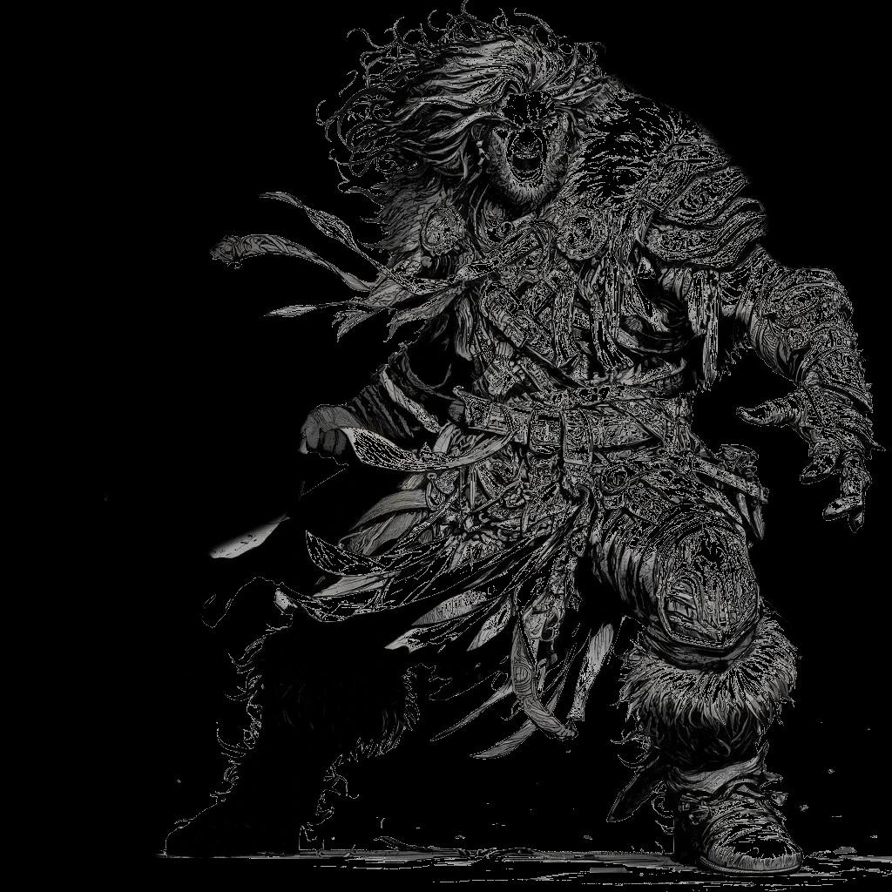

# Divine Spells {#sec-chapter-divine-spells}

```{=typst}
#label("sec-chapter-divine-spells")
```

{width="60%"}

*Illustration 19 � Divine spells chapter art (Unbalanced class). Placeholder; final art TBD. Dimensions: 1024�1024.*



Divine magic isn't earned, it's given. You don't study it. You don't master it through repetition and force of will. You open yourself to something bigger than you, a god, a cause, the light between stars, and it flows through you. Or it doesn't. That part's not up to you.

But once it does? Once you're a conduit for divine power? You heal wounds that should be fatal. You raise barriers that turn aside demons. You see truth that lies hidden behind lies and shadow. You burn what shouldn't exist and shield what should. The power isn't yours, but the choice of how to use it always is.

Divine magic doesn't throw fireballs. It doesn't dissolve armor or dominate minds. It heals. It protects. It reveals. These are the spells that keep your party alive when the dungeon wants them dead, that ward the camp against things that hunt in the dark, that answer questions no mortal should be able to answer. Arcane magic dominates the battlefield. Divine magic makes sure there's a battlefield left to dominate.

This chapter contains every divine spell in the game. Shepherds use them. Some Leaders use them. Anyone who's ever knelt before something greater and felt it kneel back.

*See `@sec-chapter-magic-system`{=typst} for how spellcasting works.*



## Divine Cantrips

Divine cantrips are minor blessings, small miracles that cost nothing and ask nothing in return. They don't require Disciplines, they don't cost anything to learn, and you can invoke them as often as you like. Every divine caster knows all of these.

They won't turn the tide of battle. They'll steady a shaky hand, light a dark corridor, and remind the dying that someone is still fighting for them. Sometimes that's enough.

### Guidance (Cantrip)
**Disciplines:** None
**Casting Time:** 1 action
**Range:** Touch
**Duration:** Concentration, up to 1 minute
**Target:** One creature

**Description:** You lay a hand on an ally and whisper a prayer. For the next minute, they feel the presence of something greater, a steadying hand on their shoulder, a whisper of confidence at the back of their mind.

| Outcome | Effect |
|---------|--------|
| Weak (1-8) | The target gains +1 on the next skill check they make within 1 minute. |
| Standard (9-14) | +2 on the next skill check within 1 minute. |
| Strong (15-18+) | +2 on the next skill check. If that check succeeds, the target also gains advantage on their next check within the same minute, the blessing compounds. |

*The simplest prayer. The most reliable help. When your ally is about to attempt something stupid and heroic, give them Guidance. It won't make the stupid part less stupid, but it might make the heroic part work.*

### Light (Cantrip)
**Disciplines:** None
**Casting Time:** 1 action
**Range:** Touch
**Duration:** 1 hour
**Target:** One object

**Description:** You touch an object and it begins to glow with pure, steady radiance, not fire, not magic-light, but something closer to daylight. The light is warm on allies and harsh on creatures of darkness.

| Outcome | Effect |
|---------|--------|
| Weak (1-8) | Dim light in a 10-foot radius. Duration 10 minutes. |
| Standard (9-14) | Bright light in a 20-foot radius, dim for another 20 feet. Duration 1 hour. |
| Strong (15-18+) | As Standard, but undead and fiends in the bright light have disadvantage on attacks, the radiance burns them with its mere presence. |

*Not a torch. Not a lantern. Light is a piece of dawn you can carry in your pocket. Use it to banish shadows. Use it to blind things that hate the sun. Use it to remind your party that even in the deepest dark, someone brought the day with them.*

### Resistance (Cantrip)
**Disciplines:** None
**Casting Time:** 1 action
**Range:** Touch
**Duration:** Concentration, up to 1 minute
**Target:** One creature

**Description:** A shimmering shield of divine energy settles over the target, thin as a prayer, strong as faith. It turns aside the first touch of poison, the first lick of flame, the first whisper of dark magic.

| Outcome | Effect |
|---------|--------|
| Weak (1-8) | +1 on the target's next Fortitude check within 1 minute. |
| Standard (9-14) | +2 on the next Fortitude check. If the check is against poison, disease, or necrotic damage, the bonus is +3. |
| Strong (15-18+) | +2 on the next Fortitude check. The target also reduces the first instance of poison, disease, or necrotic damage they take within the duration by 1d6. |

*When you know the wyvern's sting is coming. When the crypt's air tastes of old death. When the evil wizard's finger is pointing at your Protector. Resistance won't make you immune, but it might make you survive.*

### Virtue (Cantrip)
**Disciplines:** None
**Casting Time:** 1 action
**Range:** Touch
**Duration:** 1 minute
**Target:** One creature

**Description:** You speak a word of divine encouragement over an ally. For the next minute, a faint glow suffuses their skin, the physical manifestation of borrowed vitality. It won't save them from a killing blow, but it might keep them standing long enough to deliver one.

| Outcome | Effect |
|---------|--------|
| Weak (1-8) | The target gains 1d4 temporary HP for 1 minute. |
| Standard (9-14) | 1d6 temporary HP for 1 minute. If these temporary HP absorb a hit, the attacker takes 1 radiant damage, the light bites back. |
| Strong (15-18+) | 1d6+2 temporary HP for 1 minute. Attacker takes 1d4 radiant on contact. The target also feels a surge of confidence, immune to fear for the duration. |

*A breath of borrowed courage. Virtue is the spell you cast on the ally who's about to do something brave and probably fatal. It won't make them invincible, but it'll make them feel invincible. Sometimes that's the same thing.*

### Thaumaturgy (Cantrip)
**Disciplines:** None
**Casting Time:** 1 action
**Range:** 30 feet
**Duration:** Up to 1 minute
**Target:** See below

**Description:** A display of minor divine power, the kind that makes mortals kneel and skeptics reconsider. You may produce one of the following effects: your voice booms three times louder, you cause flames to flicker or brighten, the ground trembles faintly, an unseen wind stirs, or your eyes blaze with inner light. These are signs and portents. Use them accordingly.

| Outcome | Effect |
|---------|--------|
| Weak (1-8) | One minor effect. It's obviously supernatural but not overwhelming. |
| Standard (9-14) | Three simultaneous effects. Your presence is unmistakably divine. Bystanders who aren't actively hostile are awed, social checks against them have advantage. |
| Strong (15-18+) | Your display is terrifying or awe-inspiring (your choice). Hostile creatures of Novice tier or lower must make a Reason check or flee for 1 round. The ground actually shakes. The fire actually roars. |

*The calling card of divine power. When you need a crowd's attention. When you need a bandit chief to reconsider their life choices. When you need everyone in the room to understand that you speak for something bigger than yourself. Thaumaturgy doesn't win arguments, but it makes sure everyone listens.*

```{=typst}
#horizontalrule
```





## Healing Chains

Healing is the heart of divine magic. It's why Shepherds are welcomed in every village, why armies march with a healer in every company, why the dying gasp prayers to gods they've never worshipped before. Healing magic knits flesh, purges poison, and, at its highest reaches, calls souls back from the threshold. It's not flashy. It's not destructive. It's the reason your party is still alive.

*See `@sec-chapter-magic-system`{=typst} for how spellcasting works.*

### Heal Wounds Chain
**Disciplines:** Water
*The fundamental healing chain. Touch them. Heal them. Send them back into the fight.*

#### Heal Wounds (Novice)
**Disciplines:** 1 Water
**Casting Time:** 1 action
**Range:** Touch
**Duration:** Instantaneous
**Target:** One creature

**Description:** Your hands glow with warm, golden light as you channel divine energy into the target. Flesh knits. Blood stops flowing. Pain recedes. This is the first miracle every healer learns, and it never stops being one.

| Outcome | Effect |
|---------|--------|
| Weak (1-8) | Restore 1d6+1 HP. The wound closes but leaves a scar. |
| Standard (9-14) | Restore 2d6+2 HP. Bleeding stops immediately. |
| Strong (15-18+) | Restore 3d6+3 HP. The healing is so complete that minor scars fade and the target feels a surge of vitality, gain advantage on their next physical action. |

*The spell that says "not today." Heal Wounds won't bring back the dead, but it'll keep the living on their feet. In a game where every hit connects, healing isn't optional, it's survival. Learn this spell. Love this spell. Your party will love you for it.*

#### Restoration (Adept)
**Disciplines:** 2 Water, 1 Protection
**Casting Time:** 1 action
**Range:** Touch
**Duration:** Instantaneous
**Target:** One creature

**Description:** A deeper healing, more than flesh and blood. Restoration purges what ails the body and mind: disease, poison, blindness, paralysis. It doesn't just close wounds. It makes the target whole.

| Outcome | Effect |
|---------|--------|
| Weak (1-8) | Restore 2d6+2 HP. End one minor condition (dazed, deafened, sickened). |
| Standard (9-14) | Restore 4d6+4 HP. End one major condition (blinded, paralyzed, poisoned) or one disease. |
| Strong (15-18+) | Restore 6d6+6 HP. End one major condition AND one minor condition, or end two major conditions. The target also gains advantage on Fortitude checks for the next hour. |

*Healing-plus. Restoration is what you cast when Heal Wounds isn't enough, when the poison is in their blood and their eyes have gone glassy. It's the difference between "they'll live" and "they'll fight." In the middle of combat, that difference is everything.*

#### Mass Heal (Master)
**Disciplines:** 3 Water, 1 Protection
**Casting Time:** 1 action
**Range:** 60 feet
**Duration:** Instantaneous
**Target:** Up to 6 creatures

**Description:** Divine light erupts from you in a wave, washing over every ally in range. Wounds close simultaneously. The dying gasp and sit up. The broken rise and reach for their weapons. This isn't healing, it's a second wind for the entire party, delivered by the hand of a god who isn't done with them yet.

| Outcome | Effect |
|---------|--------|
| Weak (1-8) | Up to 3 creatures restore 3d6+3 HP each. |
| Standard (9-14) | Up to 6 creatures restore 6d6+6 HP each. One condition removed from each target. |
| Strong (15-18+) | Up to 6 creatures restore 9d6+9 HP each. All minor conditions removed. One major condition removed per target. Creatures at 0 HP who receive this healing immediately stand up and can act on their next turn. |

*The spell that turns a TPK into a victory. Mass Heal is the panic button for when everything has gone wrong, when three party members are down and the other two are one hit away. One cast. Six allies. Enough healing to reset the entire fight. This is why gods made healers. This is why healers are never the first target, because the enemy knows what happens if they leave you standing.*

### Purify Chain
**Disciplines:** Water
*Cleanse corruption. Purge affliction. Restore what was lost.*

#### Purify (Novice)
**Disciplines:** 1 Water
**Casting Time:** 1 action
**Range:** Touch
**Duration:** Instantaneous
**Target:** One creature, object, or 5-foot cube

**Description:** Divine light scours corruption from the target. Poisoned food becomes wholesome. Tainted water runs clear. A festering wound cleans itself. The spell doesn't heal, it cleanses. What was befouled is made pure.

| Outcome | Effect |
|---------|--------|
| Weak (1-8) | Purify one dose of weak poison or spoiled food. A festering wound stops worsening. |
| Standard (9-14) | Purify a 5-foot cube of food, water, or air. Remove one disease or poison from a creature. Cleanse a cursed object of minor enchantment. |
| Strong (15-18+) | Purify a 10-foot cube. Remove one disease and one poison simultaneously. A cursed object of Adept tier or lower is cleansed, the curse breaks. |

*Not as dramatic as a heal, but sometimes more important. The well in the plague village. The feast the suspicious baron laid out. The dagger your rogue just picked up that's whispering her name. Purify is the answer. Clean water and clean food have saved more lives than any battle spell ever will.*

#### Cleanse (Adept)
**Disciplines:** 2 Water, 1 Protection
**Casting Time:** 1 minute
**Range:** Touch
**Duration:** Instantaneous
**Target:** One creature

**Description:** A deeper purification, this spell reaches into the target's very essence and burns away what shouldn't be there. Curses unravel. Possession breaks. Magical compulsions shatter like glass. The target may feel like they've been scrubbed from the inside out. They have.

| Outcome | Effect |
|---------|--------|
| Weak (1-8) | Remove one curse or magical compulsion of Novice tier. The target is shaken, disadvantage on their next action. |
| Standard (9-14) | Remove one curse, possession, or magical compulsion of Adept tier or lower. Remove all poisons and diseases. |
| Strong (15-18+) | As Standard, but the cleansing is so complete that the target becomes immune to the removed effect for 24 hours, the same curse cannot re-afflict them. The target also heals 2d6 HP from the purifying energy. |

*When the curse has taken root. When the ghost is wearing your friend's face. When the charm spell has been running for days and nobody remembers who the real person is anymore. Cleanse is the reset button. It's brutal, the target will feel every moment of the purification, but they'll be themselves again when it's done.*

#### Resurrection (Master)
**Disciplines:** 3 Water, 1 Protection
**Casting Time:** 1 hour
**Range:** Touch
**Duration:** Instantaneous
**Target:** One dead creature

**Description:** You reach across the threshold between life and death and pull someone back. The soul, departed, drifting, already turning toward whatever comes next, hears your call and answers. The body knits. The heart beats. The eyes open. This is not healing. This is reversal. The universe does not approve, but the universe doesn't get a vote.

| Outcome | Effect |
|---------|--------|
| Weak (1-8) | The target returns to life with 1 HP. They are disoriented, disadvantage on all actions for 1 hour. They remember fragments of what lay beyond. |
| Standard (9-14) | The target returns with HP equal to half their maximum. They are weak but functional. They remember being dead, the memory will never fully fade. |
| Strong (15-18+) | The target returns at full HP. They bring something back with them, a fragment of knowledge from beyond, a vision of what's coming, a name they shouldn't know. The DA decides what they learned. They also gain advantage on death-related checks for the next week, death has lost its mystery. |

*The ultimate divine spell. Resurrection is why people pray. It's why kings keep Shepherds at their side. It's why your party will drag your body through three levels of dungeon rather than leave you behind. Casting it costs you, not in mana, but in something deeper. The gods notice when you reach past death. They always notice.*

### Bolster Chain
**Disciplines:** Water
*Ongoing healing. Keep them standing. Keep them fighting.*

#### Bolster (Novice)
**Disciplines:** 1 Water
**Casting Time:** 1 action
**Range:** Touch
**Duration:** Concentration, up to 1 minute
**Target:** One creature

**Description:** You infuse the target with a trickle of ongoing divine vitality. It's not a burst of healing, it's a steady stream. Small wounds close as they open. Fatigue burns away. For the next minute, the target is just a little bit harder to put down.

| Outcome | Effect |
|---------|--------|
| Weak (1-8) | Target regains 1 HP at the start of each turn for 3 rounds. |
| Standard (9-14) | Target regains 2 HP at the start of each turn for 1 minute (10 rounds). |
| Strong (15-18+) | Target regains 3 HP per round for 1 minute. Additionally, the first time they drop to 0 HP during the duration, they immediately regain 1d6 HP and stay standing. |

*Healing over time. Bolster is for the Protector who's holding the line while everyone else escapes. For the Blade who's dueling the enemy champion. For anyone who needs to stay upright just a little longer. It won't outpace a dragon's breath, but it'll turn a dozen small cuts from fatal to forgettable.*

#### Regeneration (Adept)
**Disciplines:** 2 Water, 1 Protection
**Casting Time:** 1 action
**Range:** Touch
**Duration:** Concentration, up to 1 minute
**Target:** One creature

**Description:** The target's body awakens to its own capacity for healing, accelerated a hundredfold. Flesh crawls as it knits. Severed blood vessels reconnect. Even shattered bone begins to grind back into place. The target isn't just being healed, they're being *remade* in real time.

| Outcome | Effect |
|---------|--------|
| Weak (1-8) | Target regains 3 HP per round for 3 rounds. Bleeding stops. |
| Standard (9-14) | Target regains 5 HP per round for 1 minute. Lost fingers or minor appendages begin to regrow, fully restored by the spell's end. |
| Strong (15-18+) | Target regains 8 HP per round for 1 minute. A lost limb regrows over the duration. The target cannot die from hit point loss while Regeneration is active, they stabilize at 0 HP and continue to heal. |

*When Bolster isn't enough. Regeneration is the spell you cast on the ally who's already down, already bleeding out, already halfway to the grave. It doesn't just heal, it rebuilds. Watch their eyes flutter open. Watch their hand grow back. Watch the enemy's expression change from triumph to horror.*

#### True Life (Master)
**Disciplines:** 3 Water, 1 Protection
**Casting Time:** 1 action
**Range:** Touch
**Duration:** 1 hour
**Target:** One creature

**Description:** You pour so much divine vitality into the target that death itself becomes a temporary inconvenience. For the next hour, the target heals faster than they can be hurt. Their body glows faintly. Their blood shimmers. They are, for a short time, more alive than anyone in the room, and life, true life, does not go gently.

| Outcome | Effect |
|---------|--------|
| Weak (1-8) | Target regains 5 HP per round for 3 rounds. They have advantage on death checks. |
| Standard (9-14) | Target regains 10 HP per round for 1 hour. They are immune to poison, disease, and necrotic damage. If reduced to 0 HP, they automatically stabilize and continue regenerating, only a killing blow that deals more than 20 damage in a single hit can truly kill them. |
| Strong (15-18+) | As Standard, but the target also radiates an aura of vitality, all allies within 15 feet regain 3 HP per round. The target's maximum HP increases by 20 for the duration. They are, for all practical purposes, immortal for the next hour. |

*This is what the gods give their chosen. True Life is not a combat spell, it's a declaration. For one hour, one creature in your party is functionally unkillable. Send them into the dragon's jaws. Send them through the trapped corridor. Send them to hold the bridge against a hundred foes. They'll be standing when it's over. They'll be standing, and they'll be smiling.*

### Remove Affliction Chain
**Disciplines:** Water
*Target specific ailments. Cure the incurable.*

#### Soothe (Novice)
**Disciplines:** 1 Water
**Casting Time:** 1 action
**Range:** Touch
**Duration:** Instantaneous
**Target:** One creature

**Description:** Your touch calms the body's rebellion. Pain fades. Muscles unclench. The mind quiets. Soothe doesn't cure disease or close wounds, it simply tells the body that everything is going to be all right. And for a little while, the body believes it.

| Outcome | Effect |
|---------|--------|
| Weak (1-8) | Remove one minor condition (dazed, sickened, frightened). Restore 1 HP. |
| Standard (9-14) | Remove one minor condition. Restore 1d6+1 HP. The target feels genuinely comforted, they know, somehow, that someone is looking out for them. |
| Strong (15-18+) | Remove up to two minor conditions. Restore 2d6+2 HP. The target gains temporary immunity to the removed conditions for 10 minutes, their body remembers the calm. |

*The smallest healing spell. Not for wounds, for everything else. The nausea after the poison trap. The ringing ears after the thunderclap. The creeping dread after the third near-death experience this hour. Soothe is the spell you cast when an ally just needs a moment. A breath. A reminder that they're not alone.*

#### Remove Affliction (Adept)
**Disciplines:** 2 Water, 1 Protection
**Casting Time:** 1 action
**Range:** Touch
**Duration:** Instantaneous
**Target:** One creature

**Description:** You name the affliction and it flees. Blindness peels away from the eyes. Deafness cracks and falls silent. Paralysis releases its grip. The target is not healed in the traditional sense, they are *freed.* Whatever held them is gone, banished by the authority of the divine.

| Outcome | Effect |
|---------|--------|
| Weak (1-8) | Remove one condition: blinded, deafened, or paralyzed. The condition fades over 1 round rather than instantly. |
| Standard (9-14) | Remove one condition instantly: blinded, deafened, paralyzed, or petrified. Target can act immediately. |
| Strong (15-18+) | Remove any one condition (including stunned, unconscious from non-lethal sources). The target gains advantage on checks against that condition type for 24 hours, it won't take hold again easily. |

*The surgical strike of divine magic. Remove Affliction doesn't heal HP, it solves specific, devastating problems. The medusa's gaze. The banshee's wail. The ghoul's paralytic claws. When a party member is locked down and the enemy is closing in, this spell doesn't just help, it changes the math entirely.*

#### Miracle Cure (Master)
**Disciplines:** 3 Water, 1 Protection
**Casting Time:** 1 action
**Range:** Touch
**Duration:** Instantaneous
**Target:** One creature

**Description:** You don't cast this spell, you pray it. And something answers. The incurable is cured. The permanent becomes temporary. The congenital defect present since birth unravels in a wash of golden light. This is the spell for things that aren't supposed to be fixable. The universe makes an exception.

| Outcome | Effect |
|---------|--------|
| Weak (1-8) | Remove one long-term condition (blindness, deafness, a lingering curse). The effect is permanent but the target is exhausted, gain 1 level of exhaustion that fades after a long rest. |
| Standard (9-14) | Cure one condition normally considered permanent: congenital blindness, a birth defect, a curse passed through bloodlines. Also restores 6d6+6 HP and removes all temporary conditions. |
| Strong (15-18+) | As Standard, but the miracle also cures one condition the target didn't know they had, a latent disease, a dormant curse, a genetic weakness. The target also gains a permanent +1 to Fortitude checks against the cured condition type. They've been touched by something holy, and it left a mark. |

*The spell you cast when everything else has failed. When the curse has a name older than the kingdom. When the disease laughs at Restoration. When the child was born blind and the parents have spent their life savings on healers who shook their heads. Miracle Cure is why people believe. It's why they journey to distant temples and kneel before forgotten altars. Sometimes, just sometimes, someone kneels back.*

```{=typst}
#horizontalrule
```





## Protection Chains

Protection magic is the shield arm of the divine. It wards the innocent, guards the faithful, and draws lines across the battlefield that evil cannot cross. Protection spells don't hurt the enemy, they make the enemy's efforts irrelevant. A fireball that never lands. A sword that never connects. A demon that reaches for your ally and finds only light.

*See `@sec-chapter-magic-system`{=typst} for how spellcasting works.*

### Shield of Faith Chain
**Disciplines:** Protection
*Personal and targeted protection. The divine shield.*

#### Shield of Faith (Novice)
**Disciplines:** 1 Protection
**Casting Time:** 1 action
**Range:** 30 feet
**Duration:** Concentration, up to 10 minutes
**Target:** One creature

**Description:** A shimmering field of divine energy envelops the target, turning aside blows with whispered prayers. Blades skid off invisible barriers. Arrows curve in flight. The target isn't wearing armor, they're wearing faith.

| Outcome | Effect |
|---------|--------|
| Weak (1-8) | +1 Armor for 1 minute. |
| Standard (9-14) | +2 Armor for 10 minutes. The first attack that hits the target each round has its damage reduced by 1. |
| Strong (15-18+) | +2 Armor for 10 minutes. Damage reduction applies to all attacks. Against undead and fiends, the bonus increases to +3 Armor, they recoil from the divine light. |

*The bread and butter of divine protection. Shield of Faith is simple, reliable, and always welcome. Cast it on your Protector to make an iron wall into a mythic one. Cast it on your Blade to let them fight with reckless abandon. Cast it on yourself, you're the healer, and the enemy knows it.*

#### Sanctuary (Adept)
**Disciplines:** 2 Protection, 1 Energy
**Casting Time:** 1 action
**Range:** Touch
**Duration:** Concentration, up to 1 minute
**Target:** One creature

**Description:** The target is wrapped in an aura of profound peace. Enemies find their eyes sliding away, their attacks hesitating, their will to harm evaporating. They *can* attack the protected creature, but every fiber of their being tells them not to. Those who push through find their blows strangely weak.

| Outcome | Effect |
|---------|--------|
| Weak (1-8) | Enemies must make a Reason check to target the protected creature. Attacks that succeed deal -2 damage. Duration 3 rounds. |
| Standard (9-14) | Enemies must make a Reason check to target the creature. On failure, they must choose a different target or lose the attack. On success, damage is halved. Duration 1 minute. |
| Strong (15-18+) | As Standard, but the Reason check has disadvantage. Undead and fiends automatically fail, they cannot approach within 10 feet of the target. If the protected creature attacks, the spell ends. |

*"Don't hit me" in spell form. Sanctuary is for the non-combatant caught in combat, the scholar you're escorting, the wounded ally you're stabilizing, yourself when you need one round to get a Mass Heal off. It's not invisibility. It's something stranger, the divine assertion that this person is not part of the fight, and the fight should look elsewhere.*

#### Holy Aegis (Master)
**Disciplines:** 3 Protection, 1 Energy
**Casting Time:** 1 action
**Range:** Self (30-foot radius)
**Duration:** Concentration, up to 1 minute
**Target:** All allies within 30 feet

**Description:** You raise your holy symbol and a dome of radiant light erupts outward, sheltering every ally in range. Inside the Aegis, the air is calm. Outside, the storm of battle rages, but it cannot cross the threshold. Enemies may enter, but they pay for every step. Allies within are shielded, healed, and blessed.

| Outcome | Effect |
|---------|--------|
| Weak (1-8) | All allies within 20 feet gain +2 Armor. Duration 3 rounds. |
| Standard (9-14) | All allies within 30 feet gain +2 Armor and resistance to necrotic and radiant damage. At the start of each ally's turn, they regain 2 HP. Enemies entering the Aegis take 2d6 radiant damage. Duration 1 minute. |
| Strong (15-18+) | As Standard, but the radius is 40 feet. Allies also have advantage on Fortitude and Reason checks. Enemies inside the Aegis at the start of their turn take 3d6 radiant damage. The Aegis moves with you. Undead and fiends cannot enter, they burn at the boundary. |

*The ultimate protective spell. Holy Aegis turns the battlefield into sacred ground. Your party fights inside a bubble of divine favor, healing every round, resisting dark magic, and watching enemies burst into flame just for getting too close. When you raise the Aegis, you're not just protecting your allies. You're consecrating the battlefield. This ground is yours now. The enemy is trespassing.*

### Bless Chain
**Disciplines:** Protection
*Enhance your allies. Bless their efforts. Make them more than they were.*

#### Bless (Novice)
**Disciplines:** 1 Protection
**Casting Time:** 1 action
**Range:** 30 feet
**Duration:** Concentration, up to 1 minute
**Target:** Up to 3 creatures

**Description:** You speak a benediction over your allies, and something listens. For the next minute, their hands are steadier, their aim truer, their minds clearer. A divine whisper guides their strikes and guards their thoughts.

| Outcome | Effect |
|---------|--------|
| Weak (1-8) | 1 ally gains +1 on attack rolls for 1 minute. |
| Standard (9-14) | Up to 3 allies gain +1 on all attack rolls and Reason checks for 1 minute. |
| Strong (15-18+) | Up to 3 allies gain +1 on attack rolls, Reason checks, and Fortitude checks. Additionally, the first time each ally rolls a Weak result during the duration, they may reroll, the blessing intervenes. |

*The spell that makes everyone better. Bless isn't flashy, but a +1 on every attack roll across three party members adds up fast. Over a five-round combat, that's fifteen attacks, and fifteen chances for the blessing to turn a Weak into a Standard, or a Standard into a Strong. Your party won't notice the difference. The enemy will.*

#### Divine Favor (Adept)
**Disciplines:** 2 Protection, 1 Energy
**Casting Time:** 1 action
**Range:** Self
**Duration:** Concentration, up to 1 minute
**Target:** Self

**Description:** You become the instrument of divine wrath, or divine mercy, depending on what's needed. Your weapon glows with holy light. Your strikes burn with radiant fire. For one minute, you are not just a caster. You are a warrior blessed by something greater, and everything you hit is going to feel it.

| Outcome | Effect |
|---------|--------|
| Weak (1-8) | Your weapon attacks deal +1d4 radiant damage. Duration 3 rounds. |
| Standard (9-14) | Your weapon attacks deal +1d6 radiant damage. Undead and fiends take +2d6 instead. Duration 1 minute. |
| Strong (15-18+) | Your weapon attacks deal +2d6 radiant damage (+3d6 vs. undead/fiends). Once during the duration, you may declare an attack a "divine strike", it automatically hits at the Strong tier. |

*For the Shepherd who needs to wade into melee. For the Leader who wants to lead from the front. Divine Favor turns a support caster into a holy terror. Your mace isn't just a mace anymore, it's a delivery system for divine judgment. The undead don't just fear you. They burn at your approach.*

#### Crusader's Mantle (Master)
**Disciplines:** 3 Protection, 1 Energy
**Casting Time:** 1 action
**Range:** Self (30-foot radius)
**Duration:** Concentration, up to 1 minute
**Target:** All allies within 30 feet

**Description:** Divine wrath settles over you like a cloak and extends to every ally nearby. Weapons burst into flame, not ordinary fire, but holy radiance that sears the wicked and leaves the innocent untouched. Your party becomes a holy shock force: every strike blessed, every arrow sanctified, every blade a burning testament.

| Outcome | Effect |
|---------|--------|
| Weak (1-8) | Allies within 15 feet deal +1d4 radiant damage on weapon attacks. Duration 3 rounds. |
| Standard (9-14) | Allies within 30 feet deal +1d6 radiant damage on weapon attacks (+2d6 vs. undead/fiends). Allies also emit dim light in a 10-foot radius, darkness effects within the mantle are suppressed. Duration 1 minute. |
| Strong (15-18+) | As Standard, but the bonus is +2d6 radiant (+3d6 vs. undead/fiends). The first time each ally hits an enemy during the duration, that enemy is marked with divine light, attacks against marked enemies have advantage for 1 round. The battlefield is bathed in holy radiance. |

*Your party is now an army of the divine. Crusader's Mantle turns every ally into a holy warrior, their weapons burn with sacred fire, their presence banishes darkness, and the enemy formation becomes a shooting gallery of illuminated targets. When the paladin order rides to war, this is the spell their high priest casts before the charge. Nothing survives the charge.*

### Ward Chain
**Disciplines:** Protection
*Static protections. Glyphs. Circles. Barriers that hold.*

#### Ward (Novice)
**Disciplines:** 1 Protection
**Casting Time:** 1 minute
**Range:** Touch
**Duration:** 8 hours
**Target:** One doorway, container, or 10-foot square

**Description:** You trace a glyph of protection onto a threshold. When a creature of a type you specify crosses it, the ward triggers, a flash of light, a clap of thunder, a silent alarm in your mind. The ward doesn't stop intruders. It announces them. And you'll be ready.

| Outcome | Effect |
|---------|--------|
| Weak (1-8) | The ward triggers with a faint glow visible within 30 feet. You know it triggered if you're within 100 feet. Duration 1 hour. |
| Standard (9-14) | You specify a creature type (undead, humanoid, beast, etc.). When such a creature crosses, you receive a mental alert if within 1 mile. The creature is briefly outlined in silver light, visible to all. Duration 8 hours. |
| Strong (15-18+) | As Standard, but you may specify up to three creature types or one specific individual you've met. The ward also deals 2d6 radiant damage to the triggering creature. |

*The spell that lets you sleep through the night. Ward the camp perimeter. Ward the dungeon door behind you. Ward the treasure chest before you open it. Knowledge is power, and knowing something is coming before it arrives is the difference between a prepared party and a total party kill.*

#### Magic Circle (Adept)
**Disciplines:** 2 Protection, 1 Energy
**Casting Time:** 1 minute
**Range:** Touch
**Duration:** 1 hour
**Target:** 10-foot radius circle

**Description:** You inscribe a circle of protection on the ground, chalk, salt, or pure divine light. Creatures of a type you specify cannot cross the boundary. They cannot attack creatures inside. Their magic fizzles at the edge. The circle is a statement: this space is not yours, and you are not welcome here.

| Outcome | Effect |
|---------|--------|
| Weak (1-8) | The circle hedges out creatures of one type. They have disadvantage on attacks against creatures inside. Duration 10 minutes. |
| Standard (9-14) | Creatures of the chosen type cannot enter the circle, cannot attack across it, and have disadvantage on spells cast into it. Inside creatures have +2 Armor against attacks from outside. Duration 1 hour. |
| Strong (15-18+) | As Standard, but the circle also prevents teleportation and planar travel into or out of the area. Creatures of the chosen type inside when the circle is cast are trapped, they cannot leave. Duration 2 hours. |

*The summoner's nightmare. Magic Circle is for when you know what's hunting you and need a guaranteed safe zone. Camp inside one when the werewolves are prowling. Trap a demon inside one while you negotiate. Cast one around the ritual altar before the cultists finish their spell. The circle doesn't judge. It just holds.*

#### Divine Barrier (Master)
**Disciplines:** 3 Protection, 1 Energy
**Casting Time:** 1 action
**Range:** 60 feet
**Duration:** Concentration, up to 1 minute
**Target:** A 20-foot radius dome or 30-foot wall

**Description:** A wall of solid divinity, not force, not magic, but something purer, seals the battlefield. The barrier is opaque to evil, transparent to the faithful. Enemy spells shatter against it. Enemy creatures burn at its touch. Your allies pass through freely, their weapons trailing holy light as they emerge.

| Outcome | Effect |
|---------|--------|
| Weak (1-8) | A 15-foot wall or 10-foot dome. Blocks physical attacks and Novice-tier spells. +2 Armor to allies behind it. Duration 3 rounds. |
| Standard (9-14) | A 30-foot wall or 20-foot dome. Blocks all attacks and spells of Adept tier or lower. Undead and fiends touching it take 4d6 radiant damage. Allies inside have resistance to all damage from outside sources. Duration 1 minute. |
| Strong (15-18+) | As Standard, but the barrier also blocks Master-tier spells, nothing crosses without your permission. Allies inside regenerate 5 HP per round. Enemies of a type you specify are blinded while inside or adjacent to the barrier. The dome can encompass structures. |

*The final word in protective magic. Divine Barrier doesn't just shield, it divides the world into "safe" and "not safe" with absolute clarity. Drop it over your party when the dragon breathes. Seal a building against the zombie horde. Create a hemisphere of "no" that even the most powerful enemy magic cannot penetrate. When the Divine Barrier goes up, the fight changes. Your side just became the winning side.*

```{=typst}
#horizontalrule
```





{width="60%"}

*Illustration 35 � Divine spells chapter midpoint. Placeholder for final art. Use placeholder-section.svg dimensions: 400�300.*



## Divination Chains

Divination is the magic of knowing. It sees what's hidden, identifies what's unknown, and sometimes, at its highest reaches, peers into what hasn't happened yet. Diviners are the party's eyes and ears. They find the trap before it triggers. They read the villain's plans in ancient texts. They ask questions of beings who were old when the world was young, and they get answers.

*See `@sec-chapter-magic-system`{=typst} for how spellcasting works.*

### Detect Magic Chain
**Disciplines:** Energy
*Sense magical energies. Identify enchantments. Uncover hidden lore.*

#### Detect Magic (Novice)
**Disciplines:** 1 Energy
**Casting Time:** 1 action
**Range:** Self (30-foot radius)
**Duration:** Concentration, up to 10 minutes
**Target:** Self (sensory aura)

**Description:** Your eyes film over with silver light. For the duration, magical auras become visible, glowing halos around enchanted objects, colored mist trailing from active spells, dark stains where curses linger. You see magic the way others see color: obvious, informative, and everywhere once you know how to look.

| Outcome | Effect |
|---------|--------|
| Weak (1-8) | You sense the presence of magic within 30 feet. No details, just "something is magical nearby." Duration 1 minute. |
| Standard (9-14) | You see magical auras within 30 feet. You can identify the school or general type of magic (fire, illusion, necromancy, divine, etc.). Duration 10 minutes. |
| Strong (15-18+) | As Standard, but you also sense the relative strength of each aura (Novice/Adept/Master tier) and whether it's beneficial, harmful, or neutral. You can concentrate on one aura to learn its specific spell name if you've encountered it before. |

*The spell that saves parties from cursed swords and trapped altars. Detect Magic is never a wasted cast. That suspicious throne? Glowing with necromancy, don't sit. That plain dagger in the trash heap? Radiating Adept-tier enchantment, grab it. Knowledge is survival. This spell gives you knowledge.*

#### Identify (Adept)
**Disciplines:** 2 Energy, 1 Water
**Casting Time:** 1 minute (or 1 hour for complex items)
**Range:** Touch
**Duration:** Instantaneous
**Target:** One object or creature

**Description:** You hold an object, close your eyes, and *listen.* The magic within speaks to you, its name, its purpose, its command word, its history. Curses reveal themselves reluctantly. Artifacts share their secrets eagerly. By the time you open your eyes, you know the item better than its creator did.

| Outcome | Effect |
|---------|--------|
| Weak (1-8) | Learn the item's basic properties and whether it's cursed. No command words or detailed history. |
| Standard (9-14) | Learn all properties, command words, number of charges (if any), and the item's name and creator. Identify curses and how to break them. For artifacts with complex histories, you receive flashes of key events. |
| Strong (15-18+) | As Standard, but you also learn one secret about the item that even its creator may not have known, a hidden property, a dormant power, a destiny tied to the item. The DA decides what this secret is. |

*The spell that answers "what does this do?" Identify turns mysterious loot into known assets. That glowing sword? Now you know it's a Flame Tongue, command word "ignis," 3 charges, bursts into fire on command. That ring the villain was wearing? Cursed, don't put it on until you've cast Cleanse. Knowledge isn't just power. It's insurance.*

#### Legend Lore (Master)
**Disciplines:** 3 Energy, 1 Water
**Casting Time:** 10 minutes
**Range:** Self
**Duration:** Instantaneous
**Target:** One creature, object, or location you can name

**Description:** You don't just identify, you *remember.* The universe holds memories of everything that ever mattered, and this spell gives you access. You speak a name, a person, a place, an artifact, and the universe tells you its story. Not everything. But enough. The important parts. The parts that were legendary.

| Outcome | Effect |
|---------|--------|
| Weak (1-8) | You receive 1d3 significant facts about the subject, public knowledge or commonly known legends. |
| Standard (9-14) | You receive a full account of the subject's legendary history: its creation, its major deeds, its famous wielders or inhabitants, its known powers and weaknesses. If the subject has ever been the focus of a prophecy, you learn the gist of it. |
| Strong (15-18+) | As Standard, but you also learn one piece of information that has been deliberately hidden, forgotten, or erased from history, the true name of the demon bound in the sword, the location of the lich's phylactery, the identity of the traitor who brought down the ancient kingdom. |

*The spell that solves mysteries. Legend Lore is why ancient libraries still matter, you can cast it on any named thing, anywhere, and learn what the world knows about it. The villain's true name. The artifact's hidden weakness. The dungeon's original purpose. When the party is stuck, when the clues have run dry, when the only way forward is through a door that requires a password lost to time, cast Legend Lore. The universe remembers. Now you do too.*

### True Seeing Chain
**Disciplines:** Energy
*See through deception. Pierce illusion. Witness truth.*

#### See Invisible (Novice)
**Disciplines:** 1 Energy
**Casting Time:** 1 action
**Range:** Self
**Duration:** Concentration, up to 10 minutes
**Target:** Self

**Description:** Your eyes flicker with silver fire. Invisible creatures become visible, not solid, but outlined in faint luminescence, like heat shimmer on a cold day. Hidden doors glow. Ethereal watchers are revealed. Nothing can hide from you by simply not being there.

| Outcome | Effect |
|---------|--------|
| Weak (1-8) | You sense the presence of invisible creatures within 30 feet but cannot pinpoint their location. Duration 1 minute. |
| Standard (9-14) | Invisible creatures and objects within 60 feet are visible to you as translucent outlines. Hidden doors and secret compartments glow faintly. Duration 10 minutes. |
| Strong (15-18+) | As Standard, but you also see into the Ethereal Plane, creatures phasing through walls, ghosts lurking between worlds. You can target ethereal creatures with spells as if they were material. |

*The counter to invisibility. When the assassin strikes from nowhere. When the treasure vault has a guardian nobody can see. When the ghost won't show itself. See Invisible removes the advantage of being unseen. The invisible rogue smirking in the corner? You're looking right at them. Wave.*

#### True Seeing (Adept)
**Disciplines:** 2 Energy, 1 Water
**Casting Time:** 1 action
**Range:** Touch
**Duration:** Concentration, up to 1 hour
**Target:** One creature

**Description:** The target's eyes open, truly open, for the first time. Illusions become transparent. Shapechangers writhe between forms, their true shape burning through the false one like fire through paper. Hidden truths reveal themselves in glowing script only the target can read. For one hour, the target sees the world as it actually is, and it is never quite the same afterward.

| Outcome | Effect |
|---------|--------|
| Weak (1-8) | Target sees through illusions of Novice tier. Shapechangers flicker, their true form is visible in peripheral vision. Duration 10 minutes. |
| Standard (9-14) | All illusions and visual deceptions of Adept tier or lower are transparent. Shapechangers are seen in their true form. Secret doors and hidden compartments glow. Magical darkness is merely dim. Duration 1 hour. |
| Strong (15-18+) | As Standard, but Master-tier illusions are also transparent. The target sees the true alignment of creatures as a faint aura. The target automatically knows when someone is lying, not what the truth is, but that the words are false. |

*The truth, the whole truth, and nothing but. True Seeing is the spell that strips away every layer of deception. The disguised assassin. The illusory wall. The polymorphed dragon pretending to be a merchant. One touch, one hour, and your party's scout becomes a lie detector with perfect vision. The villain's schemes look a lot less clever when you can see every thread.*

#### Foresight (Master)
**Disciplines:** 3 Energy, 1 Water
**Casting Time:** 1 minute
**Range:** Touch
**Duration:** 8 hours
**Target:** One creature

**Description:** You touch an ally and give them the one thing no amount of training can provide: a glimpse of what's coming. For the next eight hours, the target experiences flashes of precognition, they know where the axe will fall before the swing begins, they feel the trap trigger before their foot lands, they hear the lie before it's spoken. The future whispers to them, and they listen.

| Outcome | Effect |
|---------|--------|
| Weak (1-8) | The target has advantage on initiative rolls and cannot be surprised for 1 hour. They sense danger a heartbeat before it arrives. |
| Standard (9-14) | For 8 hours: advantage on all attack rolls, checks, and initiative. Enemies have disadvantage on attacks against the target. The target cannot be surprised. Once during the duration, the target may declare that they foresaw a specific event and automatically succeed on one check related to it. |
| Strong (15-18+) | As Standard, but the target also gains a single moment of perfect clarity, once during the duration, they may ask the DA one question about an immediate future event (within the next minute) and receive a truthful answer of up to 25 words. The target also knows the exact moment the spell will end, down to the second. They feel time running out. |

*The ultimate divination. Foresight doesn't show the future, it makes the future a known quantity. For eight hours, one member of your party is operating on information the enemy doesn't have: what's about to happen. They dodge attacks before they're thrown. They find traps before they're set. They make decisions with the confidence of someone who's already seen how this plays out. This is the spell that turns a hero into a legend, and a legend into a prophecy.*

### Commune Chain
**Disciplines:** Energy
*Ask questions. Get answers. Speak to powers beyond mortal ken.*

#### Augury (Novice)
**Disciplines:** 1 Energy
**Casting Time:** 1 minute
**Range:** Self
**Duration:** Instantaneous
**Target:** Self

**Description:** You cast the bones, read the entrails, or simply close your eyes and listen. You pose a question about a course of action you plan to take within the next 30 minutes, and the divine sends back a sign: Weal (good fortune), Woe (ill fortune), Weal and Woe (mixed), or Nothing (the outcome is too uncertain or the question too vague).

| Outcome | Effect |
|---------|--------|
| Weak (1-8) | You receive a one-word omen: Weal, Woe, or Nothing. It may be cryptic. |
| Standard (9-14) | You receive a clear omen with a brief accompanying vision or sensation, a flash of fire for danger, a sense of peace for safety. You understand the general nature of the outcome. |
| Strong (15-18+) | The omen is detailed. You also learn which aspect of the plan carries the greatest risk or reward, "the left passage leads to treasure, but the guardian is awake." |

*The spell for when you're standing at a crossroads, literally or figuratively. Augury won't solve your problems, but it'll tell you which path leads to glory and which leads to a very compressed expiration. Cast it before opening doors. Cast it before accepting quests. Cast it before trusting the smiling stranger. The gods see farther than you do. Let them.*

#### Divination (Adept)
**Disciplines:** 2 Energy, 1 Water
**Casting Time:** 1 action (ritual: 10 minutes)
**Range:** Self
**Duration:** Instantaneous
**Target:** Self

**Description:** You ask a single question and receive a direct answer, not a cryptic omen, not a vision, but words. A short phrase. A name. A location. The answer comes from a divine source: your deity, their servants, or the accumulated wisdom of the faithful who came before. The source knows more than you do, but it is not omniscient. It can be wrong, but it almost never is.

| Outcome | Effect |
|---------|--------|
| Weak (1-8) | You receive a short, possibly cryptic answer of 1-3 words. It's accurate but may lack context. |
| Standard (9-14) | You receive a direct answer of up to 10 words. It addresses your question specifically and truthfully, to the best of the divine source's knowledge. |
| Strong (15-18+) | You receive an answer of up to 25 words, plus relevant context the source thinks you should know, "The lich's phylactery is in the crypt beneath the old temple. It's guarded by a death knight who was once the lich's son. He can be redeemed." |

*Direct answers to direct questions. Divination is the investigator's best friend and the DA's worst nightmare. "Who murdered the king?" "Where is the artifact hidden?" "What is the villain's true name?" You get one question. Make it count. The answer will be true, which doesn't mean you'll like it.*

#### Commune (Master)
**Disciplines:** 3 Energy, 1 Water
**Casting Time:** 1 minute
**Range:** Self
**Duration:** 1 minute (3 questions)
**Target:** Self

**Description:** You open a direct channel to your deity, or to one of their senior servants. Your eyes roll back. Your voice doubles, triples, becomes a chorus. For one minute, you are the mouthpiece of a god. You may ask three questions before the connection fades. The entity on the other end answers truthfully, it is a god, or close enough, but it speaks in its own voice, with its own agenda, and it may choose to tell you more than you asked.

| Outcome | Effect |
|---------|--------|
| Weak (1-8) | You reach a lesser servant, an angel, a spirit guide, a saint. Two questions. Answers are brief and literal. The servant cannot lie, but may omit. |
| Standard (9-14) | Direct communion with your deity or their archangel equivalent. Three questions. Answers are truthful and complete to the entity's knowledge. The entity may offer unsolicited advice or warnings, it has its own concerns. |
| Strong (15-18+) | As Standard, but the connection is unusually clear. You may ask five questions. The entity is favorably disposed and answers with enthusiasm, offering insights beyond your questions. After the communion ends, you retain a lingering connection, once in the next 24 hours, you may ask one additional question as if casting Divination. |

*You speak with a god. Not pray to one, speak with one. Commune is the pinnacle of divine magic: direct access to a being of incomprehensible power and knowledge. The answers you receive will be true. They may also be terrifying. They may reveal things you weren't ready to know. The gods don't see the world the way mortals do. When you ask "how do we defeat the dark lord," and the god answers "you don't, but your daughter will," you'll understand why most Shepherds use this spell sparingly. Some truths are too heavy to carry.*

```{=typst}
#horizontalrule
```





## Divine Spell Quick Reference

| Spell | Tier | Category | Disciplines | Summary |
|-------|------|----------|-------------|---------|
| Guidance | Cantrip | Blessing | None | +2 on next skill check |
| Light | Cantrip | Blessing | None | Bright light 20-ft radius, 1 hour |
| Resistance | Cantrip | Blessing | None | +2 on next Fortitude check |
| Virtue | Cantrip | Blessing | None | 1d6 temp HP, 1 minute |
| Thaumaturgy | Cantrip | Blessing | None | Minor divine displays and omens |
| | | | | |
| Heal Wounds | Novice | Healing | 1 Water | Touch, restore 2d6+2 HP |
| Restoration | Adept | Healing | 2 Water, 1 Protection | Restore 4d6+4 HP, cure one condition |
| Mass Heal | Master | Healing | 3 Water, 1 Protection | Up to 6 targets, 6d6+6 HP each |
| | | | | |
| Purify | Novice | Healing | 1 Water | Cleanse poison, disease, or 5-ft cube |
| Cleanse | Adept | Healing | 2 Water, 1 Protection | Remove curses, possession, compulsion |
| Resurrection | Master | Healing | 3 Water, 1 Protection | Return dead creature to life |
| | | | | |
| Bolster | Novice | Healing | 1 Water | Ongoing 2 HP/round, 1 minute |
| Regeneration | Adept | Healing | 2 Water, 1 Protection | 5 HP/round, regrow limbs, 1 minute |
| True Life | Master | Healing | 3 Water, 1 Protection | 10 HP/round, near-immortal, 1 hour |
| | | | | |
| Soothe | Novice | Healing | 1 Water | Remove minor condition, restore 1d6+1 HP |
| Remove Affliction | Adept | Healing | 2 Water, 1 Protection | Cure blindness, deafness, paralysis |
| Miracle Cure | Master | Healing | 3 Water, 1 Protection | Cure any condition, including permanent |
| | | | | |
| Shield of Faith | Novice | Protection | 1 Protection | +2 Armor, 10 minutes |
| Sanctuary | Adept | Protection | 2 Protection, 1 Energy | Enemies must check to attack target |
| Holy Aegis | Master | Protection | 3 Protection, 1 Energy | 30-ft aura, +2 Armor, 2 HP/round to allies |
| | | | | |
| Bless | Novice | Protection | 1 Protection | 3 allies, +1 attacks and Reason checks |
| Divine Favor | Adept | Protection | 2 Protection, 1 Energy | Self, +1d6 radiant on weapon attacks |
| Crusader's Mantle | Master | Protection | 3 Protection, 1 Energy | Allies in 30 ft, +1d6 radiant on attacks |
| | | | | |
| Ward | Novice | Protection | 1 Protection | Alarm glyph on doorway, 8 hours |
| Magic Circle | Adept | Protection | 2 Protection, 1 Energy | 10-ft circle, blocks creature type, 1 hour |
| Divine Barrier | Master | Protection | 3 Protection, 1 Energy | 30-ft wall or 20-ft dome, blocks all |
| | | | | |
| Detect Magic | Novice | Divination | 1 Energy | See magical auras, 30-ft radius |
| Identify | Adept | Divination | 2 Energy, 1 Water | Learn all item properties and curses |
| Legend Lore | Master | Divination | 3 Energy, 1 Water | Learn legendary history of named subject |
| | | | | |
| See Invisible | Novice | Divination | 1 Energy | See invisible creatures, 60-ft range |
| True Seeing | Adept | Divination | 2 Energy, 1 Water | See through illusions, shapechangers, 1 hour |
| Foresight | Master | Divination | 3 Energy, 1 Water | Advantage on everything, 8 hours |
| | | | | |
| Augury | Novice | Divination | 1 Energy | Omen: Weal/Woe for planned action |
| Divination | Adept | Divination | 2 Energy, 1 Water | Direct answer to one question |
| Commune | Master | Divination | 3 Energy, 1 Water | Speak directly with deity, 3 questions |
