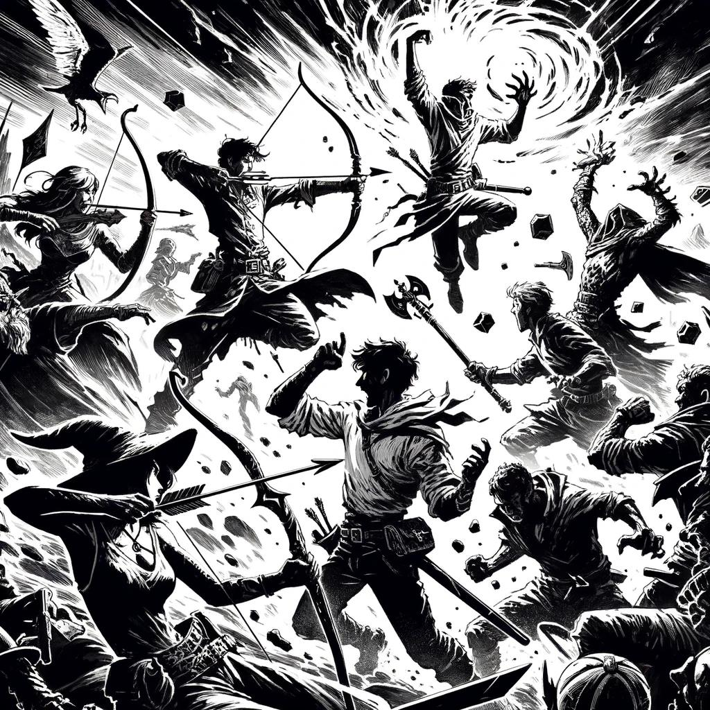

# Combat {#sec-chapter-combat}

```{=typst}
#label("sec-chapter-combat")
```

{width="60%"}

*Illustration 20 � Combat chapter art (Character traits / combat). Placeholder; final art TBD. Dimensions: 1024�1024.*



Listen up. This is the chapter that keeps your hero alive.

Combat in *Heroes of Legend* is fast, cinematic, and unforgiving. Attacks always hit. Every swing changes the board. Your job isn't to avoid getting hit, it's to hit them harder than they hit you, and to make sure you're still standing when the dust clears.



## Initiative: Who Goes First

When blades come out, everyone rolls. **1d6 + Agility modifier.** Highest goes first. Ties go to the higher Agility score; if it's still tied, roll off.

That's it. No convoluted surprise rounds. No phases. Roll, sort, go.

Initiative is simple by design. Combat already has enough moving parts � action economy, maneuvers, reactions, cover, conditions. You don't need a complex initiative system on top of all that. You need to know who's up next so you can plan your turn while the goblins are swinging. The 1d6 keeps things moving and gives Agility heroes a consistent edge without letting them monopolize the first round. The quick always go first. Sometimes the lucky go first too. That's combat.



## The Combat Round

On your turn, you get three things. Use them or lose them, they don't carry over.

| Resource | Per Turn | What You Can Do |
|----------|----------|-----------------|
| **Action** | 1 | Attack, cast a spell, activate an ability, Dash (double move) |
| **Movement** | 1 | Move up to your Speed. Break it up, move, act, move. |
| **Maneuver** | 1 | Basic maneuvers (Defend, Shove, etc.) or skill-granted maneuvers |
| **Reaction** | 1/round | Opportunity attack, shield block, triggered abilities |
| **Free** | Unlimited | Talk, drop an item, draw a weapon, gesture |

::: {.callout-important}
## Trading Down, Never Up

You can trade your **Action** for an extra **Movement** or **Maneuver**. You cannot trade a Maneuver for a second Action. You get one big thing per turn. Make it count.
:::

### Basic Maneuvers

These maneuvers are free for everyone. No skill required. No Discipline check. Just something every combat-trained hero knows how to do. You spend your Maneuver for the turn and the effect happens.

: Table 13.1: Basic Combat Maneuvers {#tbl-basic-maneuvers}

| Maneuver | Effect |
|----------|--------|
| **Defend** | +2 Protection Value until your next turn. |
| **Disengage** | Move 5 ft without provoking opportunity attacks. |
| **Aid** | Ally within 30 ft gains +2 on their next roll before your next turn. |
| **Shove** | Opposed Brawn vs Brawn/Agility. Push target 5 ft (10 ft on Strong). |
| **Grapple** | Initiate a grapple (see @sec-grappling). |
| **Command** | A companion, familiar, or mount under your control takes an extra move. |
| **Catch Breath** | Regain HP equal to your Fortitude score (min 1). Once per combat. |
| **Search** | Active Investigation check to spot a hidden creature or clue. |
| **Stand Up** | Rise from prone. |
| **Use Item** | Drink a potion, apply a salve, or activate a simple device. |

Skill-granted maneuvers are listed on each skill's card in @sec-chapter-skills. They're typically more powerful than basics and require Adept or Master rank. You earn those. They're not free.



## Making an Attack

Attacks always hit. Say it with me: *always hit.* When you swing your weapon or hurl a spell, you connect. The question isn't whether, it's how hard.

Roll 3d6 + modifiers. The total determines your damage tier:

- **Weak:** Glancing blow. Apply the weapon's Weak damage value.
- **Standard:** Solid hit. Apply Standard damage.
- **Strong:** Devastating strike. Apply Strong damage.
- **Critical (three 6s):** Maximum Strong damage plus a bonus effect from the Critical table (@sec-chapter-core-resolution).

That's one roll. No separate damage dice. No "did I hit?" anxiety. Roll once, read the damage, move on.

::: {.callout-note}
## Why Always-Hit?

Think about your favorite fantasy fight scenes. How often does the hero swing and completely miss? Almost never. They clash. They parry. They take glancing blows. Contact happens.

The always-hit rule means every round advances the fight. Nobody whiffs three rounds in a row while the table checks their phones. Nobody spends their whole turn to accomplish nothing. Something *always* happens.

This also means fights are inherently dangerous. You can't stack AC so high that goblins need a natural 20 to touch you. Every attack lands, armor reduces damage instead of preventing hits. The knight in plate mail still gets knocked around. They just stay standing longer.

The math supports it too. With the 3d6 bell curve, Weak results cluster around the middle just like everything else. A typical attack lands Standard or Weak, consistent, predictable, but never wasted. Combat moves. The tension comes from *who's still standing*, not from *who finally rolled high enough to participate.*
:::



## Damage Types

Not all wounds are created equal. A slash bleeds. A burn blisters. A psychic assault leaves no mark on the body but the mind remembers. Damage types exist so the fiction and the mechanics speak the same language � when the troll's flesh sizzles at the touch of your firebolt, the rules should reflect that.

**Physical:** Slashing, Piercing, Bludgeoning. These are the bread and butter of combat. Swords slash, arrows pierce, hammers bludgeon. Most armor protects against all three equally, but some creatures care deeply about the distinction � skeletons laugh at piercing arrows but crumble under bludgeoning maces.

**Elemental:** Fire, Cold, Lightning, Acid, Poison. The primal forces, channeled through magic or alchemy. Elemental damage bypasses most physical armor entirely, but many creatures have natural resistances � fire elementals shrug off flames, frost giants wade through blizzards.

**Magical:** Force, Radiant, Necrotic, Psychic. The esoteric damage types. Force is raw magical energy, the wizard's hammer. Radiant is divine light, the shepherd's fire. Necrotic is death made manifest, the unbalancing touch. Psychic attacks the mind directly � the brain has no armor.

Resistances and vulnerabilities modify damage of specific types. A creature resistant to Fire takes half damage from your Firebolt (round down). A creature vulnerable to Slashing takes double from your longsword. The DA will tell you when it matters � part of the game's fun is discovering, through play, that the shambling horror in the swamp stops regenerating when you hit it with fire.



## Conditions

Conditions are the status effects that change how a creature behaves in combat. They come from spells, abilities, maneuvers, and environmental hazards. Each condition tells you exactly what it does and how it ends.

: Table 13.2: Conditions {#tbl-conditions}

| Condition | Effect | Ends |
|-----------|--------|------|
| **Blinded** | Attacks reduced one tier | Source duration |
| **Charmed** | Cannot attack charmer | Save ends |
| **Deafened** | Perception disadvantage | Source duration |
| **Frightened** | Cannot approach source | Save ends |
| **Grappled** | Speed 0 | Escape action |
| **Incapacitated** | No actions | Source duration |
| **Invisible** | Cannot be targeted directly | Attack/action ends |
| **Paralyzed** | Incapacitated + auto-crit if hit | Save ends |
| **Poisoned** | Disadvantage on attacks | Save ends |
| **Prone** | Melee adv vs you, ranged disadv | Stand up (move) |
| **Restrained** | Speed 0, attack disadv | Escape action |
| **Stunned** | Incapacitated + cannot move | Save ends |
| **Unconscious** | Incapacitated + prone + unaware | Healing or save |



## Surprise

You don't always see the fight coming. When one side catches the other flat-footed, the ambushing side acts first in the opening round, regardless of initiative rolls. Surprised targets take a -2 penalty on their first roll. They're reacting, not acting. That half-second of hesitation costs them.

To determine surprise, the ambushing side rolls Stealth opposed by the target's passive Insight (Knowledge score + 7). Standard or Strong success means surprise is achieved. Weak means the target heard something, a snapped twig, a hissed whisper, and is ready.

> **DA Guidance:** Don't let the party surprise every encounter just because the rogue has high Stealth. Surprise requires genuine tactical advantage, darkness, distraction, or terrain. Walking up to a guard in plain sight and saying "I hide" isn't surprise. It's comedy.



## Grappling {#sec-grappling}

Sometimes you don't want to kill them. Sometimes you want to hold them still while your friends ask questions. Or choke them out. Or throw them off a bridge. Grappling covers all of it.

To initiate a grapple, make a Brawn (Athletics) roll opposed by the target's Brawn (Athletics) or Agility (Acrobatics), their choice. They'll pick whichever they're better at, obviously.

| Result | Effect |
|--------|--------|
| **Weak** | You grab hold but don't control. Target is Grappled but can still act freely. |
| **Standard** | Firm hold. Target is Grappled and Restrained. |
| **Strong** | Complete control. Target is Grappled, Restrained, and you may move them at half speed. |

While grappling, you may use your Action to:

- **Pin:** Force another opposed roll. Strong result adds Incapacitated.
- **Throw:** End the grapple. Target is knocked Prone adjacent to you and takes Weak unarmed damage.
- **Choke:** Target begins suffocating. They can hold breath for Fortitude + 2 rounds before things get desperate.

> *A grappled creature can still fight back.* The Grappled condition only stops movement, a grappled spellcaster can still cast. The Restrained condition imposes disadvantage on attacks but doesn't prevent them. Grabbing the enemy wizard doesn't end the fight. It starts a new one.



## Two-Weapon Fighting

A blade in each hand. It looks good. It *feels* good. Here's how it works.

When you wield a weapon in each hand, you may attack with both as a single Action. The off-hand weapon deals damage one tier lower:

| Primary Result | Off-Hand Result |
|---------------|-----------------|
| Strong | Standard |
| Standard | Weak |
| Weak | 1 damage |

The off-hand weapon must have the **Light** property (Dagger, Shortsword, Handaxe) unless you have the **Dual Wielder** talent, which removes that restriction.

**Example:** Kael wields a longsword (primary) and shortsword (off-hand). He rolls 3d6 and lands a Standard hit, 3 damage from the longsword. The shortsword drops a tier to Weak, 2 more damage. Total: 5. Two blades, one roll, clean result.



## Non-Lethal Attacks

Not every enemy needs to die. When you reduce a creature to 0 HP with a melee attack, you can pull the blow. Declare it non-lethal. The creature falls Unconscious but stable at 0 HP instead of bleeding out. They'll wake up with a headache and, hopefully, a newfound appreciation for answering questions.

Ranged attacks and spells can't be made non-lethal � arrows and fireballs don't do "gentle." You can't ask a lightning bolt to hold back. Unless the spell specifically says otherwise (like *Sleep*), assume ranged and magic are lethal. If you want prisoners, put the bow away and draw steel.

> *Why this matters:* Prisoners have information. Killing the only goblin who knows the dungeon layout means you're wandering blind. The cultist you spared might know the villain's true name. The bandit leader, once disarmed and facing a choice between talking and bleeding, becomes your best source of intelligence. Sometimes the most powerful thing you can do is leave someone alive, and talking. The dead don't negotiate.



## Morale

NPCs and monsters don't fight to the death by default. Most creatures want to *live.* When the fight turns against them, they break. Use morale to keep combat short and believable.

When a creature faces overwhelming odds, the DA calls for a **Morale Check.** The creature rolls 3d6 with no modifiers:

| Result | Behavior |
|--------|----------|
| **Strong (15+)** | Stands firm. Gains +1 on its next attack. |
| **Standard (9-14)** | Wavers but stays. Disadvantage on its next attack. |
| **Weak (1-8)** | Flees or surrenders. Fight's over for this one. |

A creature automatically checks morale when:

- Reduced below half HP for the first time
- Its leader is defeated
- Half its group has fallen
- The party demonstrates overwhelming force (DA's call)

> *DA Guidance:* Use morale to keep combat from becoming a slog. When the goblins' leader falls and three of their friends are down, the remaining two should break and run, not fight to 0 HP while the party mops up. Morale makes fights feel alive and saves table time. The goblins want to go home too.



## Dying and Death

0 HP. You're down. The world goes dark. But the story's not over, not yet.

At 0 HP, you fall Unconscious. Each round on your turn, roll 3d6 with no modifiers:

| Result | Outcome |
|--------|---------|
| **Strong (15+)** | You stabilize at 1 HP. You're back in the fight, barely. |
| **Standard (9-14)** | You remain unconscious but stable. Not getting worse. |
| **Weak (1-8)** | Take 1 wound. You're still dying. |
| **Fumble (3-1)** | Death. The table goes quiet. |
| **Critical (3-6)** | You snap awake at half HP. Someone up there likes you. |

An ally can stabilize you with a Medicine check (Standard difficulty) or any healing effect. Once stable, you're unconscious at 0 HP but no longer rolling to survive.



## Cover

Use the terrain. A pillar, a flipped table, a crouching ally � anything between you and incoming fire helps. Cover is free armor. It doesn't cost a Maneuver, doesn't require a skill, doesn't use an Action. It just requires you to think about where you're standing before the arrows start flying.

| Cover | Attacker Penalty |
|-------|-----------------|
| **Half cover** | -1 to attack roll |
| **Three-quarters cover** | -3 to attack roll |
| **Full cover** | Cannot be targeted |

Positioning matters. If you're standing in the open trading shots with archers, you're doing it wrong. Get behind something. Make them work for it. The difference between a dead hero and a living one is often the pillar they hid behind during the first volley. Use the terrain. It's the one ally that never misses a session.





{width="60%"}

*Illustration 36 � Combat chapter midpoint. Placeholder for final art. Use placeholder-section.svg dimensions: 400�300.*



## Worked Example: A Full Combat Round

The party faces a Knight of the Iron Circle (Challenge 3) and two Cultists (Challenge 1/2) in a torchlit temple chamber. Initiative order: Lyra (Odd) 5, Kael (Blade) 4, Knight 3, Cultists 2, Roric (Protector) 1.

**Round 1, Lyra's Turn:**

Lyra sees the cultists chanting, they're building toward something. She decides to disrupt them.

"I cast *Gust* at the cultists. Wind Discipline, Novice."

She rolls 3d6 + Reason (+1) + no skill. Rolls 3, 4, 4 = 11 + 1 = 12. **Standard.** The gust slams into both cultists, they must make Fortitude saves or be knocked Prone. Cultist 1 fails (rolls 4). Cultist 2 passes (rolls 10). One cultist goes sprawling, his chant broken. Lyra spends her Maneuver to Defend, +2 Protection Value.

**Round 1, Kael's Turn:**

Kael sees the Knight advancing on Roric. He moves 15 ft to flank, drawing his longsword as a free action.

"I attack the Knight. Blades Fighting Adept."

Rolls 3d6 + Brawn (+1) + Blades Fighting (+2). Rolls 5, 4, 5 = 14 + 3 = 17. **Strong.** Longsword Strong damage: 5. Knight's plate armor: DR 4. 5 - 4 = 1 damage. The blade finds a gap at the Knight's gorget, a thin line of blood. Not a killing blow, but the Knight knows Kael can hurt him.

Kael uses his Maneuver: **Riposte** is ready if the Knight swings at him.

**Round 1, Knight's Turn:**

The Knight assesses the threat. The Blade just drew blood. The Protector is a wall. The Odd is in the back. Tactical decision: kill the one who can actually hurt him.

"I attack the Blade." Rolls for the Knight. Longsword: 3d6 + Brawn (+2). Rolls 6, 3, 2 = 11 + 2 = 13. **Standard.** Longsword Standard damage: 4. Kael's leather armor: DR 2. 4 - 2 = 2 damage. Kael drops from 11 HP to 9 HP.

"Shield Block," Kael declares, spending his reaction. The Knight's Standard drops to Weak: 3 damage - DR 2 = 1 damage. Kael drops to 10 HP instead of 9. The Knight's blade skids off Kael's raised buckler.

"Riposte!" Kael spends his reaction, wait. He already used his reaction for Shield Block. He gets one reaction per round. No Riposte. The Knight's attack stands, and Kael's counter never comes. That's the tradeoff. Shield Block saved him HP. Riposte would have cost him HP but dealt damage back. Kael chose survival.

**Round 1, Cultists' Turn:**

Cultist 1 stands up from Prone (uses half his movement). Cultist 2, still standing, hurls a **Dark Bolt** at Lyra, the one who knocked his friend down.

Rolls 3d6 + Guile (+1). Rolls 2, 5, 5 = 12 + 1 = 13. **Standard.** Dark Bolt Standard damage: 3 necrotic. Lyra has no armor. She takes 3 damage. The bolt of shadow slams into her shoulder, cold and wrong. She drops to 7 HP.

**Round 1, Roric's Turn:**

Roric has been waiting. The Knight is focused on Kael. The cultists are clustered. Time to be the Protector.

"I move to engage the Knight. Attack with my warhammer."

Rolls 3d6 + Brawn (+2) + Heavy Weapon Fighting Novice (+1). Rolls 3, 3, 2 = 8 + 3 = 11. **Standard.** Warhammer Standard damage: 4. Knight's armor: DR 4. 4 - 4 = 0 damage. The hammer rings off the Knight's breastplate. Sparks. No blood. But Roric's not done.

"Maneuver: I'm using **Menacing Glare** from Intimidation Adept." The Knight must make a Morale Check. The DA rolls for the Knight: 3d6. Rolls 4, 2, 3 = 9. **Standard.** The Knight wavers, disadvantage on his next attack.

**End of Round 1.** The party has dealt 2 total damage to the Knight (Kael's 1, Roric's 0). The cultists dealt 3 to Lyra. The Knight dealt 1 to Kael (reduced from 2 by Shield Block). Nobody is down. Everyone is engaged. The next round will be decisive.

**Round 2, Lyra's Turn:**

Lyra's shoulder burns from the Dark Bolt, but she's an Odd, when things go wrong, she gets interesting.

"I cast *Spark* at the standing cultist. Fire Discipline, Novice. Then I use my Odd ability, **Wildcard.**"

Spark roll: 3d6 + Reason (+1). Rolls 6, 6, 1 = 13 + 1 = 14. **Strong.** Spark Strong damage: 4 fire. Cultist has no armor. 4 damage straight through. The cultist screams as fire catches his robes.

Wildcard: Lyra rolls a d6 on the chaos table, 4. "Enemies within 15 ft take 1 damage." The Knight and both cultists are within range. Each takes 1 damage. The Knight's armor reduces it to 0, but the cultists both take it. The standing cultist has now taken 5 damage, he's at 1 HP.

**Round 2, Kael's Turn:**

The Knight is wavering from Roric's Menacing Glare. Kael sees the opening.

"Attack the Knight again."

Rolls 3d6 + Brawn (+1) + Blades Fighting (+2). Rolls 4, 6, 5 = 15 + 3 = 18. **Strong.** Longsword Strong damage: 5. Knight's DR: 4. 5 - 4 = 1 damage. Total damage on Knight: 3 (2 from earlier attacks + 1 now). The blade slips under the Knight's pauldron, deeper this time. The Knight grunts.

Kael uses his Maneuver to **Flurry** (Master maneuver, but wait, Kael is only Adept. He can't use Flurry). He uses **Defend** instead, +2 PV. Smart. He's the Knight's target and he knows it.

**The Knight's Morale:**

The Knight has taken 3 damage, not much, but he's down to 17 HP from 20. Both cultists are bloodied. One is at 1 HP. The party is coordinated and the Protector hasn't even been hit yet. The DA calls for a Morale Check.

Knight rolls 3d6: 3, 2, 1 = 6. **Weak.** The Knight lowers his sword. "Enough," he growls. "You fight well. The Iron Circle withdraws." He drags the wounded cultist to his feet. They retreat into the shadows of the temple.

The party could press the attack, but Lyra is at 7 HP, Kael is at 10, and the Knight might have reinforcements. They let them go.

**Total combat time at the table:** About 8 minutes. Two full rounds. Everyone acted. Damage was exchanged. The Knight broke on morale. The story advanced. That's *Heroes of Legend* combat.



## Worked Example: The Ambush

The party has tracked a bandit scout to a forest clearing. The bandit doesn't know they're here. The party wants him alive for questioning.

**Surprise Check:** Lyra rolls Stealth: 3d6 + Agility (+2) + Stealth Adept (+2). Result: 5, 6, 4 = 15 + 4 = 19. **Strong.** The bandit's passive Insight is 7 (Knowledge 0 + 7). 19 beats 7 easily. Surprise achieved.

**Round 1 (Surprise Round):** The party acts. The bandit does not.

**Kael** moves 30 ft through the underbrush, drawing his shortsword. "I grapple him from behind."

Grapple roll: 3d6 + Brawn (+1) + Athletics Novice (+1). Bandit opposes with Brawn (+0). Kael: 4, 3, 5 = 12 + 2 = 14. Bandit: 2, 4, 1 = 7. **Strong.** Kael has the bandit in a full lock, Grappled, Restrained, and controlled. The bandit can't move, can't reach his weapon, and Kael can drag him wherever he wants.

**Lyra** moves up, dagger drawn. "Talk. Where's your camp?"

The bandit is Restrained, outnumbered four to one, and caught completely off guard. The DA rules this is an automatic Morale Check at disadvantage. Bandit rolls: 1, 3, 2 = 6. **Weak.** "North! Two miles north! Old watchtower! Please don't kill me!"

Combat over. One roll. The ambush worked because the party used Stealth, positioning, and overwhelming force, not because they rolled high on a damage die.

::: {.callout-tip}
## Running Combat for New Players

If you're DAing for a group that's new to *Heroes of Legend*, here's how to make combat sing from the first session.

**Start small.** One enemy per hero. No lieutenants, no reinforcements, no lair actions. Let the players learn the action economy, Action, Movement, Maneuver, before you add complexity.

**Announce the turn order at the top of every round.** "Kael, you're up. Lyra, you're next. Then the goblins. Roric, you're after them." Players stop asking "whose turn is it?" when they can see the on-deck circle.

**Use physical tokens for reactions.** Give each player a poker chip or a coin. When they spend their reaction, they flip it over. At the start of their turn, they flip it back. It's a visual reminder that they have one reaction per round, and it prevents the "wait, did I already use my reaction?" conversation.

**Describe damage, not numbers.** "The goblin's blade skips off your pauldron, you feel the impact but no pain" is better than "You take 0 damage." The fiction matters more than the arithmetic. Players remember the time the dragon's claw sent them flying across the room. They don't remember the time they took 7 piercing damage.

**End fights when they're over.** When the outcome is certain, the last two goblins are surrounded, wounded, and outnumbered, don't play out two more rounds of cleanup. The goblins surrender or flee. Move to the aftermath. Combat is a pacing tool, not a punishment.
:::
