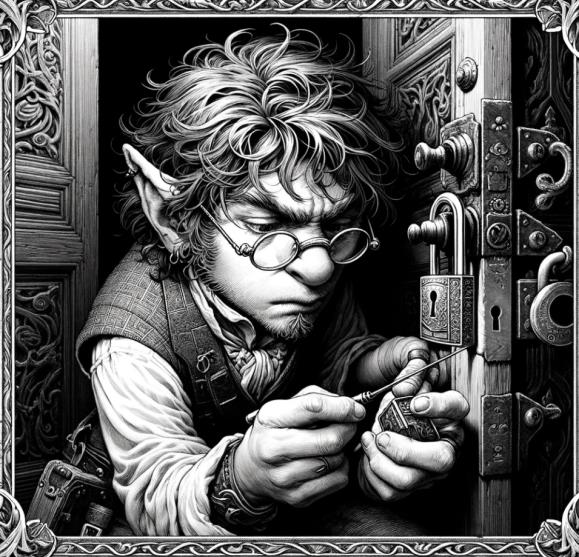

# Social Conflict {#sec-chapter-social-conflict}

{width="60%"}

*Illustration 21 — Social conflict chapter art (Basic Mechanics). Placeholder; final art TBD. Dimensions: 579×557.*



Not every battle is fought with swords. Sometimes the most dangerous weapon in the room is a well-timed word.

Social conflict covers everything from haggling with a merchant to negotiating a peace treaty between warring kingdoms. The same 3d6 engine drives it all, roll your dice, add your attribute, add your skill, compare to success tiers. The difference is the stakes: instead of hit points, you're gambling with trust, reputation, and information.



## Social Skills

Four skills carry the weight of social encounters. Know which one fits the moment.

**Deception (Guile):** Lying convincingly. False identities, forged documents, "Of course I'm supposed to be here." The Blade's favorite. The Protector's last resort.

**Persuasion (Guile):** Diplomatic negotiation. Building rapport, finding common ground, making reasonable people see reason. The Leader's primary tool. The Intellect's backup plan.

**Intimidation (Brawn):** Threats and coercion. "I wasn't asking." Works fast, burns bridges faster. The Unbalanced lives here. Everyone else visits when patience runs out.

**Insight (Reason):** Reading truth from lies. Catching the twitch, the hesitation, the glance at the exit. Passive Insight is your Knowledge score + 7, that's the number the DA uses when someone's lying to you and you're not actively looking for it.



## NPC Attitudes

Every NPC your party encounters has an attitude. It's the starting point for every social roll. Shift it in your favor, and doors open. Shift it the wrong way, and you're talking to a slammed gate.

| Attitude | Response | Mechanical Effect |
|----------|----------|-------------------|
| **Hostile** | Will oppose actively. | Need Strong result to shift to Neutral. Standard fails, they dig in harder. |
| **Neutral** | Indifferent. Doesn't care about you either way. | Standard result gains cooperation for a single request. |
| **Friendly** | Inclined to help. You've made a good impression. | Weak result sufficient for minor favors. Standard opens real doors. |
| **Allied** | Will risk themselves for you. | No roll needed for reasonable requests. They're on your side. |

Attitudes shift based on your actions, both in and out of social conflict. Insult a Friendly NPC and they drop to Neutral. Save a Hostile NPC's child and they might climb to Neutral or even Friendly. The fiction drives the numbers, not the other way around.



## Extended Social Conflicts

For high-stakes negotiations, convincing the king to commit troops, talking down the assassin with a blade at the queen's throat, negotiating surrender with the bandit lord, run social encounters as multi-round conflicts.

Here's the structure:

1. **Set the stakes.** What does each side want? What happens if negotiations fail?
2. **Determine attitudes.** Where does each NPC start on the attitude scale?
3. **Round by round.** Each round, one PC makes a social skill roll. The DA roleplays the NPC's response based on the result.
4. **First to 3 successes wins.** The conflict resolves in the winning side's favor.
5. **Failures shift attitudes negatively.** Each failed roll pushes the NPC one step toward Hostile. At Hostile, further failures may end the conversation, or start a different kind of fight.

::: {.callout-note}
## Failing Forward in Social Encounters

A failed social roll shouldn't mean "the conversation stops." It means the conversation takes a turn you didn't want.

Failed to persuade the guard? He doesn't slam the gate, he calls his sergeant over. Now you're talking to someone with more authority and more suspicion. The scene escalates, but it doesn't end.

Failed to deceive the merchant? She doesn't kick you out, she raises the price. "I know what you're doing. Twenty percent surcharge for wasting my time." You can still buy the thing. It just costs more.

The worst outcome in a social scene is "nothing happens." Keep the fiction moving. Every roll should change the situation, even if it's not in the party's favor.
:::



## Worked Example: A Full Social Conflict Scene

The party needs passage through the Ironwood, a dense forest controlled by the Thornwood elves. The elven warden at the border crossing is Neutral: she doesn't know these travelers, doesn't trust them, but hasn't been given a reason to turn them away yet. The party's Leader, Ser Aldric, takes the lead.

**The stakes:** Passage through the Ironwood. Fail, and the party must take the mountain pass, adding a week to their journey and costing them the element of surprise against the cult they're chasing.

**Round 1, Opening Gambit:**

**Aldric (the player):** "I approach the warden with open hands. 'We have no quarrel with the Thornwood. We hunt a cult that's kidnapped children from three villages. They passed this way two days ago.'"

**The DA:** "The warden's expression doesn't change, but her eyes flick toward the treeline. 'Children, you say.' She's listening. Give me a Persuasion roll. Standard difficulty, she's Neutral, and your cause is sympathetic."

*Aldric rolls:* 3d6 + Guile (+1) + Persuasion Adept (+2). Result: 4, 5, 3 = 12 + 3 = 15. **Strong.**

**The DA:** "The warden uncrosses her arms. 'We found tracks, heavy boots, dragging something. They went east, toward the old barrows. You'll need a guide. The barrows are... unsettled.' That's one success. She's shifted to Friendly."

**Round 2, The Lieutenant Objects:**

**The DA:** "Before the warden can assign a guide, her lieutenant steps forward. He's older, scarred, and clearly doesn't like outsiders. 'Warden. These *humans* could be lying. They could be the cultists, spinning a story to get past us.' He's Hostile."

**Lyra (the player):** "I step up beside Aldric. 'Lieutenant. Look at us. We're exhausted, we're armed for a fight, and we're asking permission instead of forcing our way through. Cultists don't ask.' Can I use Insight to read what's really bothering him?"

**The DA:** "Roll Insight. Standard difficulty."

*Lyra rolls:* 3d6 + Reason (+1) + Insight Novice (+1). Result: 5, 2, 4 = 11 + 2 = 13. **Strong.**

**The DA:** "You catch it, a microexpression when he said 'humans.' He lost someone to human bandits. Years ago. This isn't about you. It's about old wounds. You can use that."

**Lyra:** "I soften my voice. 'We're not them. Whoever hurt your people, we're hunting the same kind of monster.' Persuasion, using the Insight lead."

*Lyra rolls:* 3d6 + Guile (+1) + Persuasion (no skill, just attribute). DA gives +1 for the Insight advantage. Result: 3, 6, 5 = 14 + 2 = 16. **Strong.**

**The DA:** "The lieutenant stares at Lyra for a long moment. Then he nods once, a single, sharp motion. 'Warden. I'll guide them myself.' Two successes."

**Round 3, The Warden's Price:**

**The DA:** "The warden raises a hand. 'One condition. The cult lairs in the old barrows. If you find something there that belongs to the Thornwood, an artifact, a tome, a spirit-stone, you bring it back to us. The barrows are elven graves. What's buried there is ours.'"

**Aldric:** "Agreed. We're not grave robbers. You have my word."

**The DA:** "She's already Friendly, and this is a reasonable request. No roll needed, she trusts you. Three successes. The conflict is won."

**Outcome:** The party gains passage through the Ironwood, a guide who knows the terrain, and an ally in the Thornwood elves, all because they worked the social conflict round by round instead of rolling once and hoping for the best.



## Why Run Extended Social Conflicts

The single-roll approach works fine for buying a sword or asking directions. But for moments that define the story, extended conflicts give every player a chance to contribute. The Blade might read the room with Insight. The Arcanist might use Arcana to identify the magical wards on the negotiation chamber, information that becomes a bargaining chip. The Protector might just stand there looking unstoppable, giving the party's face a +1 circumstance bonus from sheer presence.

Let the party stack their skills. Social encounters are team efforts. The person rolling Persuasion is just the one delivering the final line, everyone else is feeding them the setup.

::: {.callout-note}
## The "Face" Problem, And How to Avoid It

In a lot of games, one player builds the "party face", max Charisma, max social skills, and handles every conversation while the rest of the table checks their phones. Don't let that happen.

Spread the social spotlight. The dwarf with Brawn +2 and no social skills can still contribute by standing behind the negotiator, arms crossed, looking like a wall of muscle. That's worth a +1 circumstance bonus, and it keeps the dwarf's player engaged.

The wizard with Knowledge +2 can drop a historical reference that earns the NPC's respect. The ranger can mention a shared enemy. Everyone has something to add. Your job as DA is to ask: "What's your character doing while they talk?" The answer might not require a roll, but it should always require attention.
:::
