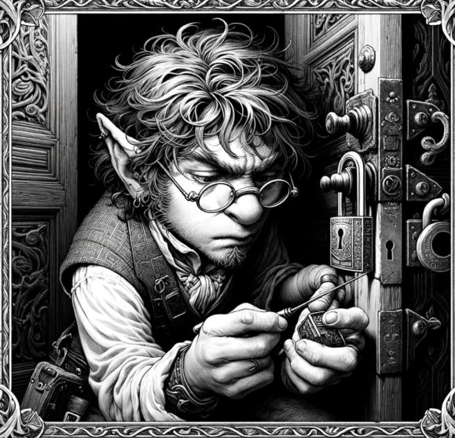

# Social Conflict {#sec-chapter-social-conflict}

```{=typst}
#label("sec-chapter-social-conflict")
```

{width="60%"}

*Illustration 21: Social conflict chapter art (Basic Mechanics). Placeholder; final art TBD. Dimensions: 579×557.*



Not every battle is fought with swords. Sometimes the most dangerous weapon in the room is a well-timed word.

Social conflict covers everything from haggling with a merchant to negotiating a peace treaty between warring kingdoms. The same 3d6 engine drives it all, roll your dice, add your attribute, add your skill, compare to success tiers. The difference is the stakes: instead of hit points, you're gambling with trust, reputation, and information.



## Social Skills

Five skills carry the weight of social encounters. Know which one fits the moment.

**Deception (Guile):** Lying convincingly. False identities, forged documents, "Of course I'm supposed to be here." The Blade's favorite. The Protector's last resort.

**Persuasion (Guile):** Diplomatic negotiation. Building rapport, finding common ground, making reasonable people see reason. The Leader's primary tool. The Intellect's backup plan.

**Intimidation (Brawn):** Threats and coercion. "I wasn't asking." Works fast, burns bridges faster. The Unbalanced lives here. Everyone else visits when patience runs out.

**Insight (Reason):** Reading truth from lies. Catching the twitch, the hesitation, the glance at the exit. Passive Insight is your Knowledge score + 7, that's the number the DA uses when someone's lying to you and you're not actively looking for it. When an NPC lies to you and you're not actively contesting the claim, their Deception roll is opposed by your passive Insight.

**Performance (Guile):** Music, oratory, working a room. The right song at the right moment buys more passage than a coin ever will. The Odd's stage. The Leader's secret weapon.



## NPC Attitudes

Every NPC your party encounters has an attitude. It's the starting point for every social roll. Shift it in your favor, and doors open. Shift it the wrong way, and you're talking to a slammed gate.

| Attitude | Response | Mechanical Effect |
|----------|----------|-------------------|
| **Hostile** | Will oppose actively. | Need Strong result to shift to Neutral. Standard fails, they dig in harder. |
| **Neutral** | Indifferent. Doesn't care about you either way. | Standard result gains cooperation for a single request. |
| **Friendly** | Inclined to help. You've made a good impression. | Weak result sufficient for minor favors. Standard opens real doors. |
| **Allied** | Will risk themselves for you. | No roll needed for reasonable requests. They're on your side. |

Attitudes shift based on your actions, both in and out of social conflict. Insult a Friendly NPC and they drop to Neutral. Save a Hostile NPC's child and they might climb to Neutral or even Friendly. The fiction drives the numbers, not the other way around.

Criticals and Fumbles follow the core rules (@sec-chapter-core-resolution): three natural 6s is an automatic Strong result, three natural 1s is an automatic failure with a serious complication.



## Extended Social Conflicts

High-stakes encounters, the negotiation with the king, the interrogation of the spy, the trial that decides a life, run as multi-round conflicts. Not one roll and a coin flip. A back-and-forth, where both sides spend points.

**Stakes must be declared before the conflict begins.** "If I win, the guard lets us pass. If you win, we're arrested." What does each side want, and what happens if the negotiation fails? Say it out loud before the first die hits the table. That's the hard bound that keeps a social conflict from becoming an endless persuasion check.

**Round structure.** Each round, the party's face makes one social skill roll: Persuasion, Deception, Intimidation, or Performance. The roll is opposed by the NPC's Insight score, or the relevant attribute if the NPC is actively counter-arguing. The opposed rolls rule from the core chapter (@sec-chapter-core-resolution) decides the outcome tier: the higher tier wins the exchange, a tie on tier goes to the higher total, and a full tie goes to the NPC, the defender.

| Result | Effect |
|--------|--------|
| **Weak** | Your argument falters. The NPC gains 1 success. |
| **Standard** | You score a point. You gain 1 success. |
| **Strong** | Devastating point. You gain 2 successes. |
| **Critical** | You break through entirely. Win the conflict immediately. |
| **Fumble** | You offend or reveal weakness. The NPC gains 2 successes. |

**First to 3 successes wins.** The first side to 3 successes takes the conflict. A Weak or Fumble result is a failed roll for the party: the NPC's attitude shifts one step toward Hostile. At Hostile, further failures may end the conversation, or start a different kind of fight. A Strong result shifts the NPC one step closer to you. One shift per roll, never both.

::: {.callout-note}
## Failing Forward in Social Encounters

A failed social roll shouldn't mean "the conversation stops." It means the conversation takes a turn you didn't want.

Failed to persuade the guard? He doesn't slam the gate, he calls his sergeant over. Now you're talking to someone with more authority and more suspicion. The scene escalates, but it doesn't end.

Failed to deceive the merchant? She doesn't kick you out, she raises the price. "I know what you're doing. Twenty percent surcharge for wasting my time." You can still buy the thing. It just costs more.

The worst outcome in a social scene is "nothing happens." Keep the fiction moving. Every roll should change the situation, even if it's not in the party's favor.
:::



## Worked Example: A Full Social Conflict Scene

The party needs passage through the Ironwood, a dense forest controlled by the Thornwood elves. The elven warden at the border crossing is Neutral: she doesn't know these travelers, doesn't trust them, but hasn't been given a reason to turn them away yet. The party's Leader, Ser Aldric, takes the lead.

**The stakes:** Passage through the Ironwood. Fail, and the party must take the mountain pass, adding a week to their journey and costing them the element of surprise against the cult they're chasing.

**Round 1, Opening Gambit:**

**Aldric (the player):** "I approach the warden with open hands. 'We have no quarrel with the Thornwood. We hunt a cult that's kidnapped children from three villages. They passed this way two days ago.'"

**The DA:** "The warden's expression doesn't change, but her eyes flick toward the treeline. 'Children, you say.' She's listening. Give me a Persuasion roll, opposed by her Insight."

*Aldric rolls:* 3d6 + Guile (+1) + Persuasion Adept (+2). Result: 4, 5, 3 = 12 + 3 = 15. **Strong.** The warden's passive Insight is 13 (Knowledge +2, base 7). 15 is Strong, 13 is Standard, and Strong beats Standard. Two successes.

**The DA:** "The warden uncrosses her arms. 'We found tracks, heavy boots, dragging something. They went east, toward the old barrows. You'll need a guide. The barrows are... unsettled.' Two successes for the party, and her attitude shifts one step closer to you. Neutral to Friendly."

**Round 2, The Lieutenant Objects:**

**The DA:** "Before the warden can assign a guide, her lieutenant steps forward. He's older, scarred, and clearly doesn't like outsiders. 'Warden. These *humans* could be lying. They could be the cultists, spinning a story to get past us.' He's Hostile."

**Lyra (the player):** "I step up beside Aldric. 'Lieutenant. Look at us. We're exhausted, we're armed for a fight, and we're asking permission instead of forcing our way through. Cultists don't ask.' Can I use Insight to read what's really bothering him?"

**The DA:** "Roll Insight, opposed by his. He's not counter-arguing, just holding the line. His Insight is 11 (Knowledge 0, base 7)."

*Lyra rolls:* 3d6 + Reason (+1) + Insight Novice (+1). Result: 5, 2, 4 = 11 + 2 = 13. **Standard.** 13 against his 11, both Standard, so the higher total wins. One success.

**The DA:** "You catch a flicker of old anger when he said 'humans.' Something personal behind the hostility. Not just standard suspicion. You can use that. Three successes. The conflict is yours."

**The Warden's Price:**

**The DA:** "The warden names the guide, a sharp-eyed scout who knows the barrow roads. Then she raises a hand. 'One condition. The cult lairs in the old barrows. If you find something there that belongs to the Thornwood, an artifact, a tome, a spirit-stone, you bring it back to us. The barrows are elven graves. What's buried there is ours.'"

**Aldric:** "Agreed. We're not grave robbers. You have my word."

**Outcome:** The party gains passage through the Ironwood, a guide who knows the terrain, and an ally in the Thornwood elves, all because they worked the social conflict round by round instead of rolling once and hoping for the best.



## Why Run Extended Social Conflicts

The single-roll approach works fine for buying a sword or asking directions. But for moments that define the story, extended conflicts give every player a chance to contribute. The Blade might read the room with Insight. The Arcanist might use Arcana to identify the magical wards on the negotiation chamber, information that becomes a bargaining chip. The Protector might just stand there looking unstoppable, and the DA grants the party's face a Boon on their next social roll from sheer presence.

Let the party stack their skills. Social encounters are team efforts. The person rolling Persuasion is just the one delivering the final line, everyone else is feeding them the setup.

::: {.callout-note}
## The "Face" Problem, And How to Avoid It

In a lot of games, one player builds the "party face", max Guile, max social skills, and handles every conversation while the rest of the table checks their phones. Don't let that happen.

Spread the social spotlight. The dwarf with Brawn +2 and no social skills can still contribute by standing behind the negotiator, arms crossed, looking like a wall of muscle. That's worth a Boon on the negotiator's next social roll, and it keeps the dwarf's player engaged.

The Arcanist with Knowledge +2 can drop a historical reference that earns the NPC's respect. The Protector can mention a shared enemy. Everyone has something to add. Your job as DA is to ask: "What's your character doing while they talk?" The answer might not require a roll, but it should always require attention.
:::
