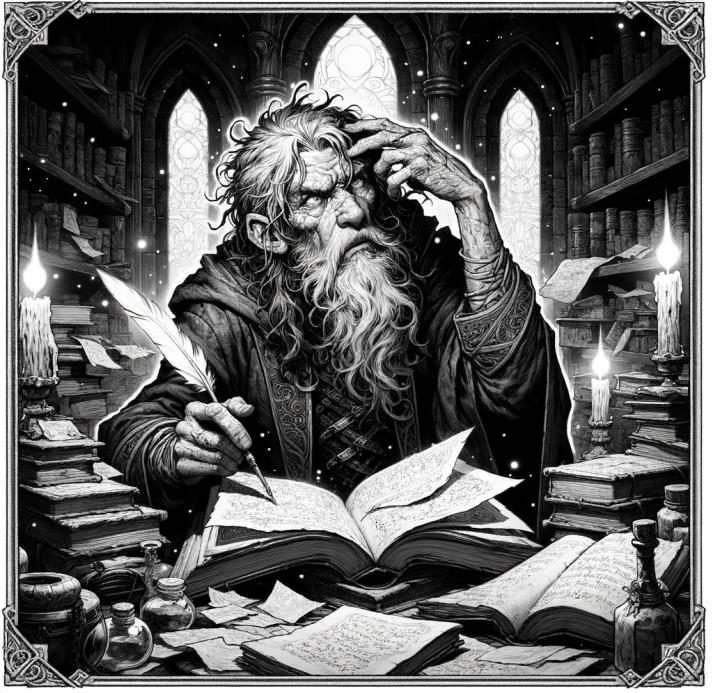

# Equipment {#sec-chapter-equipment}

{width="60%"}

*Illustration 22 — Equipment chapter art (Health & healing). Placeholder; final art TBD. Dimensions: 713×693.*



Your hero is going to need gear. A sword, some armor, a rope, a torch, a bedroll, and probably a ten-foot pole because someone at the table has read about pit traps. Equipment is the stuff between your hero and a bad day. Choose it well.

The tables in this chapter list weapons by damage tier, armor by damage reduction, and adventuring gear by utility and cost. Prices are in gold pieces (gp), the standard currency of the realms. A laborer earns about 1 gp a month. A suit of plate armor costs more than most villagers see in a lifetime. Keep that in mind when you're haggling with the blacksmith — you're not just buying gear, you're spending someone's annual salary.



## Weapons

Every weapon has fixed Weak, Standard, and Strong damage values. No damage dice, the 3d6 roll already determined how well you struck.

| Weapon | Disciplines Required | Damage (W/S/St) |
|--------|---------------------|-----------------|
| Unarmed |, | 1 / 1 / 2 |
| Dagger | 1 Blade | 1 / 2 / 3 |
| Shortsword | 2 Blades | 2 / 3 / 4 |
| Longsword | 1 Blade, 1 Heavy Weapon | 2 / 3 / 5 |
| Greatsword | 1 Blade, 2 Heavy Weapons | 3 / 5 / 8 |
| Handaxe | 1 Axe | 2 / 3 / 5 |
| Battleaxe | 1 Axe, 1 Heavy Weapon | 3 / 4 / 6 |
| Greataxe | 1 Axe, 2 Heavy Weapons | 3 / 5 / 8 |
| Spear | 1 Polearm | 2 / 3 / 4 |
| Halberd | 1 Polearm, 1 Axe | 3 / 5 / 7 |
| Shortbow | 1 Archery | 2 / 3 / 4 |
| Longbow | 2 Archery | 3 / 4 / 6 |
| Crossbow | 1 Archery, 1 Heavy Weapon | 3 / 5 / 7 |

::: {.callout-note}
## Discipline Combinations, Build Your Fighting Style

Weapons don't just require more of the same Discipline, they require specific combinations. A Longsword needs *Blade training AND Heavy Weapon training*. A Halberd needs *Polearm AND Axe*. This means your Discipline choices define your fighting style. A warrior with 2 Blades and 1 Heavy Weapon can wield a Shortsword with precision or a Longsword with power, but a Greatsword (1 Blade + 2 Heavy Weapons) requires deeper investment in the Heavy Weapon path.

**Heavy Weapon** Discipline represents training with large, two-handed weapons that rely on momentum and raw force rather than finesse. It gates access to the highest damage tiers.
:::

**Properties:**

- **Versatile**, +1 damage when wielded two-handed (Longsword only)
- **Finesse**, may use Agility modifier instead of Brawn on the 3d6 attack roll
- **Reach**, can attack targets 10 ft away (Spear, Halberd)
- **Thrown**, can be thrown (range 20/60 ft: Dagger, Handaxe, Spear)
- **Light**, can be used as an off-hand weapon for two-weapon fighting (Dagger, Shortsword, Handaxe)
- **Loading**, requires a Bonus Action to reload between shots (Crossbow only)



## Armor

Armor provides damage reduction (DR), subtract from incoming physical damage.

| Armor | Discipline Req | DR |
|-------|---------------|-----|
| Padded |, | -1 |
| Leather |, | -2 |
| Studded Leather | 1 Armor | -2 |
| Chain Shirt | 1 Armor | -3 |
| Breastplate | 2 Armor | -4 |
| Chain Mail | 2 Armor | -5 |
| Plate | 3 Armor | -6 |

Shields: **Buckler** (1 Protection, +1 DR), **Shield** (1 Protection, +2 DR), **Tower Shield** (2 Protection, +3 DR, provides half cover).



## Encumbrance

Slot-based system. You have 10 + (Brawn x 5) slots. Most items take 1 slot. Armor takes 2-4 slots. Two-handed weapons take 2 slots.



{width="60%"}

*Illustration 37 — Equipment chapter midpoint. Placeholder for final art. Use placeholder-section.svg dimensions: 400×300.*



## Adventuring Gear

The general store doesn't sell magic swords. It sells rope, rations, and the thousand small items that separate a prepared adventurer from a corpse. Here's what's on the shelf.

| Item | Cost | Slots | Notes |
|------|------|-------|-------|
| **Backpack** | 2 gp | 2* | Holds up to 30 slots of gear. Items stored inside don't count against your encumbrance, but the backpack itself takes 2 slots on your person. Retrieving a stored item takes a Maneuver. |
| **Bedroll** | 1 gp | 2 | A warm bedroll and blanket. Required for a full rest in the wild. Without one, you recover half HP (rounded down) from rest. |
| **Chalk (5 pieces)** | 5 cp | 0 | Mark walls, leave signals, draw ritual circles. Breaks easily. Costs nothing. |
| **Crowbar** | 2 gp | 1 | Advantage on Brawn checks to force open doors, chests, or grates. Makes a loud noise, no subtlety. Can be used as an improvised weapon (1/1/2 damage). |
| **Fishing Tackle** | 1 gp | 1 | Hook, line, and tackle. With a body of water and 1 hour, make a Knowledge check (Standard 9-14) to catch enough fish to feed one person for the day. On a Strong result, feed two. |
| **Grappling Hook** | 2 gp | 1 | Hooks onto ledges, branches, or battlements. Attach a rope and throw, range 30 ft. Requires a Brawn or Agility check (Standard) to set securely. |
| **Hammer** | 1 gp | 1 | Drives pitons, breaks things, nails doors shut. Can be used as an improvised weapon (1/1/2 damage). |
| **Healer's Kit** | 5 gp | 1 | Bandages, salves, and splints. 10 uses. When you stabilize a dying creature or restore HP during a short rest, add +1 HP per use expended. Without a kit, you can't use the Medicine skill to restore HP during rests. |
| **Ink & Pen** | 10 gp | 0 | Write letters, copy maps, forge documents. The ink lasts for roughly 20 pages. The pen is a quill, replace it when the cat gets it. |
| **Lantern (hooded)** | 5 gp | 1 | Bright light 30 ft, dim light 30 ft. The hood can be closed to reduce light to a 5-ft radius, useful for stealth. Burns for 6 hours per flask of oil. |
| **Manacles** | 2 gp | 1 | Restrains a creature of Small or Medium size. Escape requires an Agility check (Strong 17-20) or a Brawn check (Strong 17-20) to break. Without the key, they're not coming off quietly. |
| **Mirror (steel)** | 5 gp | 0 | Polished steel, not glass, it won't shatter when the fireball hits. Useful for looking around corners, signaling with reflected light, and confirming you're not a vampire. |
| **Oil (flask)** | 1 sp | 1 | Fuel for lanterns (6 hours). Can be thrown and ignited as an improvised attack, 2 fire damage on hit, and the target takes 1 ongoing fire damage until they spend an action to put it out. |
| **Parchment (5 sheets)** | 1 gp | 0 | Blank parchment. Maps, letters, wanted posters with your face on them, parchment is the medium of adventure. |
| **Pitons (set of 10)** | 5 sp | 1 | Iron spikes for climbing or securing ropes. Each piton supports 300 lbs when properly hammered into stone. Climbing a piton-anchored rope requires no check. |
| **Pouch (belt)** | 5 sp | 0* | Holds up to 50 coins or small items. Does not take a slot, it straps to your belt. The coins inside don't count against encumbrance. Be honest about what fits. |
| **Rations (1 day)** | 5 sp | 1 | Dried meat, hardtack, and dried fruit. Tastes like regret. One day without food: -1 to all rolls. Three days: -2. Five days: you're dying. |
| **Rope, Hemp (50 ft)** | 1 gp | 2 | Coarse, heavy, reliable. Supports 500 lbs. Can be cut with a blade (1 round) or burned through (2 rounds in fire). |
| **Rope, Silk (50 ft)** | 10 gp | 1 | Lightweight and strong. Supports 700 lbs. Half the bulk of hemp rope. Quieter when uncoiled, no rough fibers scraping against stone. |
| **Sack (large)** | 1 sp | 1* | A coarse sack that holds 1 cubic foot or 30 lbs of material. The sack takes 1 slot but its contents don't count, until it tears. One sharp edge and your loot is on the floor. |
| **Shovel** | 2 gp | 2 | Digs graves, trenches, and latrines. Buries treasure. Unearths treasure. The shovel has seen more adventuring than most bards. |
| **Spyglass** | 100 gp | 1 | Magnifies distant objects. Reduce the difficulty of visual Perception checks at long range by one tier (Strong becomes Standard, Standard becomes Weak). Objects beyond 1 mile are still indistinct. |
| **Tent (2-person)** | 2 gp | 3 | Canvas shelter. Keeps rain off, holds heat. Sleeping in a tent during severe weather negates the exhaustion penalty for exposure. Two people can squeeze in, three if you're very good friends. |
| **Thieves' Tools** | 25 gp | 1 | Lockpicks, files, and tension wrenches in a leather roll. Required for lockpicking and disabling mechanical traps. Without these, you can't make Thievery checks to pick locks. If you break a pick (fumble), replacement picks cost 5 gp. |
| **Torch (bundle of 3)** | 1 sp | 1 | Bright light 15 ft, dim light 15 ft. Burns for 1 hour. Can be used as an improvised weapon, 1 fire damage on hit. Wind, rain, or being dropped in water extinguishes. |
| **Waterskin** | 2 sp | 1 | Holds a half-gallon of water. One day without water: -1 to all rolls. Two days: -2. Three days: you're dying. In hot climates or heavy exertion, double the consumption rate. |

**Coins and Encumbrance:** 100 coins of any denomination take 1 slot. A pouch holds up to 50 coins slot-free. A sack holds up to 300 coins before it tears. After your first dragon hoard, invest in a wagon.

::: {.callout-note}
## Starting Gear
A new hero begins with 50 gp to purchase equipment. Most adventurers start with a backpack, bedroll, waterskin, 3 days of rations, a torch bundle, and weapons appropriate to their fighting style. The rest is personal taste, some carry chalk and parchment, others carry a crowbar and a bad attitude. Both are valid.
:::



## Mounts & Vehicles

A good horse is the difference between arriving fed and rested and arriving half-dead with blisters. A wagon is the difference between carrying out treasure and leaving it behind for the next batch of idiots. Pay attention.

### Mounts

Mounts use a simplified stat block, HP, Speed, carrying capacity, and any special traits. They don't roll attacks (you do, from the saddle), but they can be targeted in combat. A dead horse is a tragedy. A dead horse in the middle of a chase is a catastrophe.

| Mount | Cost | HP | Speed | Carry | Special |
|-------|------|-----|-------|-------|---------|
| **Riding Horse** | 75 gp | 20 | 60 ft | 400 lbs |, |
| **Warhorse** | 400 gp | 35 | 50 ft | 500 lbs | Trained for combat. Does not require Animal Handling checks to control in battle. |
| **Pony** | 30 gp | 15 | 40 ft | 200 lbs | Suitable for Small riders only. Can navigate narrow tunnels and dense forest without penalty. |
| **Riding Dog** | 50 gp | 12 | 40 ft | 100 lbs | Keen Smell: +2 to tracking checks made with the dog's assistance. Suitable for Small riders only. |
| **Draft Horse** | 50 gp | 25 | 40 ft | 800 lbs | Built for hauling, not riding. Disadvantage on any check involving speed or agility. |
| **Camel** | 100 gp | 22 | 50 ft | 500 lbs | Desert Adapted: no penalties for heat or sand. Can go 5 days without water. |
| **Mule** | 8 gp | 15 | 30 ft | 400 lbs | Stubborn: once per session, may reroll a failed check to resist being moved, frightened, or coerced. |

**Mount gear:** Saddle (10 gp), saddlebags (4 gp, hold 50 lbs), bit and bridle (2 gp), barding (light: 50 gp, +1 DR to mount; heavy: 200 gp, +3 DR to mount, Speed reduced by 10 ft). Feed costs 5 cp per day per mount. Stabling at an inn costs 5 sp per night.

::: {.callout-note}
## Naming Your Mount
Give the horse a name. It'll die in session three and you'll all be genuinely upset. This is correct. This is the game working as intended.
:::

### Mounted Combat

Fighting from horseback isn't just "combat but taller." It changes the geometry of the fight. Use it.

**Charge Attack:** Here's the big one. When you move at least 20 feet in a straight line before making a melee attack from a mount, your damage tier increases by one step:

| Normal Result | Charge Result |
|---------------|---------------|
| Weak | Standard |
| Standard | Strong |
| Strong | Strong + 1d6 |

The charge must be in a straight line, no zigzagging through trees. The mount must have a clear path. The target must be within reach at the end of the movement. The mount can continue moving after the attack if it has movement remaining. A warhorse at full gallop with a lance is the closest thing to a thunderbolt you'll ever ride.

**Controlling a Mount:** You direct your mount using the Command maneuver, no roll required for trained mounts (warhorses, riding horses with riders who have Animal Handling). For untrained mounts or in chaotic situations (explosions, dragon fear, the horse just took an arrow), the DA may require an Animal Handling check (Standard) to keep control.

**Fighting from a Moving Mount:** Ranged attacks made from a moving mount suffer a -2 penalty. The horse's gait throws off your aim. If you have Animal Handling at Adept or higher, this penalty is reduced to -1. At Master rank, you ignore it entirely, you could thread an arrow through a keyhole at full gallop.

**Mount Death:** When your mount drops to 0 HP, it collapses. You're coming off. Make an Agility check (Standard 9-14) or take 1d6 falling damage and land Prone. On a Strong result, you leap clear and land on your feet, no damage, no Prone, all style.

**Dismounting:** Costs half your movement in normal circumstances. Emergency dismount (throwing yourself clear) is a free action but requires the same Agility check as mount death, you're choosing to take the risk before the horse goes down.

**Mounted vs. Foot:** Attacks against a mounted target from the ground suffer -1 (you're reaching up). Attacks from a mounted target against someone on foot gain +1 (gravity is on your side). These modifiers cancel if both combatants are mounted or both are on foot.

::: {.callout-tip}
## The Cavalry Arrives
A party of four on horseback charging a line of goblins is one of the great joys of this game. The charge damage boost turns a Standard hit into a Strong one, and Strong into something legendary. Encourage your players to use terrain, momentum, and positioning. A mounted combatant who stands still might as well be on foot.
:::

### Vehicles

Sometimes you need to move more than yourself. Trade goods, siege equipment, the dragon's hoard you just liberated. Vehicles get it done.

| Vehicle | Cost | HP | Speed | Crew | Passengers | Cargo |
|---------|------|-----|-------|------|------------|-------|
| **Cart** | 50 gp | 30 | Draft animal | 1 | 3 | 500 lbs |
| **Wagon** | 100 gp | 50 | Draft animal | 1 | 6 | 2,000 lbs |
| **Carriage** | 300 gp | 40 | Draft animal (-2) | 1 | 4 | 200 lbs |
| **Chariot** | 150 gp | 25 | Draft animal (-2) | 1 | 1 | 50 lbs |
| **Small Boat** | 200 gp | 40 | Oars or sail | 2 | 4 | 500 lbs |
| **River Barge** | 800 gp | 80 | Oars or sail | 4 | 10 | 5 tons |
| **Coastal Ship** | 5,000 gp | 200 | Sail | 10 | 30 | 10 tons |
| **Warship** | 10,000 gp | 300 | Sail + oars | 40 | 60 | 5 tons |

**Vehicle Rules:**

- **Speed:** A vehicle drawn by draft animals moves at the animal's Speed while carrying up to its listed cargo capacity. Exceeding cargo capacity halves Speed. Doubling it stops the vehicle entirely, the axle's not made of magic.
- **Crew:** The listed number is the minimum required to operate the vehicle. Half crew means Speed is halved. No crew means the vehicle drifts (water) or stops (land).
- **Vehicle HP:** When a vehicle reaches 0 HP, it's destroyed, a cart collapses, a ship breaks apart. Repairs cost 10% of the vehicle's value per HP restored and require a craftsperson and 1 day per 5 HP.
- **Combat on Vehicles:** Characters on a moving vehicle use the vehicle's Speed for relative positioning but act on their own initiative. The DA may call for Agility checks (Standard) to keep footing during sharp turns, collisions, or rough terrain. Falling off a wagon is embarrassing. Falling off a ship in a storm is a death sentence. Know the difference.
- **Upgrades:** Vehicles can be reinforced (+10 HP, costs 25% of base price), armored (+2 DR for passengers, costs 50% of base price), or outfitted with weapon mounts (ballista platform on a ship, crossbow mount on a wagon). Weapon mounts require a crew member to operate and use the weapon's normal damage values.

::: {.callout-tip}
## Chases
For vehicle vs. vehicle chases, a wagon fleeing bandits on horseback, a ship outrunning pirates, use a simple contest. Each side rolls 1d6 each round. The side with the higher Speed rating gains +1 to the roll. First side to 3 successes wins (escape or capture). On a tie, something happens, a wheel hits a rock, a sail tears, a horse stumbles. The DA narrates the complication.
:::
