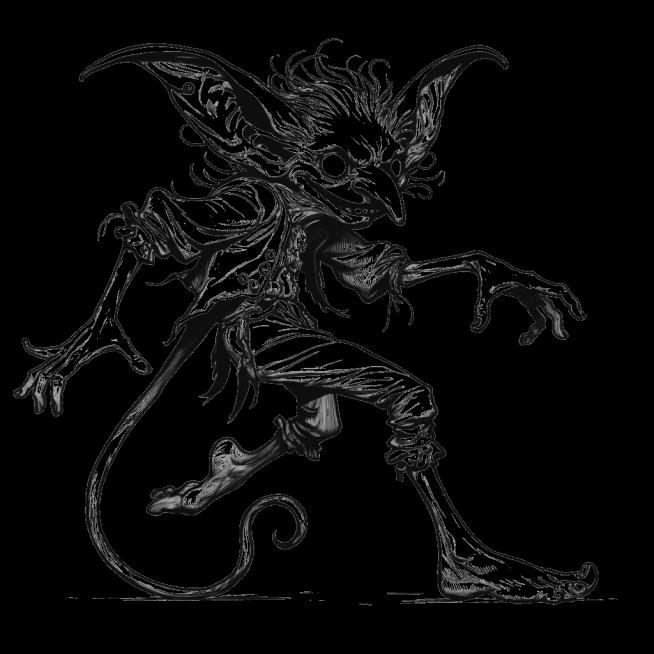

# Magic Items {#sec-chapter-magic-items}

```{=typst}
#label("sec-chapter-magic-items")
```

{width="60%"}

*Illustration 24 — Magic items chapter art. Placeholder; final art TBD. Dimensions: 654×654.*



Magic items are the treasures your hero will remember long after the hit points are tallied. A +1 sword is nice. A sword that bursts into flame when you speak its name, that's a story.

Magic items enhance heroes and may grant Disciplines. Some are always on. Some must be activated. All of them change what your hero can do.



## Reading a Magic Item Entry

Every magic item follows a simple format:

- **Name:** What it's called. The name on the treasure hoard inventory.
- **Rarity:** Uncommon, Rare, Very Rare, or Legendary. Rarity governs how often these appear and what level heroes should find them.
- **Effect:** What it does. Always on, or activated.
- **Attunement:** Whether it requires one of your three attunement slots.



## Core Magic Items

| Item | Rarity | Effect |
|------|--------|--------|
| **+1 Weapon** | Uncommon | +1 damage to all tiers. The classic. Boring but reliable. |
| **Flame Tongue** | Rare | +1d6 fire damage on hit. Requires 1 Fire Discipline. |
| **Shield +1** | Uncommon | +1 DR while wielded. |
| **Cloak of Elvenkind** | Uncommon | Advantage on Stealth checks. The cloak shifts color to match its surroundings. |
| **Ring of Protection** | Rare | +1 DR, +1 to all saves. Simple. Powerful. |
| **Staff of Power** | Very Rare | +2 to spell damage tiers. Weak becomes Standard. Standard becomes Strong. Strong becomes devastating. |
| **Deck of Many Things** | Legendary | Draw a card. Fate unfolds. Some cards grant wishes. Some steal your soul. The deck has ended more campaigns than any dragon. |



{width="60%"}

*Illustration 38 — Magic items chapter midpoint. Placeholder for final art. Use placeholder-section.svg dimensions: 400×300.*



## Expanded Magic Items

The following items showcase the range of what magic can do, from simple utility to battlefield-defining power. Each includes Weak/Standard/Strong effects where the item's power depends on a roll.

### Blade of the Last Ember

*Rare - Longsword - Requires Attunement - 1 Fire Discipline*

A sword forged from a fallen star. The blade is warm to the touch and glows faintly orange in darkness.

**Always On:** +1 damage to all tiers. The bonus is fire damage.

**Activated, Ember Burst (Maneuver, once per encounter):** You slam the blade into the ground. Fire erupts in a 10-ft radius around you.

| Success Tier | Effect |
|-------------|--------|
| **Weak** | 2 fire damage to all creatures in radius. |
| **Standard** | 4 fire damage. Creatures that fail a Fortitude save are Blinded until end of your next turn. |
| **Strong** | 6 fire damage. Creatures are Blinded (no save) and take 2 ongoing fire damage until they spend an action to put out the flames. |

### Veilwalker's Shroud

*Uncommon - Cloak - Requires Attunement*

A cloak woven from shadow and spider silk. When you pull the hood up, the world forgets you're there.

**Always On:** +1 to Stealth checks.

**Activated, Step Between (Maneuver, once per encounter):** You vanish from your current position and reappear up to 30 ft away in any shadow or dimly lit area.

| Success Tier | Effect |
|-------------|--------|
| **Weak** | You teleport but leave a faint shimmer for 1 round. Enemies know something moved. |
| **Standard** | Clean teleport. You're hidden until you attack or take an obvious action. |
| **Strong** | Clean teleport plus you become Invisible for 1 round. |

### Stormcaller's Gauntlets

*Rare - Gloves - Requires Attunement - 1 Wind Discipline*

Leather gloves crackling with trapped lightning. Your fingers leave faint arcs of static on everything you touch.

**Always On:** Unarmed attacks deal lightning damage instead of physical.

**Activated, Call Lightning (Action, once per encounter):** You point at a creature within 60 ft. A bolt of lightning descends from above.

| Success Tier | Effect |
|-------------|--------|
| **Weak** | 3 lightning damage. Target's hair stands on end. They know they were targeted. |
| **Standard** | 5 lightning damage. Target must make a Fortitude save or lose their reaction. |
| **Strong** | 8 lightning damage. Target is Stunned until end of your next turn. |

### Chalice of Shared Mercy

*Rare - Wondrous Item - Requires Attunement - 1 Life Discipline*

A silver chalice that never tarnishes. Liquid poured into it glows with a soft golden light for 1 minute.

**Activated, Shared Draught (Action, once per day):** You fill the chalice and drink. The healing flows through you to your allies.

| Success Tier | Effect |
|-------------|--------|
| **Weak** | You regain 2 HP. One ally within 30 ft regains 2 HP. |
| **Standard** | You regain 4 HP. Up to three allies within 30 ft each regain 3 HP. |
| **Strong** | You regain 6 HP. All allies within 30 ft regain 5 HP and lose one condition of their choice. |

### Titan's Girdle

*Very Rare - Belt - Requires Attunement*

A broad leather belt with a buckle of carved mountain stone. It's heavier than it looks, much heavier.

**Always On:** Your Brawn score is treated as +3 for the purposes of carrying capacity, lifting, and breaking objects. Your Brawn modifier for attack and damage rolls is unchanged.

**Always On:** You have advantage on Brawn checks to grapple, shove, or resist being moved.

### Horn of the Dawn

*Uncommon - Wondrous Item - No Attunement*

A spiral horn carved from the tooth of some great celestial beast. When blown, it sounds like sunrise.

**Activated, Dawn Call (Action, once per day):** You blow the horn. A wave of golden sound rolls outward.

| Success Tier | Effect |
|-------------|--------|
| **Weak** | All allies within 60 ft lose the Frightened condition. |
| **Standard** | All allies lose Frightened. Undead within 60 ft have disadvantage on their next attack. |
| **Strong** | All allies lose Frightened and gain +1 on their next roll. Undead within 60 ft take 3 radiant damage. |

### Mirror of Echoing Eyes

*Rare - Wondrous Item - Requires Attunement*

A hand mirror framed in tarnished silver. The glass doesn't show your reflection, it shows what someone else is seeing.

**Activated, Echo Sight (Action, once per session):** You speak the name of a creature you've met. The mirror shows you what they see, right now, for up to 1 minute.

| Success Tier | Effect |
|-------------|--------|
| **Weak** | Flashes of imagery. You get a general sense of their location and what they're doing. |
| **Standard** | Clear vision for 1 minute. You see through their eyes. They feel a faint unease, they know something is watching. |
| **Strong** | Clear vision for 1 minute. They feel nothing. You may also hear what they hear. |

### Boots of the Long Road

*Uncommon - Wondrous Item - No Attunement*

Sturdy leather boots, scuffed and comfortable. They never wear out. They never give you blisters. They always know the way home.

**Always On:** Your overland travel speed increases by 50%. You and up to five companions ignore non-magical difficult terrain while traveling.

**Always On:** Once you've walked a road, you can retrace your steps perfectly, even in darkness, even in fog. The boots remember.

### Mantle of the Burning Shield

*Very Rare - Cloak - Requires Attunement - 2 Fire Discipline*

A cloak of crimson scales. When danger threatens, the scales ignite, wrapping the wearer in a corona of protective flame.

**Always On:** Resistance to fire damage.

**Reaction, Burning Retort (once per encounter):** When a creature within 10 ft hits you with a melee attack, the mantle erupts. The attacker takes fire damage.

| Success Tier | Effect |
|-------------|--------|
| **Weak** | 3 fire damage. The creature is singed and angry. |
| **Standard** | 5 fire damage. The creature must succeed on a Morale Check or back away. |
| **Strong** | 8 fire damage. The creature is Blinded until end of its next turn. |

### Locket of the Final Word

*Legendary - Wondrous Item - Requires Attunement*

A small silver locket containing a scrap of parchment. The ink on the parchment changes each time you open it. It always says exactly what you need to say, to one person, at one moment.

**Activated, Final Word (Action, once per campaign):** You open the locket, read the words aloud, and speak directly to the heart of one creature that can hear you.

No roll. The creature's attitude shifts two steps toward Friendly. If it was Hostile, it becomes Neutral. If it was Neutral, it becomes Allied. The effect is permanent unless you betray the trust the locket creates.

The locket crumbles to dust after use. Some words can only be spoken once.

### Frost Brand

*Rare - Longsword - Requires Attunement - 1 Water Discipline*

A longsword with a blade of pale blue ice that never melts. Condensation beads on the hilt in warm weather. The grip is cold but never painful, like plunging your hand into a mountain stream.

**Always On:** +1 damage to all tiers. The bonus is cold damage.

**Activated, Frost Nova (Maneuver, once per encounter):** You drive the blade into the ground. A wave of bitter cold radiates outward in a 15-ft radius.

| Success Tier | Effect |
|-------------|--------|
| **Weak** | 2 cold damage to all creatures in radius. Ground becomes slick, creatures moving through the area must make an Agility check or fall Prone. |
| **Standard** | 4 cold damage. Creatures that fail a Fortitude save are Slowed (half Speed) until end of your next turn. |
| **Strong** | 6 cold damage. Creatures are Frozen in place (cannot move) until end of your next turn. The area remains difficult terrain for 1 minute. |

### Thunder Maul

*Very Rare - Warhammer - Requires Attunement - 1 Earth Discipline*

A massive hammer with a head of clouded silver. When it strikes, the air cracks like a storm breaking. The haft thrums faintly in your hands, as if something inside is impatient to be released.

**Always On:** +2 damage to all tiers. The bonus is thunder damage.

**Activated, Shockwave (Action, once per encounter):** You slam the maul into the ground at your feet. A shockwave of concussive force erupts in a 20-ft cone.

| Success Tier | Effect |
|-------------|--------|
| **Weak** | 3 thunder damage. Creatures in the cone are pushed 5 ft away from you. |
| **Standard** | 5 thunder damage. Creatures are pushed 10 ft and must make a Fortitude save or be knocked Prone. |
| **Strong** | 8 thunder damage. Creatures are pushed 15 ft, knocked Prone, and Stunned until end of your next turn. |

### Shadow Thorn

*Rare - Dagger - Requires Attunement*

A dagger with a blade so dark it seems to absorb light. When you hold it, your own shadow stretches and twists, sometimes in directions the torchlight doesn't explain.

**Always On:** +1 damage to all tiers. Attacks with Shadow Thorn ignore 1 point of DR from non-magical armor.

**Activated, Shadow Step (Maneuver, once per encounter):** You throw the dagger at a shadow within 60 ft and step through. You vanish from your position and reappear where the dagger lands.

| Success Tier | Effect |
|-------------|--------|
| **Weak** | You teleport to the shadow but the dagger doesn't return to your hand, it's embedded in the surface. You must retrieve it. |
| **Standard** | Clean teleport. The dagger returns to your hand. Until the end of your next turn, your next attack with Shadow Thorn has advantage. |
| **Strong** | Clean teleport plus you become Invisible until you attack or take an obvious action. The dagger returns to your hand. |

### Sunbow

*Rare - Longbow - Requires Attunement - 1 Fire Discipline*

A longbow of pale golden wood, warm to the touch. When drawn, the string hums with light and the arrow nocked upon it ignites, not with fire, but with pure radiance. Dawn priests call it "the first ray."

**Always On:** Arrows fired from the Sunbow deal radiant damage instead of physical. +1 damage to all tiers.

**Activated, Blinding Volley (Action, once per encounter):** You fire an arrow that erupts in a burst of blinding light at a point within range. All creatures within 10 ft of the impact point must make a Fortitude save or be Blinded.

| Success Tier | Effect |
|-------------|--------|
| **Weak** | Creatures in the radius are Dazzled (-1 to attack rolls) until end of your next turn. No damage. |
| **Standard** | 3 radiant damage to all creatures in radius. Creatures that fail their save are Blinded until end of your next turn. |
| **Strong** | 5 radiant damage. Creatures are Blinded (no save) until end of your next turn. Undead take double damage. |

### Spellguard Shield

*Rare - Shield - Requires Attunement*

A shield of silvered steel inlaid with faintly glowing runes. The runes pulse softly when magic is near, a heartbeat of warning against the arcane.

**Always On:** +2 DR (as a standard shield). You have advantage on all saving throws against spells and magical effects.

**Reaction, Spell Catch (once per encounter):** When a single-target spell targets you or an ally within 5 ft, you may interpose the shield. The spell is absorbed into the shield's runes and has no effect.

| Success Tier | Effect |
|-------------|--------|
| **Weak** | The spell is negated but the shield's runes go dark, you cannot use Spell Catch again until you finish a long rest. |
| **Standard** | The spell is negated. The shield stores one charge of the spell's energy, your next attack deals +2 damage of the absorbed spell's damage type. |
| **Strong** | The spell is negated and reflected back at the caster. They suffer the spell's Weak effect. |

### Adamantine Plate

*Very Rare - Heavy Armor - Requires Attunement*

Full plate armor forged from star-metal, black iron veined with silver that gleams like captured constellations. It's impossibly heavy, impossibly strong, and it has turned aside blows that should have felled giants.

**Always On:** DR 7 (Plate is normally 6). Any critical hit scored against you becomes a normal hit instead, roll damage as if the attack had scored a Standard success. This does not prevent fumble effects against you.

**Always On:** You have resistance to non-magical bludgeoning, piercing, and slashing damage from creatures of Large size or smaller.

### Bag of Holding

*Uncommon - Wondrous Item - No Attunement*

A nondescript leather satchel, slightly larger than a coin purse. The interior is considerably less nondescript, it opens into an extradimensional space roughly 4 feet deep and 2 feet wide at the mouth.

**Always On:** The bag can hold up to 500 pounds of gear while weighing only 15 pounds regardless of contents. Items placed inside must fit through the bag's opening (roughly 2 feet in diameter). Retrieving an item requires a Maneuver, the bag always produces the item you're thinking of, but you do have to reach in and find it.

**Warning:** Piercing or tearing the bag from the inside destroys it and scatters its contents across the Astral Plane. Don't put the Immovable Rod in the Bag of Holding. Don't put the Bag of Holding in another Bag of Holding. These things have been tried. The craters are still there.

### Rope of Climbing

*Uncommon - Wondrous Item - No Attunement*

Sixty feet of silken rope, fine as a finger's width and strong as steel cable. When you speak the command word, it animates, rising, coiling, and knotting itself with the patience of a trained serpent.

**Activated, Animate Rope (Maneuver, at will):** You speak the command word and designate a destination within 60 ft. The rope rises and fastens itself securely to that point.

| Success Tier | Effect |
|-------------|--------|
| **Weak** | The rope reaches the destination and holds. Climbing it requires an Athletics check (Standard 9-14). |
| **Standard** | The rope knots itself at 5-ft intervals. Climbing requires no check. |
| **Strong** | As Standard, plus the rope can tie itself into a harness around a willing creature and lift or lower them at a rate of 15 ft per round. |

### Lantern of Revealing

*Uncommon - Wondrous Item - No Attunement*

A brass lantern with lenses of violet glass. When lit, its flame burns a pale blue-violet and casts shadows that don't quite match the objects making them. Invisible things cast shadows too, and this lantern shows them all.

**Always On:** When lit, the lantern sheds bright light in a 30-ft radius and dim light for an additional 30 ft. Within the bright light radius, invisible creatures and objects are visible as faint violet outlines. Hidden magical auras (including illusions and glyphs) are revealed as a soft shimmer.

**Duration:** The lantern burns for 6 hours on a single flask of oil. The command word to light or extinguish it is usually etched on the bottom.

### Immovable Rod

*Rare - Wondrous Item - No Attunement*

A flat iron rod, two feet long, with a single button at one end. It looks like a piece of scaffolding that someone forgot to install. Press the button. The rod freezes in place, not braced, not wedged, just *fixed*, as if the universe has decided this particular rod belongs exactly here and nowhere else.

**Activated, Immovable (Maneuver, at will):** Press the button. The rod locks into its current position in space and does not move. It can support up to 8,000 pounds of weight before deactivating. A creature can force the rod to move by succeeding on a Brawn check (Strong 17-20). Press the button again to deactivate.

**Creative uses (all confirmed by playtesters who should have been taking notes instead of experimenting):** Bar a door from the wrong side. Anchor a rope in midair. Stop a wagon. Pin a giant's cloak to the floor. Hang a hammock between nothing and nothing. Attach two Immovable Rods to a shield and create an instant ladder (the party's Arcanist will call this "a ladder", they're insufferable, but they're right).

### Potion of Healing

*Uncommon - Consumable - No Attunement*

A glass vial filled with a shimmering red liquid that catches the light like liquid ruby. It tastes of honey and mint and something faintly metallic, the taste of wounds closing.

**Activated, Drink (Maneuver):** You uncork the vial and drink. Roll 3d6 (no modifiers, the potion's magic, not your skill, determines the outcome).

| Success Tier | Effect |
|-------------|--------|
| **Weak** | Restore 2 HP. |
| **Standard** | Restore 5 HP. |
| **Strong** | Restore 8 HP and lose one condition of your choice. |

**Variants:** Greater Healing (Rare, 5/10/15 HP), Superior Healing (Very Rare, 10/20/30 HP). These follow the same W/S/S pattern and count as consumables. Greater potions are thick as syrup and glow with inner light. Superior potions are nearly black and taste of nothing at all, the absence of pain, bottled.

### Elixir of Dragon's Breath

*Rare - Consumable - No Attunement*

A crystalline vial containing a swirling, iridescent vapor that never settles. The glass is warm against your skin. When you shake it, the vapor inside roils like a tiny storm. Drinking it feels like swallowing lightning.

**Activated, Drink (Maneuver):** You drink the elixir. Choose acid, cold, fire, or lightning. You exhale a 30-ft cone of that energy type. The effect resolves immediately, you can't hold it in. Trust us, people have tried.

| Success Tier | Effect |
|-------------|--------|
| **Weak** | 3 damage of the chosen type to all creatures in the cone. |
| **Standard** | 5 damage. Creatures that fail an Agility save take full damage; those that succeed take half. |
| **Strong** | 8 damage. Creatures that fail an Agility save take full damage and suffer an ongoing 2 damage of the chosen type for 1 minute (Fortitude save ends). Those that succeed take half and suffer no ongoing effect. |

The elixir's potency fades after 24 hours once opened. An unopened vial keeps indefinitely, some have been found in dragon hoards centuries old, still swirling, still waiting.

### Cloak of the Manta Ray

*Uncommon - Wondrous Item - No Attunement*

A cloak of deep blue leather, smooth and faintly slick to the touch. When submerged in water, it unfurls into a flexible mantle that wraps your legs and arms, transforming you into something the sea recognizes as its own.

**Always On:** While underwater, you gain a swimming Speed of 40 ft and can breathe water as easily as air. The cloak provides no protection against cold, pressure, or the things that hunt in the deep, it only makes you *belong* there.

**Always On:** You have advantage on all Agility checks made to swim, dive, or escape grappling creatures underwater.



## Attunement

A character may attune to **3 magic items** at a time. Artifacts do not count against this limit. Attuning to an item requires a short rest, you're bonding with the item's magic, not just picking it up.

::: {.callout-note}
## Attunement Is a Choice, Not a Limit

Three slots sounds restrictive. It's meant to be. Magic items are force multipliers, and too many multipliers break the game's math.

When you find a fourth item you want to attune, you have to make a choice: which three define your hero? The Flame Tongue or the Stormcaller's Gauntlets? The Cloak of Elvenkind or the Mantle of the Burning Shield? These choices are character-defining. Make them count.

One veteran's advice: keep one attunement slot flexible. Dedicate two slots to your core build, the items that make your class work. Leave the third slot open for whatever the adventure throws at you. The Mirror of Echoing Eyes might be useless in nine sessions out of ten. In the tenth session, it solves the mystery and saves the kingdom. That's what the third slot is for.
:::



## Discipline Items

Some items grant temporary Disciplines while attuned. A **Fire Opal** grants 1 Fire Discipline. A **Blade Master's Gauntlet** grants 1 Blade Discipline. These count toward prerequisite requirements, they can unlock Adept and Master abilities just like purchased Disciplines.

| Item | Rarity | Discipline Granted | Notes |
|------|--------|-------------------|-------|
| **Fire Opal** | Uncommon | 1 Fire | Pulses with inner heat. Warm to the touch even in winter. |
| **Tear of the Sea** | Uncommon | 1 Water | A crystallized drop of elemental water. Never dries. |
| **Windseeker's Feather** | Uncommon | 1 Wind | A griffon feather that quivers when storms approach. |
| **Heartstone** | Uncommon | 1 Earth | A polished stone that hums faintly when placed on bare ground. |
| **Blade Master's Gauntlet** | Rare | 1 Blades | Supple leather inscribed with dueling forms. Your grip never slips. |
| **Saint's Reliquary** | Rare | 1 Religion | A fingerbone or scrap of vestment from a departed holy figure. |
| **Menagerie Collar** | Rare | 1 Animal | A leather collar. When worn, animals understand your intent. |

::: {.callout-note}
## Finding Magic Items

The DA controls the flow of magic items. A good rule of thumb:

- **Levels 1-3:** One Uncommon item per hero. Potions, scrolls, and a single +1 weapon for the party.
- **Levels 4-6:** Two Uncommon, one Rare per hero. Discipline items start appearing.
- **Levels 7-10:** Mostly Rare, one Very Rare for the party. Items with W/S/S effects become available.
- **Levels 11+:** Very Rare and Legendary items. These should feel earned, quest rewards, not shop purchases.

Magic items aren't in every treasure hoard. When the party finds one, it should matter. The Blade who's been using the same longsword for five levels unsheathes a Flame Tongue for the first time, that's a moment. Milk it.
:::
