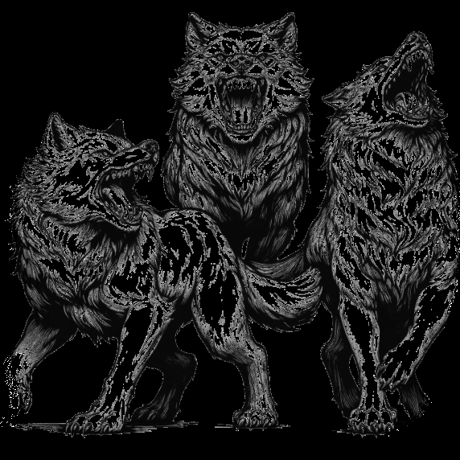

# Advancement {#sec-chapter-advancement}

{width="60%"}

*Illustration 25 — Advancement chapter art (Titles). Placeholder; final art TBD. Dimensions: 572×572.*



Your hero doesn't stay the same person who kicked down their first door. Every adventure leaves a mark — a new technique mastered, a spell perfected, a scar that tells a story. Advancement in *Heroes of Legend* isn't about filling an XP bar. It's about your hero becoming more of who they already are, or surprising everyone by becoming someone new.

This chapter covers the mechanics: when you level, what you gain, and how to spend what you've earned. The stories behind those gains — the mentor who trained you, the ancient text you deciphered, the near-death experience that unlocked something dormant — those are yours to tell.



## Gaining Levels

Levels are earned through adventure milestones, not experience points. When the party achieves something significant — defeats a major enemy, completes a quest, resolves a story arc — the DA awards a level. There's no tracking individual goblin kills. There's no calculating CR budgets. The story says "you've earned this," and you level up.

The expected pace is roughly one level every two to three sessions. At that rate, a weekly group reaches level 20 in about a year of play. Some tables move faster. Some move slower. The pace that's right for your group is the pace where leveling feels earned, not automatic. When the party hits a new level and the table goes "yes!", you're doing it right. When they barely notice, you're leveling too fast. When they're frustrated, too slow. Adjust.

**Milestone examples:** The DA awards a level when the party:
- Defeats a boss or major antagonist
- Completes a significant quest or story arc
- Achieves a personal character goal (the Blade avenges their master, the Intellect deciphers the lost codex)
- Survives an ordeal that changes them (the dungeon that killed two hirelings, the negotiation that averted a war)

The DA decides. There's no formula. Trust your instincts — you know when the party has earned it.



## Development Points

Development Points are the currency of growth. You spend them to buy skills, talents, and abilities. Every level gives you a fresh infusion, and every point spent is a choice about who your hero is becoming.

At each level, you gain 3–4 DP, with larger awards at milestone levels (1, 5, 10, 15, 20). The table below shows the full progression. Budget wisely — DP don't carry over between levels, so spend every point before you level again. Unspent DP is potential left on the table.

| Level | DP | Other Gains |
|-------|-----|-------------|
| 1 | 4 | Class signature, Starting Disciplines |
| 2 | 3 |, |
| 3 | 3 | Progression Discipline |
| 4 | 3 | Attribute increase (+1, max +2) |
| 5 | 4 | Class feature upgrade |
| 6-14 | 3/level | Progression Discipline every 3 levels, attribute every 4 |
| 15 | 4 | Class feature upgrade |
| 16-19 | 3/level | Progression Discipline every 3 levels, attribute every 4 |
| 20 | 4 | Capstone |

Total DP at level 20: 64. Total Progression Disciplines: 6. Total attribute increases: 5.

<!-- Advancement is purely DP-based. Classes do not have feature upgrades; progression
     is driven by player choice through Development Points. The table above shows
     total DP gain per level, not preset class features. At levels 5, 10, 15, and 20,
     players have accumulated enough DP to reach meaningful new ability tiers through
     their own purchasing decisions. -->



## Group Reputation

The party's renown grows with their deeds. Reputation affects NPC attitudes, quest availability, and title eligibility.

| Rep | Title | Effect |
|-----|-------|--------|
| 1-3 | **Unknown** | Standard prices, no recognition |
| 4-6 | **Known** | 10% discount at friendly establishments |
| 7-9 | **Renowned** | Free room and board, audiences with nobles |
| 10-14 | **Heroic** | Followers, stronghold, legendary quests |
| 15+ | **Legendary** | Immortalized in song and story |



## Reveling

Spend gold on legendary parties to boost reputation. 100 gp = +1 reputation for the session. Carousing may attract unwanted attention.



## Titles

Earned titles grant mechanical benefits. Examples: **Dragonslayer** (+1 damage vs dragons), **Knight of the Realm** (free lodging at any inn), **Archmage** (one free Adept spell chain).



## Retraining

At each level, you may exchange one skill rank or talent purchase for another of equal or lower DP cost. The DA may require narrative justification, finding a trainer, spending downtime, or a story event that prompts the change.

**Example:** At level 5, Kael realizes he never uses his Novice Intimidation. He retrains it to Novice Athletics (both 1 DP). He spends a session training with Roric, the party's Protector, to justify the change.

> **Why this exists:** Players make choices at level 1 without knowing how the game actually plays. Retraining lets them correct early mistakes without feeling stuck. It also means a character's build can evolve with the story.



## Strongholds & Bases {#sec-strongholds}

At some point, you outgrow inn rooms and borrowed beds. You need walls that are yours. A place to hang your trophies, store your artifacts, and plan your next move without the barkeep listening in. That's a stronghold. This section covers how you get one, what it does for you, and how it grows with your legend.

### Acquiring a Stronghold

You don't buy a stronghold at the general store. You earn it, or you take it.

**Requirements:**
- **Reputation 7+** with at least one faction that has the resources to sponsor construction or cede territory (@sec-faction-system). You're not just "those adventurers who passed through last spring", you're a known quantity.
- **Gold:** 500-2,000 gp depending on size and condition. An abandoned border keep costs 500 gp and a lot of sweat. A purpose-built tower with running water and magical wards costs 2,000 gp. The price covers materials, labor, and the first month of upkeep.
- **Location:** A suitable site. The DA determines what's available, an abandoned watchtower, a cleared dungeon you've already bled in, land granted by a grateful noble. Finding the right spot is an adventure in itself.

::: {.callout-tip}
## The Stronghold Quest
Acquiring a stronghold shouldn't be a shopping trip. The abandoned keep isn't empty, something's moved in since the last garrison left. The granted land comes with a catch, the noble wants you to clear out the bandits in the eastern hills first. Make the party *work* for their walls. It makes walking through the front door for the first time feel earned.
:::

### Class-Typed Strongholds

Your stronghold reflects who you are. A Blade's fortified keep doesn't look like an Arcanist's wizard tower. The type is determined by the majority of the party, or by whoever's funding the construction.

| Stronghold Type | Classes | Benefits |
|-----------------|---------|----------|
| **Fortified Keep** | Blade, Protector, any martial | +2 to combat training rolls. Can recruit 2d6 soldiers (see Followers). Armory and training grounds included. |
| **Wizard's Tower** | Arcanist, Odd, any arcane | +2 to spell research and crafting checks. Magic item creation takes half the normal time. Library and laboratory included. |
| **Sanctum** | Any class with divine spells | +2 to healing and divine ritual checks. Pilgrims bring 2d6 x 10 gp in offerings per month. Chapel and infirmary included. |
| **Hidden Safehouse** | Any skilled/rogue-ish class | +2 to information gathering and Stealth checks made from the stronghold. Black market access (rare items available for purchase). Secret passages and escape routes included. |

**Mixed parties:** If the party includes a Blade, an Arcanist, and a cleric, they choose one primary type. The others can be added as upgrades (see Stronghold Upgrades below). A Fortified Keep with a Wizard's Tower addition is a fortress with a spire, expensive, impressive, and exactly the kind of thing that attracts dragons.

### Stronghold Actions

Once per session, each character can take one stronghold action during downtime. This represents what you're doing with your base between adventures. You can't take the same action twice in a row.

| Action | Effect |
|--------|--------|
| **Craft** | Reduce the time required to craft one item by half. The stronghold's facilities, forge, library, chapel, provide the tools and space. |
| **Recruit** | Gain 1d3 temporary followers for the next adventure. They're hirelings, not heroes, use the Guard or Bandit stat block from @sec-chapter-bestiary. They follow reasonable orders but won't sacrifice themselves. |
| **Research** | Study a known monster, location, or magical phenomenon. Gain +2 on all Knowledge and Reason checks related to the subject for the next session. The DA provides one concrete piece of intelligence. |
| **Rest** | Full recovery of HP and removal of one condition or affliction. Additionally, gain temporary HP equal to your level for the next session. Real beds and hot meals make a difference. |
| **Fortify** | Improve the stronghold's defenses. The stronghold gains +10 temporary HP and attackers suffer -2 on rolls to breach the walls until the end of the next session. Stacks with the Fortify faction action. |
| **Train** | Gain a +2 bonus to one skill for the next session. This replaces (does not stack with) the Train faction action. Specialized facilities beat improvised practice. |

### Followers

When your reputation reaches Allied (+3) with a faction, or when your Group Reputation hits Heroic (10+), you attract followers. These aren't adventurers, they're people who believe in what you're doing and want to help.

| Source | Followers Gained |
|--------|-----------------|
| Allied faction | 1d4 followers from that faction's ranks |
| Heroic reputation (10+) | 1d6 followers drawn by your legend |
| Stronghold established | 2d4 followers as staff and garrison |

**Followers use simple NPC stat blocks** (Guard, Bandit, Cultist, see @sec-chapter-bestiary). They maintain the stronghold, handle mundane tasks, and provide minor mechanical benefits:

- **Garrison soldiers:** +1 to stronghold defense rolls for every 5 soldiers stationed.
- **Scholars and sages:** Reduce Research action time by half (stack with the stronghold's Research benefit).
- **Craftspeople:** Craft one common item (non-magical, value up to 25 gp) per session at no gold cost, just materials.
- **Spies and informants:** Once per session, learn one rumor from a nearby settlement without spending an action.

**Followers on adventures:** Followers can accompany the party as hirelings. They act on their own initiative and follow orders, but they're fragile, most have 4-8 HP. If a follower dies, replace them at the rate of one per session. The stronghold attracts new recruits. Word gets around that you pay well and don't get your people killed. You *do* pay well, right?

::: {.callout-warning}
## Followers Are People
Don't treat followers as disposable. If the party uses their garrison as trap-finders or monster bait, morale collapses. Followers desert. Recruitment stops. The stronghold gains a negative reputation, "Don't sign on with those lunatics." Treat your people well and they'll walk into fire for you. Treat them poorly and you'll be mopping your own floors.
:::

### Stronghold Upgrades

Spend gold to expand your stronghold's capabilities. Each upgrade requires the base stronghold to be established first. Upgrades take 1d4 weeks to complete and cost the listed amount.

| Upgrade | Cost | Requirements | Benefit |
|---------|------|-------------|---------|
| **Library** | 300 gp | Wizard's Tower or any stronghold | +2 to all Research actions. Contains reference works on history, arcana, and nature. |
| **Armory** | 400 gp | Fortified Keep or any stronghold | +2 to Craft actions for weapons and armor. Weapons stored here gain +1 damage for the first round of the next siege. |
| **Chapel** | 300 gp | Sanctum or any stronghold | +2 to Rest actions. Allies within the stronghold may reroll one failed saving throw against fear or corruption per session. |
| **Workshop** | 350 gp | Any stronghold | +2 to Craft actions for gear, tools, and non-magical items. Crafting time reduced by one-third. |
| **Walls (Reinforced)** | 500 gp | Any stronghold | Stronghold HP increased by 25. Attackers suffer -2 on all rolls to breach, climb, or bypass walls. |
| **Secondary Stronghold Type** | 800 gp | Base stronghold established | Add the benefits of a second stronghold type. A Fortified Keep with a Library has both martial training grounds and arcane reference works. |
| **Teleportation Circle** | 1,500 gp | Wizard's Tower, caster level 10+ | Permanent teleportation circle. Connects to one other circle you've attuned to. priceless when the orc army is three days away and you need reinforcements *now*. |
| **Vault** | 500 gp | Any stronghold | Secure storage with magical wards. Items stored here cannot be scryed upon. +4 to rolls against theft or tampering. |

**Upkeep:** Strongholds cost 5% of their total value in gold per month for maintenance, staff wages, and supplies. A 1,000 gp stronghold costs 50 gp per month. If the party can't pay, the stronghold degrades, lose one upgrade per month of neglect, starting with the most expensive.
