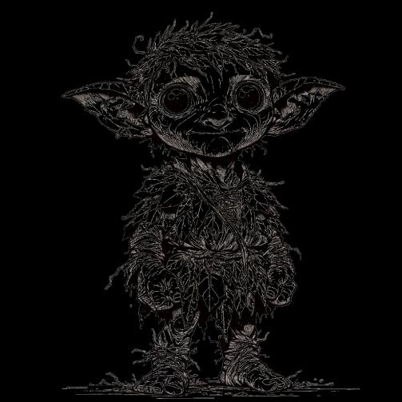

# Bestiary {#sec-chapter-bestiary}

```{=typst}
#label("sec-chapter-bestiary")
```

{width="60%"}

*Illustration 28 — Bestiary chapter art (Bestiary cover). Placeholder; final art TBD. Dimensions: 503×503.*



Monsters use the same rules as heroes, attributes, skills, and W/S/S damage. If you can read a character sheet, you can read a stat block. The only difference is that monsters don't level up, don't have DP, and don't get death saves. When they hit 0 HP, they're done.



## Reading a Stat Block

| Field | Description |
|-------|-------------|
| **Name** | Creature type and challenge rating |
| **Attributes** | B/F/A/G/K/R modifiers. Most monsters have 0s in attributes they don't use. |
| **HP** | Health points. When this hits 0, the creature is defeated. |
| **DR** | Damage reduction. Subtract from physical damage just like hero armor. |
| **Attacks** | W/S/S damage per attack. Weak/Standard/Strong values. |
| **Abilities** | Special powers. These override the normal rules, the stat block always wins. |



## Beasts

**Wolf (Challenge 1/2):** HP 8, DR 0. Bite: 2/3/4. Pack Tactics: +1 to attacks when an ally is adjacent.

**Dire Wolf (Challenge 1):** HP 14, DR 1. Bite: 3/4/6. Pack Tactics: +1 when ally adjacent. Knockdown: on Strong hit, target must succeed Agility check or be knocked Prone.

**Bear (Challenge 2):** HP 20, DR 2. Claw: 3/4/6. Bite: 4/5/7. Multiattack: may make both Claw and Bite as one Standard Action.

**Giant Spider (Challenge 1):** HP 10, DR 0. Bite: 1d4/1d6/1d8 + poison (Fortitude save or Poisoned condition). Web (Recharge): ranged attack that Restrains target on hit.

**Swarm of Rats (Challenge 1/2):** HP 5, DR 0. Bites: automatic 1 damage to all in space. Immune to single-target attacks. Vulnerable to area effects (damage tier +1).

**Stirge (Challenge 1/2):** HP 3, DR 0. Proboscis: 1/2/3 piercing + attach. On a hit, the stirge latches onto the target. While attached, it automatically deals 2 damage each round. A creature can use a Maneuver to make a Brawn check to detach the stirge. Tiny flyer, the stirge dies if it takes any damage while attached.

**Dire Boar (Challenge 2):** HP 18, DR 2. Gore: 4/5/7. Charge: if it moves 20+ ft before attacking, damage tier +1. Relentless: when reduced to 0 HP, make Fortitude save; on Strong, stays at 1 HP.



## Humanoids (NPCs)

**Bandit (Challenge 1/2):** HP 4, DR 0. Shortsword: 2/3/4. Shortbow: 2/3/4. Pack Tactics.

**Guard (Challenge 1/2):** HP 8, DR 1 (chain shirt). Spear: 2/3/4. Shield: +1 DR.

**Cultist (Challenge 1/2):** HP 6, DR 0. Dagger: 1/2/3. Dark Bolt: 2/3/4 necrotic (range 60 ft). Fanatical: immune to Frightened.

**Knight (Challenge 3):** HP 20, DR 4 (plate). Longsword: 2/3/5. Shield Block reaction. Leadership: allies within 10 ft gain +1 to attacks.

**Archmage (Challenge 6):** HP 14, DR 2. Dagger: 1/2/3. Firebolt: 2/3/5 (at will). Fireball: 6/9/12 (3/day). Counterspell: reaction to negate a spell. Magical Ward: +2 DR vs spells.



## Goblinoids

**Goblin (Challenge 1/2):** HP 4, DR 0. Scimitar: 2/3/4 slashing. Shortbow: 2/3/4 piercing (range 80/320). Nimble Escape: the goblin can use a Maneuver to Disengage. Darkvision: 60 ft. Cowardly: if outnumbered and below half HP, the goblin must make a Morale Check or flee.

**Hobgoblin (Challenge 1/2):** HP 8, DR 1 (chain shirt). Longsword: 2/3/4 slashing. Longbow: 2/3/4 piercing (range 150/600). Martial Advantage: +1 damage tier when an ally is adjacent to the target. Iron Discipline: immune to Frightened while within sight of an allied hobgoblin.

**Bugbear (Challenge 1):** HP 12, DR 1 (hide). Morningstar: 3/4/6 bludgeoning. Reach 10 ft. Brute: +1 damage tier against targets that haven't acted yet this combat. Natural Stealth: +1 to Guile (Stealth) checks. Surprise Attack: on the first round of combat, the bugbear's first attack that hits deals damage one tier higher.

**Goblin Shaman (Challenge 1):** HP 8, DR 0. Staff: 1/2/3 bludgeoning. Hex Bolt: 2/4/6 necrotic (range 60 ft). Hex (Recharge): one target within 30 ft must make a Guile save or suffer disadvantage on its next attack roll. Goblin Cunning: can use a Maneuver to Disengage. Darkvision: 60 ft.



## Orcs

**Orc (Challenge 1/2):** HP 10, DR 1 (hide). Greataxe: 3/4/5 slashing. Javelin: 2/3/4 piercing (range 30/120). Relentless Endurance: once per day, when reduced to 0 HP, the orc can make a Fortitude save. On a Strong result, it stays at 1 HP. Aggressive: can use a Maneuver to move up to its Speed toward a visible enemy.

**Orc Warchief (Challenge 3):** HP 22, DR 3 (plate). Greataxe: 4/5/7 slashing. Javelin: 3/4/6 piercing (range 30/120). Multiattack: Greataxe twice. Battle Cry (Recharge): all orc allies within 30 ft gain +1 damage tier on their next attack. Relentless Endurance: as Orc. Commanding Presence: orc allies within 30 ft are immune to Frightened.



{width="60%"}

*Illustration 29 — Bestiary chapter second art (Beast art). Placeholder; final art TBD. Dimensions: 654×654.*



## Undead

**Skeleton (Challenge 1/2):** HP 5, DR 0. Shortsword: 2/3/4. Shortbow: 2/3/4. Vulnerable (Bludgeoning): damage tier +1 vs bludgeoning. Undead Nature: immune to poison and charm.

**Zombie (Challenge 1/2):** HP 12, DR 1. Slam: 2/3/4. Undead Fortitude: when reduced to 0 HP, roll Fortitude. On Strong, stays at 1 HP. Slow: always acts last in initiative.

**Ghoul (Challenge 1):** HP 10, DR 0. Claw: 1d6/1d8/1d10. Bite: 3/4/6. Paralyzing Touch: on Strong claw hit, target must make Fortitude save or be Paralyzed for 1 round.

**Wraith (Challenge 3):** HP 12, DR 3 (non-magical). Life Drain: 3/5/7 necrotic. Incorporeal: half damage from non-magical physical attacks. Create Specter: humanoid killed by Life Drain rises as a specter under the wraith's control at next sunset.

**Lich (Challenge 10):** HP 30, DR 4. Paralyzing Touch: 4/6/9 cold + Paralyzed (Fortitude save). Disrupt Life: 5/8/11 necrotic (30 ft radius, 1/day). Spellcasting: as 10th-level Arcanist. Phylactery: reforms in 1d10 days if phylactery survives.



## Monstrosities

**Owlbear (Challenge 2):** HP 16, DR 1. Claw: 3/4/6. Bite: 4/5/7. Blood Frenzy: when below half HP, all attacks at damage tier +1.

**Basilisk (Challenge 3):** HP 14, DR 2. Bite: 3/4/6 + poison. Petrifying Gaze: creatures within 30 ft must make Fortitude save or be Restrained. Fail twice: Petrified.

**Chimera (Challenge 5):** HP 25, DR 2. Bite: 4/6/9. Claw: 4/5/7. Fire Breath: 6/9/12 (15 ft cone, Recharge). Multiattack: Bite + Claw + breath if available. Three heads: cannot be surprised.

**Harpy (Challenge 1):** HP 8, DR 0. Claw: 2/3/4 slashing. Club: 2/3/4 bludgeoning. Luring Song: creatures within 60 ft that can hear the harpy must make a Guile save or use their movement to move toward the harpy by the safest route. Creatures immune to Charmed are immune. Flyer: the harpy can fly at its full Speed.

**Minotaur (Challenge 3):** HP 22, DR 2 (natural hide). Greataxe: 4/5/7 slashing. Gore: 3/4/6 piercing + push 10 ft on a Strong hit. Charge: if the minotaur moves 20+ ft before making a Gore attack, that attack deals damage one tier higher. Labyrinthine Recall: the minotaur cannot become lost and always knows the way back to the entrance of any maze or labyrinth it has explored.

**Rust Monster (Challenge 2):** HP 12, DR 2 (chitin). Bite: 2/3/4 piercing. Rusting Antennae: as an action, the rust monster touches a metal weapon or suit of armor. Metal armor permanently loses 1 DR (to a minimum of 0). Metal weapons permanently deal damage one tier lower (to a minimum of Weak). If an item's DR or damage is reduced to its minimum, the item is destroyed. Non-metal items are unaffected. Scent Metal: the rust monster can detect the presence of metal within 60 ft.



## Fey

**Pixie (Challenge 1/2):** HP 2, DR 0. Tiny. Invisible: permanently invisible. Confusion Touch: on hit, target rolls Weak on its next action. Pixie Dust: once per day, grant one creature flight for 1 minute.

**Dryad (Challenge 1):** HP 10, DR 0. Club: 1d6/1d8/1d10. Charm: one humanoid within 30 ft must make Guile save or be Charmed (1/day). Tree Stride: teleport between trees within 60 ft. Treebound: takes 1d6 damage per round when more than 300 ft from its bonded tree.

**Green Hag (Challenge 3):** HP 16, DR 2. Claw: 3/4/6. Illusory Appearance: appears as any humanoid. Vicious Mockery: 2/4/6 psychic + disadvantage on next attack (at will). Coven Magic: when 3 hags are within 30 ft, they share spellcasting.



## Dragons

**Wyrmling (Challenge 3):** HP 15, DR 3. Bite: 3/4/6. Breath Weapon: 5/8/11 (15 ft cone, Recharge). Choose color: Red (fire), Blue (lightning), Green (poison), Black (acid), White (cold).

**Young Dragon (Challenge 6):** HP 30, DR 4. Bite: 5/7/10. Claw: 4/5/7. Breath Weapon: 8/11/15 (30 ft cone, Recharge). Multiattack: Bite + 2 Claws. Frightful Presence: creatures within 60 ft must save vs Frightened.

**Ancient Dragon (Challenge 12):** HP 60, DR 6. Bite: 7/10/14. Claw: 5/7/10. Tail: 5/7/10 (15 ft reach). Breath Weapon: 15/21/28 (60 ft cone, Recharge). Multiattack: Bite + 2 Claws + Tail. Frightful Presence. Legendary Resistance (3/day): automatically succeed a failed save.



## Elementals

**Fire Elemental (Challenge 4):** HP 20, DR 2. Slam: 4/5/7 fire. Touch: creatures touching or hitting the elemental take 2 fire. Water Vulnerability: takes 2 cold damage when splashed with water.

**Water Elemental (Challenge 4):** HP 22, DR 2. Slam: 4/5/7 bludgeoning. Whelm: target must make Brawn save or be Grappled and take 2/4/6 bludgeoning each round. Freeze: when hit by cold damage, speed halved for 1 round.



## Giants

**Hill Giant (Challenge 5):** HP 30, DR 2. Greatclub: 5/7/10. Rock: 4/6/9 (range 60/240). Slow-Witted: disadvantage on Knowledge, Reason, and Guile saves.

**Stone Giant (Challenge 7):** HP 35, DR 4. Greatclub: 2d10/3d10/4d10. Rock: 6/9/12 (range 60/240). Stone Camouflage: advantage on Stealth in rocky terrain.

**Ogre (Challenge 2):** HP 20, DR 2 (thick hide). Greatclub: 4/5/7 bludgeoning. Rock: 3/4/6 bludgeoning (range 30/90). Reach 10 ft. Slow-Witted: disadvantage on Knowledge, Reason, and Guile saves. Hulking Brute: the ogre deals +1 damage tier to objects and structures.



## Extraplanar

**Vrock (Demon, Challenge 6):** HP 25, DR 3. Claw: 4/5/7. Bite: 3/4/6. Spores (Recharge): all within 15 ft take 4/6/9 poison. Stunning Screech (1/day): all within 30 ft must make Fortitude save or be Stunned for 1 round. Magic Resistance: advantage on saves vs spells.

**Barbed Devil (Challenge 5):** HP 22, DR 4. Claw: 3/4/6 + 2 fire. Tail: 4/5/7 piercing. Barbed Hide: creatures grappling or hitting with melee take 2 piercing. Magic Resistance: advantage on saves vs spells.



## Oozes

**Gelatinous Cube (Challenge 3):** HP 20, DR 1. Pseudopod: 3/4/6 acid. Engulf: moves into target space, Restrained + 4/6/9 acid per round. Transparent: requires Standard Investigation check to notice when motionless.



## Shapechangers

**Doppelganger (Challenge 3):** HP 14, DR 0. Slam: 2/3/4 bludgeoning. Shapechange: as an action, the doppelganger can assume the appearance of any Medium humanoid it has seen. Its attributes and attacks remain unchanged, but it gains the target's voice and mannerisms. Creatures can make a Guile (Investigation) check opposed by the doppelganger's Guile (Deception) to see through the disguise. Mind Reading (Recharge): the doppelganger learns the surface thoughts of one creature within 30 ft. The target may make a Guile save to resist. Ambusher: +1 damage tier against surprised targets. Deceptive: +1 to Guile (Deception) checks.



## Additional Monsters

### Cave Troll (Challenge 4)

HP 25, DR 3 (regenerates). Attributes: Brawn +2, Fortitude +2, Agility -1, Guile -2, Knowledge -1, Reason -1.

**Claw:** 4/5/7 slashing. **Bite:** 3/4/6 piercing. **Multiattack:** Claw + Claw + Bite.

**Regeneration:** At the start of its turn, the troll regains 5 HP. This regeneration stops for 1 round if the troll takes fire or acid damage. The troll cannot regenerate from 0 HP.

**Rend:** If both claws hit the same target, the second claw deals damage one tier higher.

**Mindless Fury:** When below half HP, the troll attacks the nearest creature, friend or foe. It cannot distinguish ally from enemy in its rage.

### Shadow Stalker (Challenge 3)

HP 14, DR 1. Attributes: Agility +2, Guile +1, others +0.

**Shadow Claw:** 3/4/6 necrotic. Target's shadow is torn, disadvantage on Stealth until the end of the encounter.

**Merge with Shadow (Maneuver, at will):** If in dim light or darkness, the stalker becomes Invisible until it attacks or enters bright light.

**Shadow Leap (Maneuver, Recharge):** Teleport up to 60 ft to any area of dim light or darkness.

**Light Vulnerability:** While in bright light, all attacks against the stalker are at advantage, and its damage tier is reduced by one.

### Treant (Challenge 5)

HP 35, DR 4 (bark). Attributes: Brawn +2, Fortitude +2, Agility -2, Knowledge +1, others +0.

**Slam:** 5/7/10 bludgeoning. Reach 15 ft. **Rooted Grasp:** Creatures within 20 ft must make Agility save or be Restrained by erupting roots (Recharge).

**Animate Trees:** As an action, the treant animates one nearby tree as a Lesser Treant (HP 10, Slam 2/3/4) that acts on the treant's initiative.

**Fire Vulnerability:** Fire damage is always treated as one tier higher against the treant. The treant must make a Morale Check whenever it takes fire damage.

### Phase Beast (Challenge 4)

HP 18, DR 2. Attributes: Agility +2, Reason +1, others +0.

**Phase Bite:** 4/5/7 force. Ignores non-magical DR.

**Blink (Reaction, Recharge):** When hit by an attack, the phase beast may teleport 20 ft. The attack still deals damage, but the beast is no longer adjacent.

**Phasing (Maneuver):** Until the end of its turn, the phase beast can move through solid objects and creatures. It cannot end its turn inside a solid object.

**Unstable:** When the phase beast is reduced to 0 HP, it explodes. All creatures within 10 ft take 4/6/9 force damage (Agility save for half).

### Death Knight (Challenge 8)

HP 40, DR 5 (plate + unholy). Attributes: Brawn +2, Fortitude +1, Guile +1, others +0.

**Greatsword:** 5/8/11 slashing. **Hellfire Orb:** 6/9/12 fire + necrotic (range 90 ft, Recharge). **Multiattack:** Greatsword twice.

**Marshal Undead:** Undead allies within 30 ft gain +1 to all attack rolls.

**Unholy Resilience:** The Death Knight has advantage on all saves against spells and magical effects.

**Soulbind:** When the Death Knight reaches 0 HP, its soul retreats into its armor. It reforms at full HP in 1d4 rounds unless the armor is destroyed (HP 15, DR 6) or a Shepherd uses Turn Undead on the armor.



## Encounter Building

| Difficulty | Challenge Budget | Example (4 players) |
|-----------|-----------------|-------------------|
| Easy | 1 - party level | 4 Wolves (Challenge 1/2 each) |
| Standard | 2 - party level | 1 Knight (C3) + 2 Guards (C- each) |
| Hard | 3 - party level | 1 Young Dragon (C6) + 4 Cultists (C-) |
| Deadly | 4+ - party level | 1 Ancient Dragon (C12) or 1 Lich (C10) + minions |



## Creating Monsters

Assign attributes (-2 to +2), give 1-3 attacks with W/S/S damage, add 1-2 abilities. HP = 5 - desired challenge. DR = 0-6 based on natural armor.

**Quick Monster Template:**

1. Choose type (Beast, Undead, etc.)
2. Set Challenge (1-12)
3. HP = 5 - Challenge, DR = Challenge 1/2 2 (round down)
4. Choose 1-2 attacks with W/S/S damage (W = d6 x Challenge x 2, S = d8-Challenge-2, St = d10-Challenge-2)
5. Add 1 signature ability from its type

::: {.callout-note}
## Adjusting Monster Difficulty On the Fly

The stat block is a starting point, not a contract. If a fight is too easy or too hard, change it. The players can't see the numbers.

**Too easy?** The monster has a second phase. When it drops to 0 HP, it roars, gains 10 HP, and its damage tier increases by one. The cultist leader drinks a potion. The wolf pack's alpha arrives, drawn by the sounds of combat. You're not cheating, you're making the fight interesting.

**Too hard?** The monster is wounded from a previous fight. Reduce its HP by 25%. Remove its Multiattack, it's favoring an injured limb. Its Recharge ability doesn't recharge, it used it earlier today on a different party of adventurers. The monster wants to survive too, it might flee at half HP instead of fighting to the death.

**The golden rule:** Adjust in the fiction, not the math. Don't say "I'm reducing its HP by 10." Say "You notice a deep wound in its flank, someone fought this thing before you. It's already bleeding." The players feel smart for noticing. They don't need to know you just turned a Deadly encounter into a Hard one.

**Morale is your best tool.** If the party is getting crushed and the fight was supposed to be Standard difficulty, the monsters get overconfident. One stops to gloat. Another starts looting a downed hero instead of finishing them. The monsters make mistakes, and mistakes give the party openings. This isn't pulling punches. It's playing the monsters like they're alive.
:::
