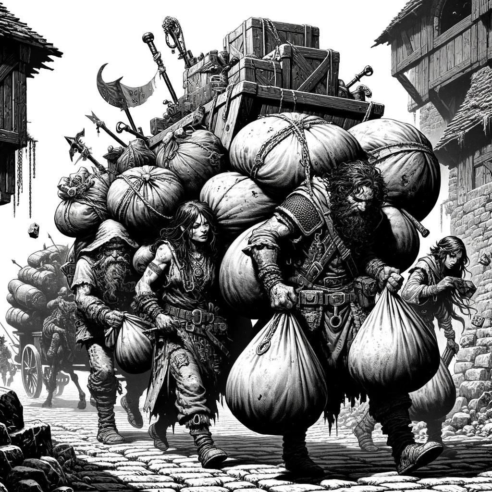

# Glossary {#sec-chapter-glossary}

```{=typst}
#label("sec-chapter-glossary")
```

{width="60%"}

*Illustration 30 — Glossary / appendices chapter art (Final page art). Placeholder; final art TBD. Dimensions: 1024×1024.*



Every mechanical term used in this book, defined in one place. If you hit a word you don't recognize, start here.



## Core Mechanic Terms

**3d6:** The core dice roll. Three six-sided dice, summed, plus modifiers.

**Always Hit:** Attacks do not roll to hit, the 3d6 determines damage tier. Every attack connects. Every swing matters.

**Attribute:** One of six core stats: Brawn, Fortitude, Agility, Guile, Knowledge, Reason. Ranges from -2 to +2.

**Bell Curve:** The probability distribution of 3d6. Most rolls cluster around 9-12. Extreme results (3 and 18) are rare, about 0.5% each.

**Boon:** An extra d6 added to a 3d6 roll. Roll 4d6 and keep the highest three. Halflings get a boon once per session from their Lucky trait.

**Bane:** An extra d6 added to a 3d6 roll where you keep the *lowest* three. The opposite of a boon. Applied by the DA for severe disadvantage.

**Critical:** Three natural 6s on 3d6. Automatic Strong success plus a bonus effect from the Critical table. About a 1-in-200 chance.

**Fumble:** Three natural 1s on 3d6. Automatic failure plus a complication. About a 1-in-200 chance. The table groans.

**Success Tier:** The three bands of outcome: Weak (1-8), Standard (9-14), Strong (15-18+). Every roll lands in one of these.

**Weak:** Partial success or success with complication. You get what you wanted, barely, or at a cost.

**Standard:** Full, clean success. The thing you attempted works as intended.

**Strong:** Exceptional success. Extra effect, bonus damage, additional information, or sheer style.



## Character Terms

**Ability:** An active power purchased with DP. Spells, combat techniques, and signature class powers are all abilities. Must be activated to use. Follows Novice/Adept/Master chain.

**Ancestry:** Your species, Human, Elf, Dwarf, or Halfling. Grants one Discipline and one trait.

**Background:** Level 0. Your hero's life before adventuring. Governed by Background DP (8 + Knowledge + Fortitude).

**Class:** Your hero's calling, Protector, Blade, Arcanist, Shepherd, Intellect, Odd, Leader, or Unbalanced. Determines favored skills, favored Disciplines, and signature ability.

**Culture:** Your upbringing within your ancestry. Grants a +1 skill bonus and either two specific Disciplines or one free Discipline.

**Development Points (DP):** The currency of character creation and advancement. Spent to purchase skills, abilities, and Disciplines. Different classes pay different costs (X1, X2, X3) for different purchases.

**Discipline:** A prerequisite resource representing mastery of a domain. Disciplines come in types: Elemental (Fire, Earth, Wind, Water), Weapon (Blades, Axes, Polearms, Heavy Weapon, Archery, Unarmed), Defense (Protection, Armor), Primal (Animal, Plants), Arcane (Energy), Divine (Life, Religion), and Esoteric (Mind, Summon).

**General Discipline:** A wildcard Discipline that can substitute for any specific type at Novice tier. All characters begin with 3 General Disciplines.

**HP (Health Points):** How much damage you can take before falling unconscious. Starting HP = 10 + Brawn. Gain Brawn modifier HP each level (minimum 1).

**Level:** Your hero's experience tier, from 1 to 20. Higher levels unlock Adept (Level 3) and Master (Level 7) abilities and grant attribute increases every 4 levels.

**Novice:** The first tier of any skill or ability. Grants +1 bonus. Costs 1 DP at X1.

**Adept:** The second tier. Grants +2 bonus. Unlocks a maneuver for skills. Costs 2 DP at X1. Requires Novice. Unlocks at Level 3.

**Master:** The third tier. Grants +3 bonus. Unlocks a powerful maneuver for skills. Costs 4 DP at X1. Requires Adept. Unlocks at Level 7.

**Maneuver:** A special technique unlocked by Adept or Master skill rank. Spent as your Maneuver for the turn.

**Signature Ability:** The unique power granted by your class at Level 1. Defines your class identity mechanically.

**Skill:** A trained competency. Ranges from Novice (+1) to Master (+3). Includes combat skills (Blades Fighting), knowledge skills (Arcana), social skills (Persuasion), and physical skills (Athletics).

**Talent:** A passive benefit purchased with DP. Always on. Does not require activation. Examples: Tough (+2 HP), Lucky (reroll one 1 per session).

**Trait:** An ancestry-granted special ability. Human: Versatile. Elf: Elven Grace. Dwarf: Sturdy. Halfling: Lucky.



## Combat Terms

**Action:** The main thing you do on your turn. Attack, cast a spell, activate an ability, Dash. One per turn.

**Maneuver (combat resource):** A secondary resource spent on basic maneuvers (Defend, Shove) or skill-granted maneuvers (Riposte, Cleave). One per turn.

**Movement:** How far you can move on your turn. Usually 30 ft. Can be broken up before and after your Action.

**Reaction:** A response triggered by someone else's turn. Opportunity attacks, Shield Block, Counterspell. One per round (resets at the start of your turn).

**Free Action:** Anything trivial, talking, dropping an item, drawing a weapon. Unlimited per turn.

**Basic Maneuver:** A combat technique available to everyone. Defend, Disengage, Aid, Shove, Grapple, Command, Catch Breath, Search, Stand Up, Use Item. Costs your Maneuver for the turn.

**Damage Reduction (DR):** Subtracted from incoming physical damage. Comes from armor, shields, and some abilities.

**Damage Tier:** Weak, Standard, or Strong, determines how much damage an attack deals. Weapons and spells have fixed damage values for each tier.

**Protection Value (PV):** A defensive bonus from shields, the Defend maneuver, and some abilities. Adds to DR or enables Shield Block.

**Shield Block:** A reaction that reduces incoming damage by one tier. Requires a shield.

**Opportunity Attack:** A free melee attack when an enemy leaves your reach without Disengaging.

**Concentration:** Some spells require concentration to maintain. You can only concentrate on one spell at a time (two with the Spell Weaver talent). Taking damage may break concentration.

**Condition:** A temporary status effect. Blinded, Charmed, Deafened, Frightened, Grappled, Incapacitated, Invisible, Paralyzed, Poisoned, Prone, Restrained, Stunned, Unconscious.

**Morale Check:** A 3d6 roll (no modifiers) to determine whether an NPC or monster flees, wavers, or stands firm.

**Initiative:** 1d6 + Agility modifier. Determines turn order in combat.

**Surprise:** When one side catches the other unaware. Surprised creatures take -2 on their first roll. Determined by Stealth vs passive Insight.

**Cover:** Terrain that provides protection. Half cover (-1 to attacker), three-quarters cover (-3), full cover (cannot be targeted).

**Non-Lethal Attack:** A melee attack that reduces a creature to 0 HP but leaves them unconscious and stable instead of dying.

**Dying:** At 0 HP, you fall Unconscious and roll 3d6 each turn to determine if you stabilize, worsen, or die.

**Wounded:** Below half HP. Healing received is halved while Wounded.



## Magic Terms

**Spell:** A magical ability. Follows Novice ? Adept ? Master chain. Always fires, no spell slots, no mana.

**Spell Chain:** Three linked spells (Novice, Adept, Master) sharing a theme. Example: Spark ? Firebolt ? Inferno.

**Concentration Spell:** A spell that requires ongoing focus. You can maintain one (or two with Spell Weaver) at a time.

**Arcane Focus:** An item (wand, staff, orb) that channels arcane magic. Required for some spells.

**Holy Symbol:** An item (amulet, reliquary, sacred text) that channels divine magic. Required for some spells.

**Attunement:** The bond between a hero and a magic item. Maximum 3 attuned items at a time. Artifacts don't count against this limit.



## GM Terms

**DA (Dungeon Architect):** The game master. Runs the world, plays the NPCs, adjudicates the rules.

**Challenge Rating (Challenge):** A measure of monster difficulty. Roughly equivalent to the level of a party that would find the monster a Standard encounter.

**Difficulty Modifier:** A bonus or penalty the DA applies to a roll based on how hard the task is. Ranges from +3 (Trivial) to -6 (Nearly Impossible).

**Passive Insight:** A creature's baseline ability to detect lies and hidden threats. Calculated as Knowledge score + 7.

**Session:** One gaming session, typically 3-4 hours. Some abilities refresh per session.

**Encounter:** A single scene or combat. Some abilities refresh per encounter.

**Campaign:** The entire ongoing story, spanning multiple sessions and potentially years of play.
