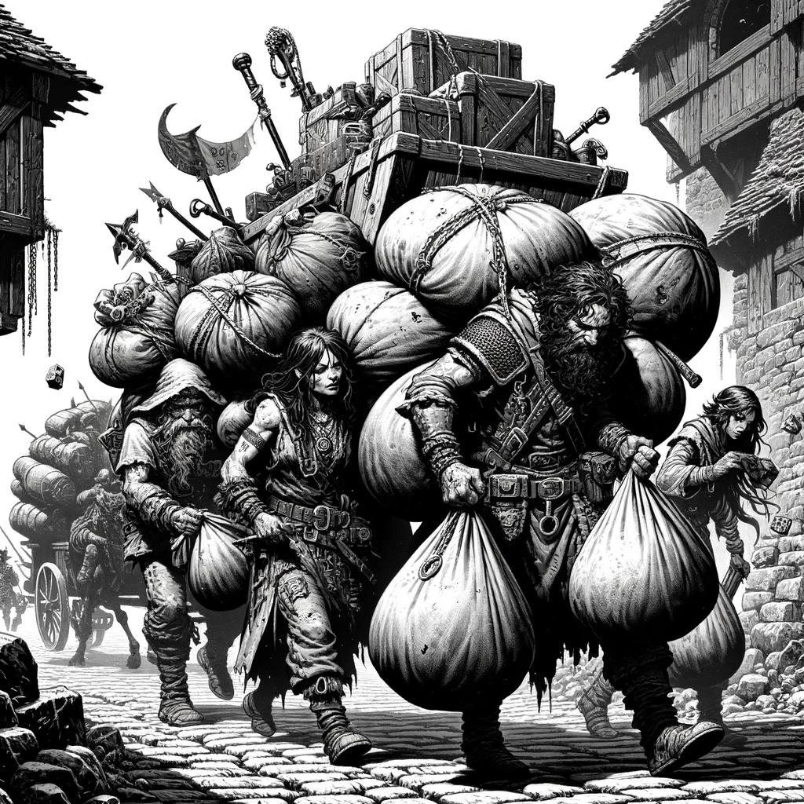

# Glossary {#sec-chapter-glossary}

```{=typst}
#label("sec-chapter-glossary")
```

{width="60%"}

*Illustration 30: Glossary / appendices chapter art (Final page art). Placeholder; final art TBD. Dimensions: 1024×1024.*



Every mechanical term used in this book, defined in one place. If you hit a word you don't recognize, start here.



## Core Mechanic Terms

**3d6:** The core dice roll. Three six-sided dice, summed, plus modifiers.

**Always Hit:** Attacks do not roll to hit, the 3d6 determines damage tier. Every attack connects. Every swing matters.

**Attribute:** One of six core stats: Brawn, Fortitude, Agility, Guile, Knowledge, Reason. Ranges from -2 to +2.

**Bell Curve:** The probability distribution of 3d6. Most rolls cluster around 9-12. Extreme results (3 and 18) are rare, about 0.5% each.

**Boon:** An extra d6 added to a 3d6 roll. Roll 4d6 and keep the highest three. Halflings get a boon once per session from their Lucky trait.

**Bane:** An extra d6 added to a 3d6 roll where you keep the *lowest* three. The opposite of a boon. Applied by the DA for severe disadvantage.

**Critical:** Three natural 6s on 3d6. Automatic Strong success plus a bonus effect from the Critical table. About a 1 in 216 chance.

**Fumble:** Three natural 1s on 3d6. Automatic failure plus a complication. About a 1 in 216 chance. The table groans.

**Success Tier:** The three bands of outcome: Weak (1-8), Standard (9-14), Strong (15-18+). Every roll lands in one of these.

**Weak:** Partial success or success with complication. You get what you wanted, barely, or at a cost.

**Standard:** Full, clean success. The thing you attempted works as intended.

**Strong:** Exceptional success. Extra effect, bonus damage, additional information, or sheer style.

**Damage Budget:** The master table every damaging spell, ability, and maneuver keys to. Novice 2/4/6, Adept 6/9/12, Master 9/15/21 (Weak/Standard/Strong). See @sec-damage-budget.

**Flat Damage:** Damage taken straight from the damage budget row with no attribute added. Arrows, thrown weapons, most spells, and all monsters use flat damage.

**Attribute-Scaled Damage:** Damage that adds a keyed attribute to a base value. For spells and abilities, the base is budget − 3 plus the card's stated attribute; melee weapons add Brawn (or the attack attribute).



## Character Terms

**Ability:** An active power purchased with DP. Spells, combat techniques, and signature class powers are all abilities. Must be activated to use. Follows Novice/Adept/Master chain with a flat DP cost by tier.

**Ancestry:** Your species, Human, Elf, Dwarf, or Halfling. Grants one Discipline and one trait.

**Background:** Level 0. Your hero's life before adventuring. Governed by Background DP (8 + Knowledge + Fortitude).

**Class:** Your hero's calling, Protector, Blade, Arcanist, Shepherd, Intellect, Odd, Leader, Unbalanced, or Shadow. Determines favored skills, favored Disciplines, and signature ability.

**Culture:** Your upbringing within your ancestry. Grants a +1 skill bonus and either two specific Disciplines or one free Discipline.

**Development Points (DP):** The currency of character creation and advancement. Spent to purchase skills, abilities, and Disciplines. Skills and abilities cost a flat rate by tier (Novice 2 DP, Adept 4 DP, Master 8 DP). Disciplines cost different amounts per class depending on their cost structure (Home, Adjacent, Foreign, Opposed).

**Discipline:** A prerequisite resource representing mastery of a domain. Disciplines come in types: Elemental (Fire, Earth, Wind, Water), Weapon (Blades, Axes, Polearms, Heavy Weapon, Archery, Unarmed), Defense (Protection, Armor), Primal (Animal, Plants), Arcane (Energy), Divine (Life, Religion), Esoteric (Mind, Summon), Subterfuge (Stealth, Sleight), and Knowledge (Lore, Tactics). Each class has a cost table showing the DP price for each rank in each discipline (see @sec-chapter-classes).

**HP (Health Points):** How much damage you can take before falling unconscious. Starting HP = 10 + Fortitude + Knowledge. Gain Fortitude modifier HP each level (minimum 1).

**Level:** Your hero's experience tier, from 1 to 10. Higher levels unlock Adept (Level 3) and Master (Level 7) abilities and grant attribute increases every 4 levels.

**Novice:** The first tier of any skill or ability. Grants +1 bonus. Flat cost: 2 DP.

**Adept:** The second tier. Grants +2 bonus. Unlocks a maneuver for skills. Flat cost: 4 DP. Requires Novice. Unlocks at Level 3.

**Master:** The third tier. Grants +3 bonus. Unlocks a powerful maneuver for skills. Flat cost: 8 DP. Requires Adept. Unlocks at Level 7.

**Rank:** A single step of a Discipline, from 1 to 3. Cards require Discipline ranks as prerequisites: Novice 1, Adept 2, Master 3. A hero's maximum in any single Discipline is 3 ranks.

**Signature Ability:** The unique power granted by your class at Level 1. Defines your class identity mechanically.

**Eccentric Spellcasting:** The Odd's signature ability. Choose one arcane ability and one divine ability; you ignore prerequisite Disciplines for these two (level requirements still apply) and need no arcane focus or holy symbol.

**Skill:** A trained competency. Ranges from Novice (+1) to Master (+3). Includes combat skills (Small/Long/Great Blades), knowledge skills (Arcana), social skills (Persuasion), and physical skills (Athletics).

**Talent:** A passive benefit purchased with DP. Always on. Does not require activation. Examples: Tough (+2 HP), Fortune's Favor (reroll one natural 1 per session).

**Trait:** An ancestry-granted special ability. Human: Versatile. Elf: Elven Grace. Dwarf: Sturdy. Halfling: Lucky.



## Combat Terms

**Action:** The main thing you do on your turn. Attack, cast a spell, activate an ability, Dash. One per turn.

**Maneuver:** A secondary resource spent on basic maneuvers (Defend, Shove) or skill-granted maneuvers unlocked by Adept or Master skill rank (Riposte, Cleave). One per turn.

**Movement:** How far you can move on your turn. Usually 30 ft. Can be broken up before and after your Action.

**Reaction:** A response triggered by someone else's turn. Opportunity attacks, Shield Block, Counterspell. One per round (resets at the start of your turn).

**Free Action:** Anything trivial, talking, dropping an item, drawing a weapon. Unlimited per turn.

**Basic Maneuver:** A combat technique available to everyone. Defend, Disengage, Aid, Shove, Grapple, Command, Catch Breath, Search, Stand Up, Use Item. Costs your Maneuver for the turn.

**Damage Reduction (DR):** Subtracted from incoming physical damage. Comes from armor, shields, and some abilities.

**Damage Tier:** Weak, Standard, or Strong, determines how much damage an attack deals. Weapons and spells have fixed damage values for each tier.

**Protection Value (PV):** A defensive bonus from shields, the Defend maneuver, and some abilities. Adds to DR or enables Shield Block.

**Shield Block:** A reaction that reduces incoming damage by one tier. Requires a shield.

**Opportunity Attack:** A free melee attack when an enemy leaves your reach without Disengaging.

**Concentration:** Some spells require concentration to maintain. You can only concentrate on one spell at a time (two with the Spell Weaver talent). Taking damage may break concentration.

**Condition:** A temporary status effect. Blinded, Charmed, Deafened, Frightened, Grappled, Incapacitated, Invisible, Paralyzed, Poisoned, Prone, Restrained, Stunned, Unconscious.

**Morale Check:** A 3d6 roll (no modifiers) to determine whether an NPC or monster flees, wavers, or stands firm.

**Initiative:** 3d6 + Agility modifier. Determines turn order in combat.

**Surprise:** When one side catches the other unaware. Surprised creatures take -2 on their first roll. Determined by Stealth vs passive Insight.

**Cover:** Terrain that provides protection. Half cover (-1 to attacker), three-quarters cover (-3), full cover (cannot be targeted).

**Non-Lethal Attack:** A melee attack that reduces a creature to 0 HP but leaves them unconscious and stable instead of dying.

**Dying:** At 0 HP, you fall Unconscious and roll 3d6 each turn to determine if you stabilize, worsen, or die.

**Wounded:** Below half your maximum HP. See Wound for what happens when you drop below half HP during an encounter.

**Wound:** A lasting injury from combat. The first time you drop below half your maximum HP during an encounter, you gain a Wound and roll on the Wound Table (see @sec-chapter-combat). Wounds linger after HP is restored and heal one per long rest.

**Thunder:** A damage type: concussive sound and shockwaves. Part of the Elemental family alongside Fire, Cold, Lightning, Acid, and Poison.



## Magic Terms

**Spell:** A magical ability bought as a spell card. Always fires, no spell slots, no mana.

**Spell Card:** A spell in the standard card format. Every spell is an individual card with Weak, Standard, and Strong outcomes, plus optional Adept and Master additions. There are no spell chains.

**Concentration Spell:** A spell that requires ongoing focus. You can maintain one (or two with Spell Weaver) at a time.

**Arcane Focus:** An item (wand, staff, orb) that channels arcane magic. Required for some spells.

**Holy Symbol:** An item (amulet, reliquary, sacred text) that channels divine magic. Required for some spells.

**Attunement:** The bond between a hero and a magic item. Maximum 3 attuned items at a time. Artifacts don't count against this limit.



## GM Terms

**DA (Dungeon Architect):** The game master. Runs the world, plays the NPCs, adjudicates the rules.

**Challenge Rating (Challenge):** A measure of monster difficulty. Roughly equivalent to the level of a party that would find the monster a Standard encounter.

**Challenge ½ (C½):** The minion-tier Challenge rating. Creatures at Challenge ½ (goblins, bandits, cultists) are individually weak and meant to be fought in numbers.

**Difficulty Modifier:** A bonus or penalty the DA applies to a roll based on how hard the task is. Ranges from +4 (Trivial) to -6 (Nearly Impossible).

**Passive Insight:** A creature's baseline ability to detect lies and hidden threats. Calculated as Knowledge score + 7.

**Session:** One gaming session, typically 3-4 hours. Some abilities refresh per session.

**Encounter:** A single scene or combat. Some abilities refresh per encounter.

**Campaign:** The entire ongoing story, spanning multiple sessions and potentially years of play.
