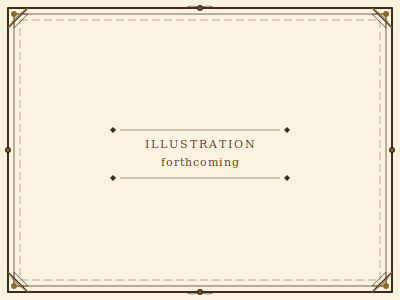

# Quick Reference Sheets {#sec-chapter-reference-sheets}

```{=typst}
#label("sec-chapter-reference-sheets")
```

{width="60%"}

*Illustration 31 — Reference sheets chapter placeholder. Placeholder for final art. Use placeholder-section.svg dimensions: 400×300.*



Tear these pages out. Photocopy them. Keep them behind your DA screen or next to your character sheet. When the dice are rolling and the table is loud, these are the numbers you need.



## Core Resolution

**The One Rule:** 3d6 + Attribute + Skill + Modifiers

| Tier | Range | Meaning |
|------|-------|---------|
| **Weak** | 1-8 | Partial success or success with complication |
| **Standard** | 9-14 | Full, clean success |
| **Strong** | 15-18+ | Exceptional success. Bonus effect. |
| **Critical** | 3-6 (natural) | Automatic Strong + special outcome |
| **Fumble** | 3-1 (natural) | Automatic failure + complication |



## Difficulty Modifiers

| Difficulty | Modifier | Example |
|-----------|----------|---------|
| Trivial | +4 | Climbing a knotted rope |
| Easy | +2 | Picking a simple lock |
| Standard | +0 | Most tasks |
| Hard | -2 | Lying to a suspicious guard |
| Very Hard | -4 | Swimming in armor during a storm |
| Nearly Impossible | -6 | Convincing the king you're his heir |



## Combat Quick-Reference

### Your Turn

| Resource | Per Turn | Common Uses |
|----------|----------|-------------|
| **Action** | 1 | Attack, cast a spell, Dash (double move), activate ability |
| **Movement** | 1 | Move up to Speed (usually 30 ft). Break up: move ? act ? move. |
| **Maneuver** | 1 | Basic maneuvers or skill-granted maneuvers |
| **Reaction** | 1/round | Shield Block, opportunity attack, Counterspell, Riposte |
| **Free** | Unlimited | Talk, draw weapon, drop item, gesture |

**Trading:** Action ? Movement or Maneuver. Never Maneuver ? Action.

### Basic Maneuvers (Everyone)

| Maneuver | Effect |
|----------|--------|
| **Defend** | +2 Protection Value until your next turn |
| **Disengage** | Move 5 ft without provoking opportunity attacks |
| **Aid** | Ally within 30 ft gains +2 on their next roll |
| **Shove** | Opposed Brawn check. Push 5 ft (10 ft on Strong) |
| **Grapple** | Initiate a grapple (opposed Brawn check) |
| **Command** | Companion/familiar/mount takes an extra move |
| **Catch Breath** | Regain HP equal to Fortitude (min 1). Once per combat. |
| **Search** | Active Investigation check to spot hidden things |
| **Stand Up** | Rise from prone |
| **Use Item** | Drink a potion, apply a salve, activate a device |

### Conditions Quick-Reference

| Condition | Effect | Ends |
|-----------|--------|------|
| **Blinded** | Attacks reduced one tier | Source duration |
| **Charmed** | Cannot attack charmer | Save ends |
| **Deafened** | Perception disadvantage | Source duration |
| **Frightened** | Cannot approach source | Save ends |
| **Grappled** | Speed 0 | Escape action |
| **Incapacitated** | No actions | Source duration |
| **Invisible** | Cannot be targeted directly | Attack/action ends |
| **Paralyzed** | Incapacitated + auto-crit if hit | Save ends |
| **Poisoned** | Disadvantage on attacks | Save ends |
| **Prone** | Melee adv vs you, ranged disadv | Stand up (move) |
| **Restrained** | Speed 0, attack disadv | Escape action |
| **Stunned** | Incapacitated + cannot move | Save ends |
| **Unconscious** | Incapacitated + prone + unaware | Healing or save |

### Morale Checks (3d6, no modifiers)

| Result | Behavior |
|--------|----------|
| **Strong (15+)** | Stands firm. +1 on next attack. |
| **Standard (9-14)** | Wavers. Disadvantage on next attack. |
| **Weak (1-8)** | Flees or surrenders. |

**Auto-triggers:** Below half HP, leader defeated, half group fallen, overwhelming force.

### Dying (at 0 HP, roll 3d6 each turn)

| Result | Outcome |
|--------|---------|
| **Strong (15+)** | Stabilize at 1 HP |
| **Standard (9-14)** | Unconscious, stable |
| **Weak (1-8)** | Take 1 wound |
| **Fumble (3-1)** | Death |
| **Critical (3-6)** | Wake at half HP |

### Cover

| Cover | Attacker Penalty |
|-------|-----------------|
| Half cover | -1 |
| Three-quarters | -3 |
| Full cover | Cannot target |



## Damage Types

| Category | Types |
|----------|-------|
| **Physical** | Slashing, Piercing, Bludgeoning |
| **Elemental** | Fire, Cold, Lightning, Acid, Poison |
| **Magical** | Force, Radiant, Necrotic, Psychic |



## Skills Quick-Reference

| Skill | Attr | Key Use |
|-------|------|---------|
| **Athletics** | BR | Climb, swim, jump |
| **Intimidation** | BR | Frighten, coerce |
| **Blades Fighting** | BR | Swords, daggers |
| **Axe Fighting** | BR | Axes, cleaving |
| **Polearms Fighting** | BR | Spears, reach |
| **Heavy Weapon Fighting** | BR | Greatswords, mauls |
| **Unarmed Fighting** | BR | Fists, grappling |
| **Endurance** | FO | Fatigue, breath-holding |
| **Survival** | FO | Track, forage, navigate |
| **Resilience** | FO | Poison, disease, extremes |
| **Acrobatics** | AG | Balance, tumble, escape |
| **Stealth** | AG | Sneak, hide |
| **Bow Fighting** | AG | Longbows, shortbows |
| **Thrown Weapon** | AG | Knives, axes, javelins |
| **Crossbow Fighting** | AG | Crossbows |
| **Sleight of Hand** | AG | Pickpocket, lockpick |
| **Deception** | GU | Lie, bluff, disguise |
| **Persuasion** | GU | Diplomacy, negotiate |
| **Streetwise** | GU | Gather info, contacts |
| **Arcana** | KN | Magic knowledge |
| **History** | KN | Lore, legends |
| **Investigation** | KN | Search, deduce |
| **Nature** | KN | Plants, animals |
| **Religion** | KN | Gods, rituals |
| **Alchemy** | RE | Potions, substances |
| **Crafting** | RE | Smith, build, create |
| **Medicine** | RE | Heal, diagnose |
| **Insight** | RE | Read people, detect lies |



## Discipline Catalog

| Category | Disciplines |
|----------|-------------|
| **Elemental** | Fire, Earth, Wind, Water |
| **Weapon** | Blades, Axes, Polearms, Heavy Weapon, Archery, Unarmed |
| **Defense** | Protection, Armor |
| **Primal** | Animal, Plants |
| **Arcane** | Energy |
| **Divine** | Life, Religion |
| **Esoteric** | Mind, Summon |



## Character Creation Checklist

1. **Concept:** One sentence. Who is your hero?
2. **Attributes:** Assign -2 to +2. Total must be +3.
3. **Ancestry:** Human, Elf, Dwarf, or Halfling. Record Discipline and trait.
4. **Culture:** Choose upbringing. Record +1 skill bonus and Disciplines.
5. **Background DP:** 8 + Knowledge + Fortitude. Spend all on Novice skills and abilities.
6. **Class:** Choose class. Record Class Discipline and signature ability.
7. **Class DP:** 8 DP. Spend all on Novice skills and abilities.
8. **Equipment:** Take class starting kit. Record weapon damage values and armor DR.
9. **Derived Stats:** HP, Initiative, Speed, Carry Slots.
10. **Backstory:** Motivation, Trinket, Name.



## Level Progression Quick-Reference

| Level | DP Gained | Milestones |
|-------|-----------|------------|
| 1 | 3 DP (class) + 8 DP (background) | Class, signature ability |
| 2 | 2 DP |, |
| 3 | 2 DP | Adept abilities unlock. +1 Discipline rank. |
| 4 | 2 DP | +1 Attribute (max +2) |
| 5 | 3 DP | Class feature |
| 6 | 2 DP | +1 Discipline rank |
| 7 | 2 DP | Master abilities unlock |
| 8 | 2 DP | +1 Attribute (max +2) |
| 9 | 2 DP | +1 Discipline rank |
| 10 | 2 DP | Class feature |
| 11-20 | 2 DP/level | Discipline every 3 levels. Attribute every 4 levels. |



## DP Cost Reference

| Purchase | X1 (Favored) | X2 (Neutral) | X3 (Out of Class) |
|----------|-------------|-------------|-------------------|
| Skill (Novice) | 1 DP | 2 DP | 3 DP |
| Skill (Adept) | 2 DP | 4 DP | 6 DP |
| Skill (Master) | 3 DP | 6 DP | 9 DP |
| Discipline (1st rank) | 1 DP | 2 DP | 3 DP |
| Discipline (2nd rank) | 2 DP | 4 DP | 6 DP |
| Discipline (3rd rank) | 4 DP | 8 DP | 12 DP |
| Ability (Novice) | 1 DP | 1 DP | 1 DP |
| Ability (Adept) | 2 DP | 2 DP | 2 DP |
| Ability (Master) | 4 DP | 4 DP | 4 DP |

**Abilities always cost 1/2/4 DP** regardless of class. Their real gate is Discipline prerequisites.



## Encounter Building Quick-Reference

| Difficulty | Challenge Budget | Example (Level 4 party) |
|-----------|-----------------|------------------------|
| Easy | 1 - party level | 4 Wolves (C- each) |
| Standard | 2 - party level | 1 Knight (C3) + 2 Guards (C-) |
| Hard | 3 - party level | 1 Young Dragon (C6) + 4 Cultists (C-) |
| Deadly | 4+ - party level | 1 Ancient Dragon (C12) |



## Common Item Reference

| Armor | DR | Stealth | Disc Req |
|-------|-----|---------|----------|
| Padded | -1 |, |, |
| Leather | -2 |, |, |
| Studded Leather | -2 |, | 1 Armor |
| Chain Shirt | -3 | Disadv | 1 Armor |
| Breastplate | -4 |, | 2 Armor |
| Half Plate | -4 | Disadv | 2 Armor |
| Chain Mail | -5 | Disadv | 2 Armor |
| Plate | -6 | Disadv | 3 Armor |

| Shield | PV | DR Bonus |
|--------|-----|----------|
| Buckler | 1 | +1 |
| Shield | 1 | +2 |
| Tower Shield | 2 | +3 |
